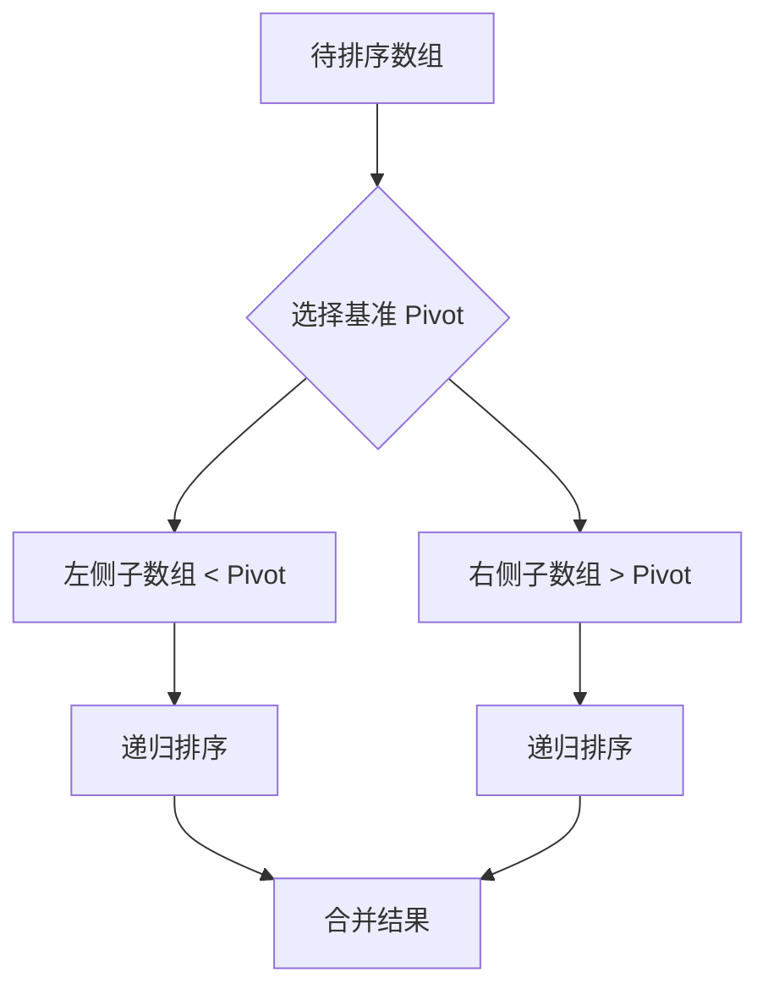

# C 语言算法集 (C Algorithms)

> 此目录收录了 C 语言实现的经典算法，涵盖排序、搜索及常见数据结构操作。

## 1. 算法列表 (Algorithm List)

| 算法名称 | 源码文件 | 难度 | 标签 | 复杂度 | 说明 |
|---|---|---|---|---|---|
| **冒泡排序** | [bubble_sort_c.c](./bubble_sort_c.c) | 入门 | 排序 | $O(n^2)$ | 基础交换排序，适合教学 |
| **快速排序** | [quick_sort_c.c](./quick_sort_c.c) | 进阶 | 排序 | $O(n \log n)$ | 原地分治排序，工业界常用 |
| **归并排序** | [merge_sort_c.c](./merge_sort_c.c) | 进阶 | 排序 | $O(n \log n)$ | 稳定排序，适合链表及外部排序 |
| **二分搜索** | [binary_search_c.c](./binary_search_c.c) | 基础 | 搜索 | $O(\log n)$ | 在有序序列中快速查找 |

## 2. 算法流程可视化 (Visualization)

### 2.1 快速排序分治流程 (Quick Sort Flow)


### 2.2 二分搜索流程 (Binary Search Flow)
```mermaid
graph LR
    A[Start] --> B[mid = low + (high-low)/2]
    B --> C{arr[mid] == target?}
    C -- Yes --> D[Return mid]
    C -- No, < target --> E[low = mid + 1]
    C -- No, > target --> F[high = mid - 1]
    E --> B
    F --> B
```

## 3. 运行指南 (How to Run)
所有 `.c` 文件均包含独立的 `main` 函数及单元测试。
```bash
# 示例：运行冒泡排序
gcc bubble_sort_c.c -o bubble_sort
./bubble_sort
```

---
### 更新日志 (Changelog)
- 2026-04-05: 初始化算法目录，新增排序与搜索算法实现。
