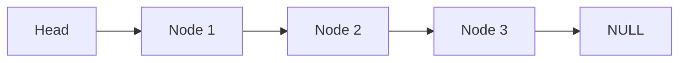
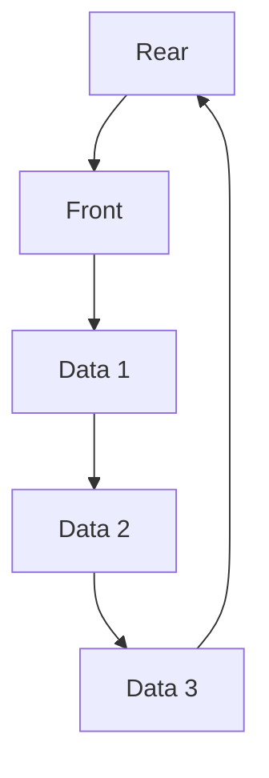

# C 语言数据结构 (C Data Structures)

> 此目录收录了 C 语言实现的经典数据结构，重点展示了内存分配、指针操作及结构设计。

## 1. 数据结构列表 (Data Structure List)

| 结构名称 | 源码文件 | 难度 | 标签 | 说明 |
|---|---|---|---|---|
| **单向链表** | [linked_list_c.c](./linked_list_c.c) | 基础 | 链表 | 动态内存分配的核心实现 |
| **顺序栈** | [stack_c.c](./stack_c.c) | 基础 | 线性结构 | 数组实现的后进先出 (LIFO) 结构 |
| **循环队列** | [queue_c.c](./queue_c.c) | 基础 | 线性结构 | 数组实现的先进先出 (FIFO) 结构 |

## 2. 结构示意图 (Diagrams)

### 2.1 单向链表 (Linked List)


### 2.2 循环队列 (Circular Queue)


## 3. 运行指南 (How to Run)
```bash
# 示例：运行栈结构测试
gcc stack_c.c -o stack_test
./stack_test
```

---
### 更新日志 (Changelog)
- 2026-04-05: 初始化数据结构目录，新增链表、栈、队列实现。
