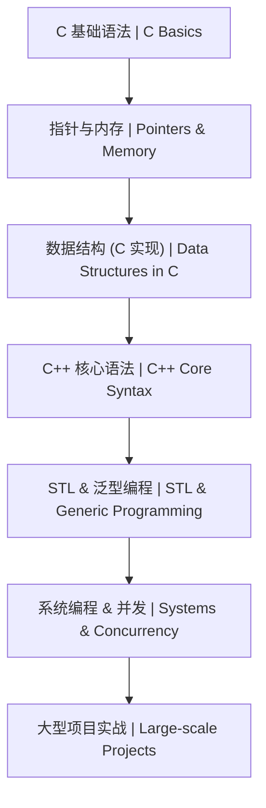
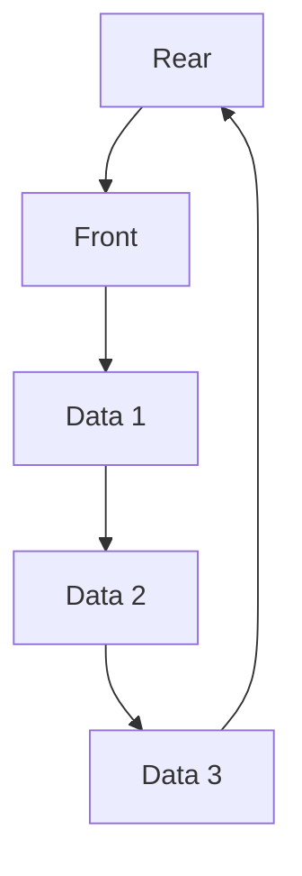
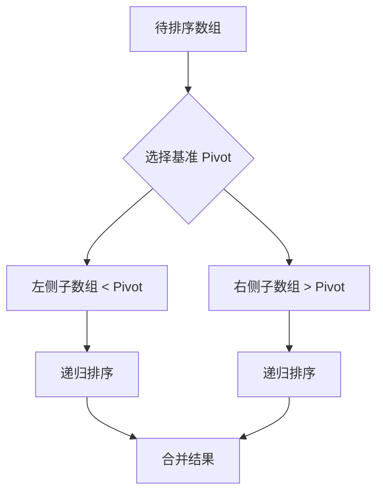

# 02-C 语言与算法 | C & Algorithms

<!--
作者：fanquanpp
创建日期：2026-04-05
版本：v3.0.0
-->

## 1. 项目简介 | Introduction

本模块是 fanquanpp 个人综合学习笔记库中的 C 语言与算法部分，专注于 C 语言基础语法、内存管理、指针操作及经典算法与数据结构的实现。作为系统编程的基础语言，C 语言是理解计算机底层原理的关键，本模块旨在为学习者提供从入门到进阶的系统化学习路径，为系统编程与高性能开发奠定坚实基础。

This module focuses on C language fundamentals, memory management, pointer operations, and implementations of classic algorithms and data structures. As a foundational language for systems programming, C is crucial for understanding computer底层 principles, and this module aims to provide a systematic learning path from beginner to advanced levels, laying a solid foundation for systems programming and high-performance development.

### 模块定位

- **C 语言学习指南**：从基础语法到高级特性，全面覆盖 C 语言核心知识点
- **算法与数据结构实现**：提供经典算法和数据结构的 C 语言实现，包含详细注释和复杂度分析
- **系统编程基础**：重点讲解内存管理、指针操作等系统编程核心概念
- **实战导向**：通过实际代码示例和练习，帮助学习者掌握 C 语言的实际应用

**使用说明：**

- 本模块已开放为公共资源，允许他人访问和克隆
- 禁止直接修改本仓库内容
- 他人使用本模块内容时出现的任何问题与作者无关

## 2. 学习路线图 | Learning Roadmap



### 详细路径 | Detailed Path

| 阶段 (Stage) | 知识点 (Topic) | 预计耗时 (Estimated Time) | 前置要求 (Prerequisites) |
| :--- | :--- | :--- | :--- |
| 入门 | C 基础语法体系 (Basics) | 20h | 无 |
| 进阶 | 指针深度解析 (Pointers) | 15h | 基础语法 |
| 初级 | 排序与搜索 (C) | 10h | 指针、数组 |
| 中级 | C++ 基础体系 | 20h | C 基础 |
| 中级 | STL 实战 | 15h | C++ 语法 |
| 高级 | 图论与 DP (C++) | 30h | 数据结构、STL |

### 学习提示 | Tips
- **内存安全**：在 C 中务必手动 `free`；在 C++ 中优先使用 `std::unique_ptr` 或 `std::shared_ptr`。
- **性能优化**：学习使用 `gprof` 或 `valgrind` 进行性能分析与内存泄漏检查。
- **面试重点**：手写 `Quick Sort`, `Smart Pointer`, `String` 类。

## 3. 目录索引 | Directory Index

### 基础语法 | Basics
- [C02_101-概述.md](./C02_101-概述.md)
- [C02_102-程序结构与语法.md](./C02_102-程序结构与语法.md)
- [C02_103-数据类型.md](./C02_103-数据类型.md)
- [C02_104-变量与常量.md](./C02_104-变量与常量.md)
- [C02_105-运算符与表达式.md](./C02_105-运算符与表达式.md)
- [C02_106-控制流.md](./C02_106-控制流.md)
- [C02_107-函数.md](./C02_107-函数.md)
- [C02_108-数组.md](./C02_108-数组.md)
- [C02_109-指针.md](./C02_109-指针.md)
- [C02_110-结构体与联合体.md](./C02_110-结构体与联合体.md)
- [C02_111-文件IO.md](./C02_111-文件IO.md)

### 高级特性 | Advanced
- [G02_201-C语言高级特性与系统编程.md](./G02_201-C语言高级特性与系统编程.md)

### 算法与数据结构 | Algorithms & Data Structures
- [SFDE02_301-binary_search_c.c](./算法与数据结构/代码示例/SFDE02_301-binary_search_c.c)
- [SFDE02_302-bubble_sort_c.c](./算法与数据结构/代码示例/SFDE02_302-bubble_sort_c.c)
- [SFDE02_303-merge_sort_c.c](./算法与数据结构/代码示例/SFDE02_303-merge_sort_c.c)
- [SFDE02_304-quick_sort_c.c](./算法与数据结构/代码示例/SFDE02_304-quick_sort_c.c)
- [SFDE02_401-linked_list_c.c](./算法与数据结构/代码示例/SFDE02_401-linked_list_c.c)
- [SFDE02_402-queue_c.c](./算法与数据结构/代码示例/SFDE02_402-queue_c.c)
- [SFDE02_403-stack_c.c](./算法与数据结构/代码示例/SFDE02_403-stack_c.c)

## 3. 基础篇详细内容 | Basics Details

### 3.1 基础篇概述 | Basics Overview

C 语言基础篇涵盖了 C 语言的核心概念和基本语法，包括程序结构、数据类型、变量与常量、运算符、控制流、函数、数组、指针、复合类型和文件操作等内容。通过学习基础篇，你将掌握 C 语言的基本使用方法，为后续的进阶学习打下基础。

### 3.2 目录索引 | Directory Index

| 序号 | 文件名 | 描述 |
| :--- | :--- | :--- |
| 01 | [C02_101-概述.md](./C02_101-概述.md) | C 语言发展史、应用领域、环境搭建 |
| 02 | [C02_102-程序结构与语法.md](./C02_102-程序结构与语法.md) | 程序结构、注释、标识符、编译过程 |
| 03 | [C02_103-数据类型.md](./C02_103-数据类型.md) | 整型、浮点型、内存布局、类型转换 |
| 04 | [C02_104-变量与常量.md](./C02_104-变量与常量.md) | 变量声明、作用域、存储类、宏定义、枚举 |
| 05 | [C02_105-运算符与表达式.md](./C02_105-运算符与表达式.md) | 算术运算符、位运算符、优先级、三目运算符 |
| 06 | [C02_106-控制流.md](./C02_106-控制流.md) | if-else、switch、for、while、do-while 语句 |
| 07 | [C02_107-函数.md](./C02_107-函数.md) | 函数定义、参数传递、递归、内联函数、可变参数 |
| 08 | [C02_108-数组.md](./C02_108-数组.md) | 一维数组、多维数组、字符串、内存布局 |
| 09 | [C02_109-指针.md](./C02_109-指针.md) | 指针基础、指针运算、函数指针、多级指针、野指针 |
| 10 | [C02_110-结构体与联合体.md](./C02_110-结构体与联合体.md) | 结构体定义与使用、结构体对齐、联合体、typedef |
| 11 | [C02_111-文件IO.md](./C02_111-文件IO.md) | 文件流、文本文件读写、二进制文件读写、文件定位、错误处理 |

### 3.3 学习路线 | Learning Path

```
概述 → 程序结构与语法 → 数据类型 → 变量与常量 → 运算符与表达式 → 控制流 → 函数 → 数组 → 指针 → 结构体与联合体 → 文件IO
```

### 3.4 核心知识点 | Core Knowledge Points

#### 3.4.1 概述

- C 语言的发展历史和特点
- C 语言的应用领域
- C 语言的环境搭建和编译工具
- C 语言的标准和版本

#### 3.4.2 程序结构与语法

- C 程序的基本结构
- 注释的使用方法
- 标识符的命名规则
- C 语言的编译过程
- 预处理指令的使用

#### 3.4.3 数据类型

- 基本数据类型（整型、浮点型、字符型）
- 数据类型的内存布局
- 类型转换（隐式转换、显式转换）
- 数据类型的范围和精度

#### 3.4.4 变量与常量

- 变量的声明和初始化
- 变量的作用域和生命周期
- 存储类说明符（auto、static、extern、register）
- 常量的定义和使用
- 宏定义和枚举类型

#### 3.4.5 运算符与表达式

- 算术运算符
- 关系运算符和逻辑运算符
- 位运算符
- 赋值运算符
- 条件运算符和逗号运算符
- 运算符的优先级和结合性

#### 3.4.6 控制流

- 分支语句（if-else、switch）
- 循环语句（for、while、do-while）
- 跳转语句（break、continue、goto、return）
- 控制流的嵌套和组合

#### 3.4.7 函数

- 函数的定义和声明
- 函数参数的传递方式（值传递、指针传递）
- 函数的返回值
- 递归函数
- 内联函数和静态函数
- 可变参数函数

#### 3.4.8 数组

- 一维数组的定义和使用
- 多维数组的定义和使用
- 字符数组和字符串
- 数组的内存布局
- 数组作为函数参数

#### 3.4.9 指针

- 指针的基本概念和定义
- 指针的运算（自增、自减、算术运算）
- 指针与数组的关系
- 函数指针
- 多级指针
- 野指针和空指针
- 指针与内存管理

#### 3.4.10 结构体与联合体

- 结构体的定义和使用
- 结构体的内存对齐
- 联合体的定义和使用
- typedef 的使用
- 结构体作为函数参数

#### 3.4.11 文件IO

- 文件流的概念
- 文件的打开和关闭
- 文本文件的读写操作
- 二进制文件的读写操作
- 文件定位操作
- 文件操作的错误处理

### 3.5 学习建议 | Learning Suggestions

1. **循序渐进**：按照学习路线的顺序学习，从概述开始，逐步掌握 C 语言的各种特性
2. **实践为主**：多编写代码，通过实际项目练习加深对 C 语言概念的理解
3. **重点关注**：特别关注指针和内存管理，这是 C 语言的核心特性
4. **查阅文档**：遇到问题时，参考 C 语言标准文档和相关资源
5. **代码规范**：遵循 C 语言的代码规范，提高代码的可维护性
6. **调试能力**：学习使用调试工具，提高排查问题的能力

### 3.6 延伸阅读 | Further Reading

- [C 语言标准文档](https://www.iso.org/standard/74528.html) <!-- nofollow -->
- [The C Programming Language](https://www.amazon.com/C-Programming-Language-2nd/dp/0131103628) - Brian W. Kernighan & Dennis M. Ritchie
- [Google C++ Style Guide](https://google.github.io/styleguide/cppguide.html) <!-- nofollow -->

### 3.7 小结 | Summary

C 语言基础篇提供了 C 语言的核心概念和基本语法，是学习 C 语言的起点。通过学习基础篇，你已经了解了 C 语言的程序结构、数据类型、变量与常量、运算符、控制流、函数、数组、指针、复合类型和文件操作等内容，为后续的进阶学习打下了基础。

在学习过程中，要注重实践，通过实际项目来巩固所学知识，同时要关注 C 语言的内存管理和指针操作，这是 C 语言的核心优势和难点。通过不断练习和实践，你将能够熟练掌握 C 语言的使用，为后续的系统编程和嵌入式开发打下坚实的基础。

## 4. 数据结构详细内容 | Data Structures Details

### 4.1 数据结构列表 | Data Structure List

| 结构名称 | 源码文件 | 难度 | 标签 | 说明 |
| :--- | :--- | :--- | :--- | :--- |
| **单向链表** | [SFDE02_401-linked_list_c.c](./算法与数据结构/代码示例/SFDE02_401-linked_list_c.c) | 基础 | 链表 | 动态内存分配的核心实现 |
| **顺序栈** | [SFDE02_403-stack_c.c](./算法与数据结构/代码示例/SFDE02_403-stack_c.c) | 基础 | 线性结构 | 数组实现的后进先出 (LIFO) 结构 |
| **循环队列** | [SFDE02_402-queue_c.c](./算法与数据结构/代码示例/SFDE02_402-queue_c.c) | 基础 | 线性结构 | 数组实现的先进先出 (FIFO) 结构 |

### 4.2 结构示意图 | Diagrams

#### 4.2.1 单向链表 | Linked List


#### 4.2.2 循环队列 | Circular Queue


### 4.3 运行指南 | How to Run
```bash
# 示例：运行栈结构测试
gcc SFDE02_403-stack_c.c -o stack_test
./stack_test
```

## 5. 算法详细内容 | Algorithms Details

### 5.1 算法列表 | Algorithm List

| 算法名称 | 源码文件 | 难度 | 标签 | 复杂度 | 说明 |
| :--- | :--- | :--- | :--- | :--- | :--- |
| **冒泡排序** | [SFDE02_302-bubble_sort_c.c](./算法与数据结构/代码示例/SFDE02_302-bubble_sort_c.c) | 入门 | 排序 | $O(n^2)$ | 基础交换排序，适合教学 |
| **快速排序** | [SFDE02_304-quick_sort_c.c](./算法与数据结构/代码示例/SFDE02_304-quick_sort_c.c) | 进阶 | 排序 | $O(n \log n)$ | 原地分治排序，工业界常用 |
| **归并排序** | [SFDE02_303-merge_sort_c.c](./算法与数据结构/代码示例/SFDE02_303-merge_sort_c.c) | 进阶 | 排序 | $O(n \log n)$ | 稳定排序，适合链表及外部排序 |
| **二分搜索** | [SFDE02_301-binary_search_c.c](./算法与数据结构/代码示例/SFDE02_301-binary_search_c.c) | 基础 | 搜索 | $O(\log n)$ | 在有序序列中快速查找 |

### 5.2 算法流程可视化 | Visualization

#### 5.2.1 快速排序分治流程 | Quick Sort Flow


#### 5.2.2 二分搜索流程 | Binary Search Flow
```mermaid
graph LR
    A[Start] --> B[mid = low + (high-low)/2]
    B --> C{arr[mid] == target?}
    C -- Yes --> D[Return mid]
    C -- No, < target --> E[low = mid + 1]
    C -- No, > target --> F[high = mid - 1]
    E --> B
    F --> B
```

### 5.3 运行指南 | How to Run
所有 `.c` 文件均包含独立的 `main` 函数及单元测试。
```bash
# 示例：运行冒泡排序
gcc SFDE02_302-bubble_sort_c.c -o bubble_sort
./bubble_sort
```

## 6. 环境要求 | Environment Requirements

- **操作系统**：Windows 10+, Ubuntu 22.04+, macOS 14+
- **运行时**：GCC 11+, Clang 14+, MSVC 2022
- **最小配置**：1 核心 CPU / 512MB 内存 / 100MB 磁盘

## 7. 快速开始 | Quick Start

```bash
# 1. 验证 GCC 安装
gcc --version

# 2. 编译并运行 Hello World
echo '#include <stdio.h>\nint main(){printf("Hello C\n");return 0;}' > hello.c
gcc hello.c -o hello
./hello
```

## 8. 核心特色 | Key Features

- **系统级视角**：从底层原理出发，深入讲解 C 语言的系统编程特性
- **内存管理**：重点讲解指针、内存分配与释放等核心内存管理技巧
- **算法实现**：收录经典算法的 C 语言实现，包含复杂度分析和优化
- **数据结构**：提供链表、栈、队列等基础数据结构的实现
- **代码规范**：强调符合 GNU 编码标准的代码风格和最佳实践
- **性能优化**：讲解 C 语言性能优化技巧，包括编译选项和内存使用
- **双语注释**：关键概念和代码提供中英文对照注释

## 9. 阅读建议 | Reading Guide

1. 按照基础语法 → 数据结构 → 算法实现的顺序学习，循序渐进
2. 结合实际编程练习，加深对 C 语言概念的理解
3. 特别关注指针和内存管理部分，这是 C 语言的核心难点
4. 尝试自己实现算法和数据结构，巩固所学知识

## 10. 延伸阅读 | Further Reading

- [C 语言标准文档](https://www.iso.org/standard/74528.html) <!-- nofollow -->
- [The C Programming Language](https://www.amazon.com/C-Programming-Language-2nd/dp/0131103628) by Brian Kernighan and Dennis Ritchie
- 本仓库：[13-C++](../13-C++/README.md)

## 11. 贡献指南 | Contribution Guide

- **编码规范**：遵循 [GNU Coding Standards](https://www.gnu.org/prep/standards/)
- **内存安全**：所有示例需通过 Valgrind 内存泄露检查
- **提交规范**：使用 Conventional Commits

## 12. 联系方式 | Contact Information

- 邮箱：<fanquanpangpiing@163.com>
- QQ：1839243393
- 欢迎提意见交流或反馈问题

## 13. 许可证信息 | License

- **SPDX-Identifier**：[CC-BY-NC-SA-4.0](https://creativecommons.org/licenses/by-nc-sa/4.0/)
- **Copyright**：2024-2026 fanquanpp

---

**更新日志 | Changelog**

- 2026-04-18: 完成GitHub仓库3.0结构优化规划，统一文件命名规范，优化目录结构，升级为 v3.0.0
- 2026-04-06: 深度优化 README.md 文件，完善结构和内容，增加仓库定位、使用说明等部分，升级为 v1.0.2
- 2026-04-06: 更新优化 README.md 文件，完善目录索引和内容结构，升级为 v1.0.1
- 2026-04-05: 体系化升级 README，补全分册索引、环境要求与快速开始
- 2026-10-04: 更新优化 README.md 文件，统一结构和格式
