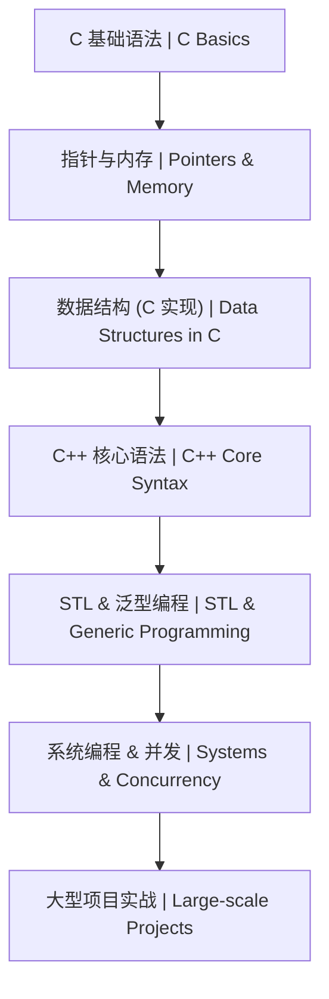

# C/C++ 学习路线图 | C/C++ Learning Roadmap

本文档展示了 C 与 C++ 系统编程的学习路径。

## 1. 学习顺序 | Learning Order

## 2. 详细路径 | Detailed Path

| 阶段 (Stage) | 知识点 (Topic) | 预计耗时 (Estimated Time) | 前置要求 (Prerequisites) |
| :--- | :--- | :--- | :--- |
| 入门 | [C 基础语法体系 (Basics)](./基础/README.md) | 20h | 无 |
| 进阶 | [指针深度解析 (Pointers)](./基础/09-指针.md) | 15h | 基础语法 |
| 初级 | [排序与搜索 (C)](./算法/README.md) | 10h | 指针、数组 |
| 中级 | [C++ 基础体系](../13-C++系统编程/基础/README.md) | 20h | C 基础 |
| 中级 | [STL 实战](../13-C++系统编程/基础/05-模板与STL.md) | 15h | C++ 语法 |
| 高级 | [图论与 DP (C++)](../13-C++系统编程/README.md) | 30h | 数据结构、STL |

## 3. 学习提示 | Tips
- **内存安全**：在 C 中务必手动 `free`；在 C++ 中优先使用 `std::unique_ptr` 或 `std::shared_ptr`。
- **性能优化**：学习使用 `gprof` 或 `valgrind` 进行性能分析与内存泄漏检查。
- **面试重点**：手写 `Quick Sort`, `Smart Pointer`, `String` 类。
