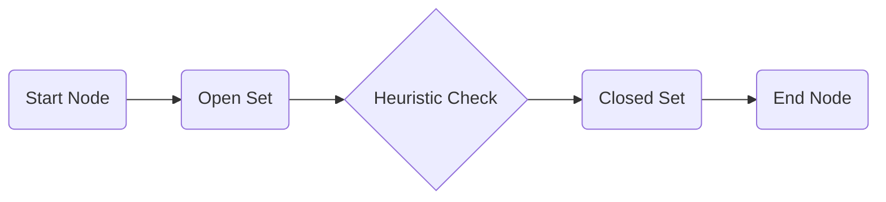

# 算法库 | Algorithms Library (GDScript)

本文档列出了 Godot 引擎中常用的算法实现。

| 算法名称 (Algorithm) | 源码文件 (Source) | 难度 (Difficulty) | 说明 (Description) |
| :--- | :--- | :--- | :--- |
| 冒泡排序 | [bubble_sort_gd.gd](./bubble_sort_gd.gd) | 基础 | 基础排序示例 |
| A* 路径搜索 | [astar_gd.gd](./astar_gd.gd) | 中级 | 经典的网格路径寻优 |

## 可视化 | Visualization

### A* 搜索过程

