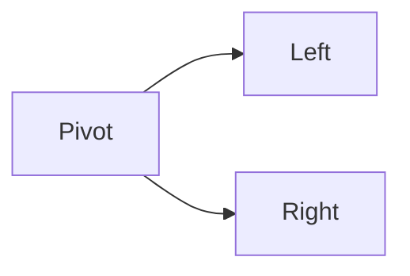
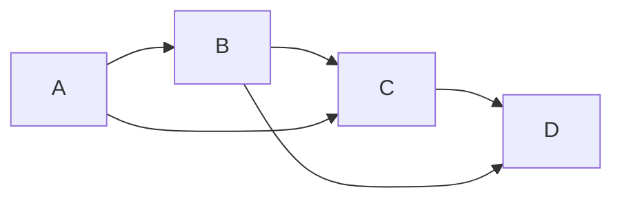

# 03-Python 脚本 | Python Automation & Data Processing

<!--
作者：fanquanpp
创建日期：2026-04-05
版本：v3.0.0
-->

## 1. 项目简介 | Introduction

本模块是 fanquanpp 个人综合学习笔记库中的 Python 脚本部分，专注于 Python 脚本开发、办公自动化和数据处理。作为一种优雅、高效的编程语言，Python 在自动化脚本、数据分析、Web 开发等领域有着广泛应用，本模块旨在为开发者提供从基础语法到高级应用的系统化 Python 学习路径。

This module focuses on Python scripting, office automation, and data processing. As an elegant and efficient programming language, Python is widely used in automation scripts, data analysis, web development, and other fields, and this module aims to provide a systematic Python learning path from basic syntax to advanced applications.

### 模块定位

- **Python 学习指南**：从环境搭建到核心语法，全面覆盖 Python 核心知识点
- **自动化脚本资源**：提供办公自动化、文件处理等实用脚本示例
- **数据处理工具**：收录数据分析、处理和可视化的实践案例
- **算法与数据结构**：提供经典算法和数据结构的 Python 实现

**使用说明：**

- 本模块已开放为公共资源，允许他人访问和克隆
- 禁止直接修改本仓库内容
- 他人使用本模块内容时出现的任何问题与作者无关

## 2. 学习路线图 | Learning Roadmap


### 详细路径 | Detailed Path

| 阶段 (Stage) | 知识点 (Topic) | 预计耗时 (Estimated Time) | 前置要求 (Prerequisites) |
| :--- | :--- | :--- | :--- |
| 入门 | Python 基础知识体系 | 10h | 无 |
| 初级 | 排序算法 | 5h | 基础语法 |
| 初级 | 搜索算法 | 5h | 基础语法 |
| 中级 | 动态规划 | 15h | 递归、数组 |
| 中级 | 图论基础 | 15h | 队列、栈 |
| 高级 | 高级数据结构 | 20h | 指针、树、图 |

### 学习提示 | Tips
- **代码重构**：尝试使用 Python 的 `list comprehension` 优化代码。
- **单元测试**：使用 `pytest` 运行所有算法示例。
- **面试重点**：掌握 `Binary Search`, `Quick Sort`, `DFS/BFS` 的手写实现。

## 3. 目录索引 | Directory Index

### 基础语法 | Basics
- [C03_101-概述与环境.md](./C03_101-概述与环境.md)
- [C03_102-程序结构与基础语法.md](./C03_102-程序结构与基础语法.md)
- [C03_103-基础数据类型.md](./C03_103-基础数据类型.md)
- [C03_104-变量与常量.md](./C03_104-变量与常量.md)
- [C03_105-运算符与表达式.md](./C03_105-运算符与表达式.md)
- [C03_106-控制流.md](./C03_106-控制流.md)
- [C03_107-函数与Lambda.md](./C03_107-函数与Lambda.md)
- [C03_108-内置数据结构.md](./C03_108-内置数据结构.md)
- [C03_109-推导式与生成器.md](./C03_109-推导式与生成器.md)
- [C03_110-面向对象.md](./C03_110-面向对象.md)
- [C03_111-异常处理.md](./C03_111-异常处理.md)
- [C03_112-文件IO与with.md](./C03_112-文件IO与with.md)
- [C03_113-模块与包.md](./C03_113-模块与包.md)

### 算法与数据结构 | Algorithms & Data Structures
- [SFDE03_301-binary_search_py.py](./算法与数据结构/代码示例/SFDE03_301-binary_search_py.py)
- [SFDE03_302-quick_sort_py.py](./算法与数据结构/代码示例/SFDE03_302-quick_sort_py.py)
- [SFDE03_303-merge_sort_py.py](./算法与数据结构/代码示例/SFDE03_303-merge_sort_py.py)
- [SFDE03_304-heap_sort_py.py](./算法与数据结构/代码示例/SFDE03_304-heap_sort_py.py)
- [SFDE03_305-dfs_bfs_py.py](./算法与数据结构/代码示例/SFDE03_305-dfs_bfs_py.py)
- [SFDE03_306-dijkstra_py.py](./算法与数据结构/代码示例/SFDE03_306-dijkstra_py.py)
- [SFDE03_307-prim_py.py](./算法与数据结构/代码示例/SFDE03_307-prim_py.py)
- [SFDE03_308-kruskal_py.py](./算法与数据结构/代码示例/SFDE03_308-kruskal_py.py)
- [SFDE03_309-knapsack_01_py.py](./算法与数据结构/代码示例/SFDE03_309-knapsack_01_py.py)
- [SFDE03_310-lcs_py.py](./算法与数据结构/代码示例/SFDE03_310-lcs_py.py)
- [SFDE03_311-lis_py.py](./算法与数据结构/代码示例/SFDE03_311-lis_py.py)
- [SFDE03_312-kmp_py.py](./算法与数据结构/代码示例/SFDE03_312-kmp_py.py)
- [SFDE03_401-binary_search_tree_py.py](./算法与数据结构/代码示例/SFDE03_401-binary_search_tree_py.py)
- [SFDE03_402-fenwick_tree_py.py](./算法与数据结构/代码示例/SFDE03_402-fenwick_tree_py.py)
- [SFDE03_403-heap_py.py](./算法与数据结构/代码示例/SFDE03_403-heap_py.py)
- [SFDE03_404-linked_list_py.py](./算法与数据结构/代码示例/SFDE03_404-linked_list_py.py)
- [SFDE03_405-segment_tree_py.py](./算法与数据结构/代码示例/SFDE03_405-segment_tree_py.py)
- [SFDE03_406-trie_py.py](./算法与数据结构/代码示例/SFDE03_406-trie_py.py)
- [SFDE03_407-union_find_py.py](./算法与数据结构/代码示例/SFDE03_407-union_find_py.py)

## 3. 基础篇详细内容 | Basics Details

### 3.1 基础篇概述 | Basics Overview

Python 基础篇涵盖了 Python 语言的核心语法、内置数据结构及工程化基础，包括环境搭建、程序结构、数据类型、控制流、函数、面向对象编程、异常处理、文件操作和模块管理等内容。通过学习基础篇，你将掌握 Python 的基本使用方法，为后续的进阶学习打下基础。

### 3.2 目录索引 | Directory Index

| 序号 | 文件名 | 描述 |
| :--- | :--- | :--- |
| 01 | [C03_101-概述与环境.md](./C03_101-概述与环境.md) | Python 历史特点、应用场景、环境搭建、虚拟环境配置 |
| 02 | [C03_102-程序结构与基础语法.md](./C03_102-程序结构与基础语法.md) | 程序结构、PEP 8 规范、缩进、注释、标识符命名 |
| 03 | [C03_103-基础数据类型.md](./C03_103-基础数据类型.md) | 数字、字符串、布尔值、None、类型转换 |
| 04 | [C03_104-变量与常量.md](./C03_104-变量与常量.md) | 变量绑定、命名规范、常量约定、作用域 |
| 05 | [C03_105-运算符与表达式.md](./C03_105-运算符与表达式.md) | 算术运算符、比较运算符、逻辑运算符、表达式与优先级 |
| 06 | [C03_106-控制流.md](./C03_106-控制流.md) | if-elif-else、match-case、for/while 循环、推导式 |
| 07 | [C03_107-函数与Lambda.md](./C03_107-函数与Lambda.md) | 函数定义、参数类型、Lambda 表达式、递归、作用域 |
| 08 | [C03_108-内置数据结构.md](./C03_108-内置数据结构.md) | list、dict、set、tuple、切片操作、常用方法 |
| 09 | [C03_109-推导式与生成器.md](./C03_109-推导式与生成器.md) | 列表推导式、字典推导式、集合推导式、迭代器、生成器、yield |
| 10 | [C03_110-面向对象.md](./C03_110-面向对象.md) | 类与实例、属性与方法、继承、多态、魔术方法 |
| 11 | [C03_111-异常处理.md](./C03_111-异常处理.md) | try-except-finally、raise 语句、自定义异常 |
| 12 | [C03_112-文件IO与with.md](./C03_112-文件IO与with.md) | 文件模式、with 上下文管理器、编码处理、路径操作 |
| 13 | [C03_113-模块与包.md](./C03_113-模块与包.md) | import 机制、包结构、依赖管理基础 |

### 3.3 学习路线 | Learning Path

```
概述与环境 → 程序结构与基础语法 → 基础数据类型 → 变量与常量 → 运算符与表达式 → 控制流 → 函数与Lambda → 内置数据结构 → 推导式与生成器 → 面向对象 → 异常处理 → 文件IO与with → 模块与包
```

### 3.4 核心知识点 | Core Knowledge Points

#### 3.4.1 概述与环境

- Python 的发展历史和特点
- Python 的应用场景和优势
- Python 环境的搭建和配置
- 虚拟环境的创建和使用
- Python 版本的选择和管理

#### 3.4.2 程序结构与基础语法

- Python 程序的基本结构
- PEP 8 编码规范
- 缩进的重要性和规范
- 注释的使用方法
- 标识符的命名规则
- 关键字和保留字

#### 3.4.3 基础数据类型

- 数字类型（整数、浮点数、复数）
- 字符串类型及其操作
- 布尔类型和逻辑值
- None 类型
- 类型转换（隐式转换、显式转换）
- 类型判断

#### 3.4.4 变量与常量

- 变量的定义和赋值
- 变量的命名规范
- 常量的约定和使用
- 变量的作用域（局部作用域、全局作用域）
- 变量的生命周期

#### 3.4.5 运算符与表达式

- 算术运算符
- 比较运算符
- 逻辑运算符
- 赋值运算符
- 位运算符
- 成员运算符和身份运算符
- 运算符的优先级和结合性

#### 3.4.6 控制流

- 条件语句（if-elif-else）
- 模式匹配（match-case）
- 循环语句（for、while）
- 循环控制（break、continue、pass）
- 推导式（列表推导式、字典推导式、集合推导式）

#### 3.4.7 函数与Lambda

- 函数的定义和调用
- 函数参数（位置参数、关键字参数、默认参数、可变参数）
- 函数返回值
- Lambda 表达式
- 递归函数
- 函数作用域和闭包
- 装饰器的基本概念

#### 3.4.8 内置数据结构

- 列表（list）的操作和方法
- 字典（dict）的操作和方法
- 集合（set）的操作和方法
- 元组（tuple）的操作和方法
- 切片操作
- 内置数据结构的性能特点

#### 3.4.9 推导式与生成器

- 列表推导式
- 字典推导式
- 集合推导式
- 迭代器的概念和使用
- 生成器的定义和使用
- yield 语句的作用
- 生成器表达式

#### 3.4.10 面向对象

- 类的定义和使用
- 实例的创建和初始化
- 属性和方法
- 继承和多态
- 魔术方法（__init__、__str__、__repr__ 等）
- 类变量和实例变量
- 访问控制（私有属性和方法）

#### 3.4.11 异常处理

- 异常的概念和类型
- try-except-finally 语句
- raise 语句
- 自定义异常
- 异常的捕获和处理策略

#### 3.4.12 文件IO与with

- 文件的打开和关闭
- 文件模式（r、w、a、b 等）
- with 上下文管理器
- 文件的读写操作
- 编码处理
- 路径操作

#### 3.4.13 模块与包

- 模块的概念和导入
- import 语句的使用
- 包的结构和创建
- __init__.py 文件的作用
- 相对导入和绝对导入
- 依赖管理基础

### 3.5 学习建议 | Learning Suggestions

1. **循序渐进**：按照学习路线的顺序学习，从概述与环境开始，逐步掌握 Python 的各种特性
2. **实践为主**：多编写代码，通过实际项目练习加深对 Python 概念的理解
3. **重点关注**：特别关注函数式编程和面向对象编程，这是 Python 的核心特性
4. **查阅文档**：遇到问题时，参考 Python 官方文档和相关资源
5. **代码规范**：遵循 PEP 8 编码规范，提高代码的可读性和可维护性
6. **工具使用**：学习使用 Python 相关工具，如虚拟环境、包管理器等

### 3.6 延伸阅读 | Further Reading

- [Python 官方文档](https://docs.python.org/3/) <!-- nofollow -->
- [PEP 8 编码规范](https://peps.python.org/pep-0008/) <!-- nofollow -->
- [Python 标准库](https://docs.python.org/3/library/) <!-- nofollow -->
- [Real Python](https://realpython.com/) <!-- nofollow -->

### 3.7 小结 | Summary

Python 基础篇提供了 Python 语言的核心概念和基本语法，是学习 Python 的起点。通过学习基础篇，你已经了解了 Python 的环境搭建、程序结构、数据类型、控制流、函数、面向对象编程、异常处理、文件操作和模块管理等内容，为后续的进阶学习打下了基础。

在学习过程中，要注重实践，通过实际项目来巩固所学知识，同时要关注 Python 的最佳实践，以编写高质量的 Python 代码。Python 的语法简洁明了，生态系统丰富，是一门非常适合初学者的编程语言，也是专业开发者的重要工具。

## 4. 数据结构详细内容 | Data Structures Details

### 4.1 数据结构列表 | Data Structure List

| 结构名称 | 源码文件 | 难度 | 标签 | 说明 |
| :--- | :--- | :--- | :--- | :--- |
| **二叉搜索树** | [SFDE03_401-binary_search_tree_py.py](./算法与数据结构/代码示例/SFDE03_401-binary_search_tree_py.py) | 进阶 | 树 | 插入、查询、遍历与典型应用 |
| **树状数组** | [SFDE03_402-fenwick_tree_py.py](./算法与数据结构/代码示例/SFDE03_402-fenwick_tree_py.py) | 进阶 | 区间 | 前缀和、单点更新、区间查询 |
| **堆** | [SFDE03_403-heap_py.py](./算法与数据结构/代码示例/SFDE03_403-heap_py.py) | 基础 | 堆 | 最小/最大堆的基本操作 |
| **单向链表** | [SFDE03_404-linked_list_py.py](./算法与数据结构/代码示例/SFDE03_404-linked_list_py.py) | 基础 | 链表 | 单链表的实现与操作 |
| **线段树** | [SFDE03_405-segment_tree_py.py](./算法与数据结构/代码示例/SFDE03_405-segment_tree_py.py) | 进阶 | 区间 | 区间查询与区间更新 |
| **字典树** | [SFDE03_406-trie_py.py](./算法与数据结构/代码示例/SFDE03_406-trie_py.py) | 进阶 | 字符串 | 前缀匹配、插入、查询 |
| **并查集** | [SFDE03_407-union_find_py.py](./算法与数据结构/代码示例/SFDE03_407-union_find_py.py) | 进阶 | 图论 | 路径压缩与按秩合并优化 |

### 4.2 运行指南 | How to Run
```bash
# 运行数据结构示例
python 算法与数据结构/代码示例/SFDE03_404-linked_list_py.py
python 算法与数据结构/代码示例/SFDE03_407-union_find_py.py
```

## 5. 算法详细内容 | Algorithms Details

### 5.1 算法列表 | Algorithm List

| 算法名称 | 源码文件 | 难度 | 标签 | 说明 |
| :--- | :--- | :--- | :--- | :--- |
| 快速排序 | [SFDE03_302-quick_sort_py.py](./算法与数据结构/代码示例/SFDE03_302-quick_sort_py.py) | 中级 | 排序 | 分治法经典实现 |
| 二分搜索 | [SFDE03_301-binary_search_py.py](./算法与数据结构/代码示例/SFDE03_301-binary_search_py.py) | 基础 | 搜索 | 有序数组查找 |
| 归并排序 | [SFDE03_303-merge_sort_py.py](./算法与数据结构/代码示例/SFDE03_303-merge_sort_py.py) | 中级 | 排序 | 稳定分治排序 |
| 堆排序 | [SFDE03_304-heap_sort_py.py](./算法与数据结构/代码示例/SFDE03_304-heap_sort_py.py) | 高级 | 排序 | 基于二叉堆排序 |
| DFS/BFS | [SFDE03_305-dfs_bfs_py.py](./算法与数据结构/代码示例/SFDE03_305-dfs_bfs_py.py) | 中级 | 搜索 | 图/树遍历基础 |
| 狄克斯特拉 | [SFDE03_306-dijkstra_py.py](./算法与数据结构/代码示例/SFDE03_306-dijkstra_py.py) | 高级 | 图论 | 单源最短路径 |
| 普里姆算法 | [SFDE03_307-prim_py.py](./算法与数据结构/代码示例/SFDE03_307-prim_py.py) | 高级 | 图论 | 最小生成树 |
| 克鲁斯卡尔 | [SFDE03_308-kruskal_py.py](./算法与数据结构/代码示例/SFDE03_308-kruskal_py.py) | 高级 | 图论 | 最小生成树 |
| 0/1 背包 | [SFDE03_309-knapsack_01_py.py](./算法与数据结构/代码示例/SFDE03_309-knapsack_01_py.py) | 中级 | 动态规划 | 经典资源分配问题 |
| LCS | [SFDE03_310-lcs_py.py](./算法与数据结构/代码示例/SFDE03_310-lcs_py.py) | 中级 | 动态规划 | 最长公共子序列 |
| LIS | [SFDE03_311-lis_py.py](./算法与数据结构/代码示例/SFDE03_311-lis_py.py) | 中级 | 动态规划 | 最长递增子序列 |
| KMP 算法 | [SFDE03_312-kmp_py.py](./算法与数据结构/代码示例/SFDE03_312-kmp_py.py) | 高级 | 字符串 | 高效模式匹配 |

### 5.2 运行指南 | How to Run
```bash
# 运行算法示例
python 算法与数据结构/代码示例/SFDE03_302-quick_sort_py.py
python 算法与数据结构/代码示例/SFDE03_301-binary_search_py.py
```

### 5.3 算法可视化 | Visualization

#### 5.3.1 快速排序 | Quick Sort


#### 5.3.2 归并排序 | Merge Sort


#### 5.3.3 狄克斯特拉 | Dijkstra


## 6. 环境要求 | Environment Requirements

- **操作系统**：Windows 10+, Ubuntu 22.04+, macOS 14+
- **运行时**：Python 3.10 / 3.12+
- **最小配置**：1 核心 CPU / 1GB 内存 / 1GB 磁盘

## 7. 快速开始 | Quick Start

```bash
# 1. 验证 Python 版本
python --version

# 2. 运行首个脚本
python -c "print('Hello, Pythonic World!')"

# 3. 创建并进入虚拟环境
python -m venv .venv
source .venv/bin/activate  # Linux/macOS
.venv\Scripts\activate     # Windows
```

## 8. 学习路线 | Learning Path

`概述与环境` → `程序结构与基础语法` → `基础数据类型` → `变量与常量` → `运算符与表达式` → `控制流` → `函数与Lambda` → `内置数据结构` → `推导式与生成器` → `面向对象` → `异常处理` → `文件IO与with` → `模块与包` → `算法实现` → `数据结构`

## 9. 核心特色 | Key Features

- **脚本自动化**：专注于办公自动化、文件处理等实用脚本开发
- **数据处理**：提供数据分析、处理和可视化的实践案例
- **生态丰富**：涵盖 Python 丰富的第三方库和工具生态
- **代码简洁**：强调 Python 优雅、简洁的语法风格
- **跨平台**：确保代码在 Windows、Linux、macOS 上的可移植性
- **性能优化**：收录 Python 性能优化的最佳实践和技巧
- **双语注释**：关键概念和代码提供中英文对照注释

## 10. 阅读建议 | Reading Guide

1. 按照学习路线的顺序学习，从概述与环境开始，逐步掌握 Python 的各种特性
2. 结合实际项目练习，加深对 Python 概念的理解
3. 特别关注函数与模块和面向对象部分，这是 Python 编程的核心
4. 尝试使用 Python 实现一些自动化脚本，巩固所学知识

## 11. 延伸阅读 | Further Reading

- [Python 官方文档](https://docs.python.org/3/) <!-- nofollow -->
- [PEP 8 编码规范](https://peps.python.org/pep-0008/) <!-- nofollow -->
- [Real Python](https://realpython.com/) <!-- nofollow -->

## 12. 贡献指南 | Contribution Guide

- **编码规范**：严格遵循 [PEP 8](https://peps.python.org/pep-0008/)
- **提交规范**：使用 Conventional Commits
- **Lint 工具**：推荐使用 `ruff` 或 `flake8`
- **测试**：提供完整的测试用例

## 13. 联系方式 | Contact Information

- 邮箱：<fanquanpangpiing@163.com>
- QQ：1839243393
- 欢迎提意见交流或反馈问题

## 14. 许可证信息 | License

- **SPDX-Identifier**：[CC-BY-NC-SA-4.0](https://creativecommons.org/licenses/by-nc-sa/4.0/)
- **Copyright**：2024-2026 fanquanpp

---

**更新日志 | Changelog**

- 2026-04-18: 完成GitHub仓库3.0结构优化规划，统一文件命名规范，优化目录结构，升级为 v3.0.0
- 2026-04-06: 深度优化 README.md 文件，完善结构和内容，增加仓库定位、使用说明等部分，升级为 v1.0.2
- 2026-04-06: 更新优化 README.md 文件，完善目录索引和内容结构，升级为 v1.0.1
- 2026-04-05: 体系化升级 README，补全分册索引、环境要求与快速开始
- 2026-10-04: 更新优化 README.md 文件，统一结构和格式
