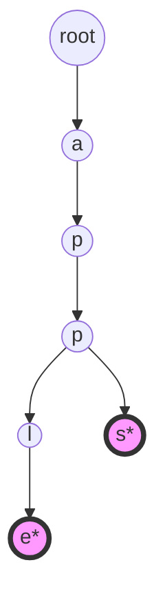
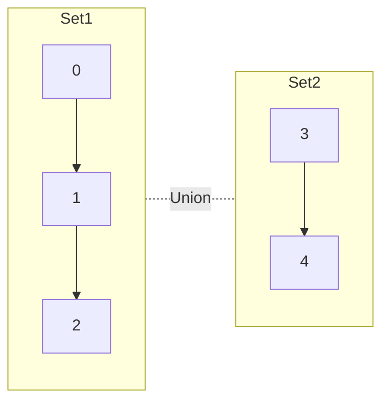

# 数据结构库 | Data Structures Library (Python)

本文档列出了 Python 语言实现的核心数据结构及其说明。

| 数据结构 (Data Structure) | 源码文件 (Source) | 难度 (Difficulty) | 标签 (Tags) | 说明 (Description) |
| :--- | :--- | :--- | :--- | :--- |
| 单链表 / 双向链表 | [linked_list_py.py](./linked_list_py.py) | 基础 | 链表 | 支持插入、删除、反转 |
| 字典树 (Trie) | [trie_py.py](./trie_py.py) | 中级 | 树 / 字符串 | 高效前缀搜索与自动补全 |
| 并查集 (Union-Find) | [union_find_py.py](./union_find_py.py) | 中级 | 集合 | 路径压缩与按秩合并优化 |
| 线段树 (Segment Tree) | [segment_tree_py.py](./segment_tree_py.py) | 高级 | 树 | 区间查询与单点更新 |
| 树状数组 (Fenwick Tree) | [fenwick_tree_py.py](./fenwick_tree_py.py) | 高级 | 树 | 区间和查询与单点增加 |
| 二叉搜索树 (BST) | [binary_search_tree_py.py](./binary_search_tree_py.py) | 中级 | 树 | 左小右大，支持有序遍历 |
| 最小堆 (Min-Heap) | [heap_py.py](./heap_py.py) | 中级 | 堆 | 支持高效获取最小值 |

## 数据结构可视化 | Visualization

### 字典树 (Trie)

*注：标记为 * 的节点表示一个单词的结尾。*

### 并查集 (Union-Find)


### 树状数组 (Fenwick Tree)
```ascii
    C[1] C[2] C[3] C[4] C[5] C[6] C[7] C[8]
     |    |    |    |    |    |    |    |
    A[1] A[2] A[3] A[4] A[5] A[6] A[7] A[8]
    
    C[1] = A[1]
    C[2] = A[1] + A[2]
    C[3] = A[3]
    C[4] = A[1] + A[2] + A[3] + A[4]
```
