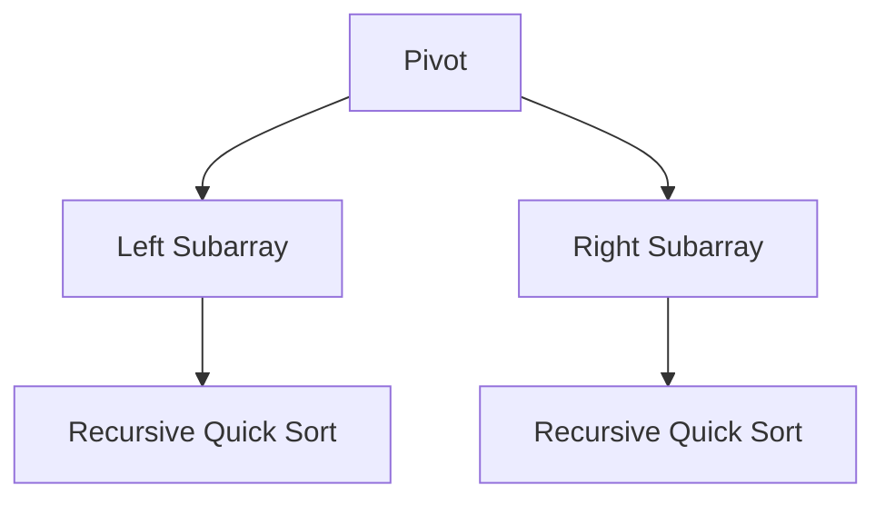
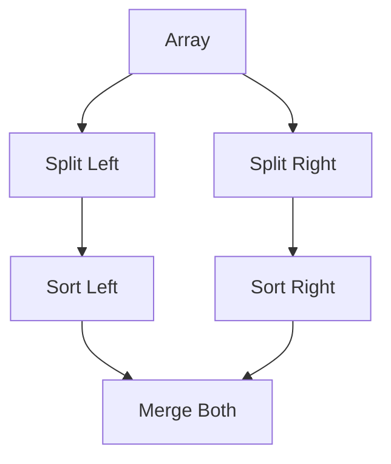
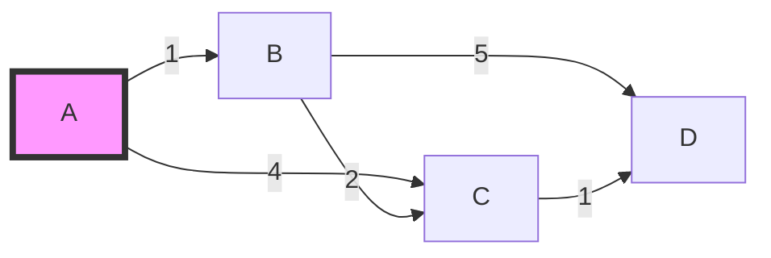

# Python 算法实现 (Python Algorithms)

> 此目录收录了使用 Python 实现的经典算法。

## 1. 算法列表 (Algorithm List)

| 算法名称 | 源码文件 | 难度 | 标签 | 说明 |
| :--- | :--- | :--- | :--- | :--- |
| 快速排序 | [quick_sort_py.py](./quick_sort_py.py) | 中级 | 排序 | 分治法经典实现 |
| 二分搜索 | [binary_search_py.py](./binary_search_py.py) | 基础 | 搜索 | 有序数组查找 |
| 归并排序 | [merge_sort_py.py](./merge_sort_py.py) | 中级 | 排序 | 稳定分治排序 |
| 堆排序 | [heap_sort_py.py](./heap_sort_py.py) | 高级 | 排序 | 基于二叉堆排序 |
| DFS/BFS | [dfs_bfs_py.py](./dfs_bfs_py.py) | 中级 | 搜索 | 图/树遍历基础 |
| 狄克斯特拉 | [dijkstra_py.py](./dijkstra_py.py) | 高级 | 图论 | 单源最短路径 |
| 普里姆算法 | [prim_py.py](./prim_py.py) | 高级 | 图论 | 最小生成树 |
| 克鲁斯卡尔 | [kruskal_py.py](./kruskal_py.py) | 高级 | 图论 | 最小生成树 |
| 0/1 背包 | [knapsack_01_py.py](./knapsack_01_py.py) | 中级 | 动态规划 | 经典资源分配问题 |
| LCS | [lcs_py.py](./lcs_py.py) | 中级 | 动态规划 | 最长公共子序列 |
| LIS | [lis_py.py](./lis_py.py) | 中级 | 动态规划 | 最长递增子序列 |
| KMP 算法 | [kmp_py.py](./kmp_py.py) | 高级 | 字符串 | 高效模式匹配 |

## 2. 运行指南 (How to Run)
```bash
# 运行算法示例
python quick_sort_py.py
python binary_search_py.py
```

## 3. 算法可视化 | Visualization

### 快速排序 (Quick Sort)


### 归并排序 (Merge Sort)


### 狄克斯特拉 (Dijkstra)

*注：从 A 到 D 的最短路径为 A -> B -> C -> D，总权重为 1+2+1=4。*

---
### 更新日志 (Changelog)
- 2026-04-06: 更新优化 README.md 文件，完善内容结构和格式
