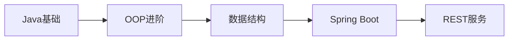

# 04-Java 后端开发 | Java Backend Development

> @Author: fanquanpp
> @Version: v3.0.0
> @Created: 2026-04-05

## 1. 项目简介 | Introduction

本模块是 fanquanpp 个人综合学习笔记库中的 Java 后端开发部分，专注于 Java 语言核心知识点、面向对象编程思想、JVM 基础、多线程编程、集合框架以及 Spring Boot 等后端开发技术。作为企业级应用开发的主流语言，Java 以其稳定性、可扩展性和丰富的生态系统而广泛应用于后端服务开发，本模块旨在为开发者提供从入门到进阶的系统化学习路径。

This module focuses on Java core concepts, object-oriented programming, JVM fundamentals, multithreading, collection framework, and Spring Boot backend development technologies. As a mainstream language for enterprise application development, Java is widely used in backend service development for its stability, scalability, and rich ecosystem, and this module aims to provide a systematic learning path from beginner to advanced levels.

### 模块定位

- **Java 后端开发指南**：从基础语法到高级特性，全面覆盖 Java 后端开发核心知识点
- **企业级应用开发资源**：提供构建稳定、可扩展的企业级后端服务的技术支持
- **JVM 与性能优化**：重点讲解 JVM 内存模型、垃圾回收机制和性能优化策略
- **Spring Boot 实战**：包含 Spring Boot 框架的核心使用和实战示例

**使用说明：**

- 本模块已开放为公共资源，允许他人访问和克隆
- 禁止直接修改本仓库内容
- 他人使用本模块内容时出现的任何问题与作者无关


## 2. 学习路线图 | Learning Roadmap



### 详细路径 | Detailed Path

| 阶段 (Stage) | 知识点 (Topic) | 预计耗时 (Estimated Time) | 前置要求 (Prerequisites) |
| :--- | :--- | :--- | :--- |
| 入门 | Java 基础知识体系 | 30h | 无 |
| 进阶 | 数据结构与算法 (Java) | 20h | 基础语法 |
| 框架 | Spring Boot 核心实战 | 25h | Java 基础 |

### 学习提示 | Tips
- **代码重构**：尝试使用 Java 8+ 的 `Stream API` 和 `Optional` 来简化逻辑。
- **并发编程**：重点掌握 `CompletableFuture` 和 `ThreadLocal` 的使用场景。
- **项目实战**：通过构建一个简单的 `Todo List API` 来实践 Spring Boot 核心组件。

## 3. 目录索引 | Directory Index

### 基础语法 | Basics

- [V_04-Java名词注释查阅表.md](./V_04-Java名词注释查阅表.md)
- [C04_101-概述与环境.md](./C04_101-概述与环境.md)
- [C04_102-程序结构与基础语法.md](./C04_102-程序结构与基础语法.md)
- [C04_103-数据类型与类型转换.md](./C04_103-数据类型与类型转换.md)
- [C04_104-变量与常量.md](./C04_104-变量与常量.md)
- [C04_105-运算符与表达式.md](./C04_105-运算符与表达式.md)
- [C04_106-控制流.md](./C04_106-控制流.md)
- [C04_107-方法与递归.md](./C04_107-方法与递归.md)
- [C04_108-数组与多维数组.md](./C04_108-数组与多维数组.md)
- [C04_109-面向对象基础.md](./C04_109-面向对象基础.md)
- [C04_110-抽象类与接口.md](./C04_110-抽象类与接口.md)
- [C04_111-异常处理.md](./C04_111-异常处理.md)
- [C04_112-集合框架.md](./C04_112-集合框架.md)
- [C04_113-多线程.md](./C04_113-多线程.md)
- [C04_114-IO流.md](./C04_114-IO流.md)
- [C04_115-JVM内存模型.md](./C04_115-JVM内存模型.md)
- [C04_116-泛型.md](./C04_116-泛型.md)
- [C04_117-Swing图形界面.md](./C04_117-Swing图形界面.md)

### 高级特性 | Advanced
- [G04_201-SpringBoot核心实战.md](./G04_201-SpringBoot核心实战.md)
- [G04_202-SpringCloud微服务.md](./G04_202-SpringCloud微服务.md)

### 算法与数据结构 | Algorithms & Data Structures
- [SFDE04_301-binary_search_java.java](./算法与数据结构/代码示例/SFDE04_301-binary_search_java.java)
- [SFDE04_302-quick_sort_java.java](./算法与数据结构/代码示例/SFDE04_302-quick_sort_java.java)
- [SFDE04_401-linked_list_java.java](./算法与数据结构/代码示例/SFDE04_401-linked_list_java.java)
- [SFDE04_402-union_find_java.java](./算法与数据结构/代码示例/SFDE04_402-union_find_java.java)

### 快速入门
- [C04_100-快速入门.md](./C04_100-快速入门.md)

## 3. 基础篇详细内容 | Basics Details

### 3.1 基础篇概述 | Basics Overview

Java 基础篇涵盖了 Java 语言的核心语法、面向对象编程及 JVM 相关知识，包括环境搭建、程序结构、数据类型、控制流、方法、数组、面向对象基础、抽象类与接口、异常处理、集合框架、多线程、I/O 流、JVM 内存模型和 Swing 图形界面等内容。通过学习基础篇，你将掌握 Java 的基本使用方法，为后续的后端开发学习打下基础。

### 3.2 目录索引 | Directory Index

| 序号 | 文件名 | 描述 |
| :--- | :--- | :--- |
| 01 | [C04_101-概述与环境.md](./C04_101-概述与环境.md) | Java 历史、特点、JDK/JRE/JVM 区别、环境搭建 |
| 02 | [C04_102-程序结构与基础语法.md](./C04_102-程序结构与基础语法.md) | 程序结构、标识符、关键字、注释、Scanner 录入 |
| 03 | [C04_103-数据类型与类型转换.md](./C04_103-数据类型与类型转换.md) | 8 种基本数据类型、自动类型转换、强制类型转换 |
| 04 | [C04_104-变量与常量.md](./C04_104-变量与常量.md) | 变量作用域、生命周期、final 常量、var 类型推断 |
| 05 | [C04_105-运算符与表达式.md](./C04_105-运算符与表达式.md) | 算术运算符、位运算符、优先级、三元运算符 |
| 06 | [C04_106-控制流.md](./C04_106-控制流.md) | 分支语句、循环语句、Java 12+ Switch 表达式 |
| 07 | [C04_107-方法与递归.md](./C04_107-方法与递归.md) | 方法定义、值传递、方法重载、递归、可变参数 |
| 08 | [C04_108-数组与多维数组.md](./C04_108-数组与多维数组.md) | 一维数组、二维数组、内存布局、Arrays 工具类 |
| 09 | [C04_109-面向对象基础.md](./C04_109-面向对象基础.md) | 封装、继承、多态、this 关键字、super 关键字 |
| 10 | [C04_110-抽象类与接口.md](./C04_110-抽象类与接口.md) | 抽象类、接口、接口默认方法、静态方法、多实现 |
| 11 | [C04_111-异常处理.md](./C04_111-异常处理.md) | try-with-resources、自定义异常、异常抛出机制 |
| 12 | [C04_112-集合框架.md](./C04_112-集合框架.md) | List、Set、Map 体系、常用类源码分析 |
| 13 | [C04_113-多线程.md](./C04_113-多线程.md) | 线程创建、同步锁、线程池入门 |
| 14 | [C04_114-IO流.md](./C04_114-IO流.md) | 字节流、字符流、序列化、NIO 基础 |
| 15 | [C04_115-JVM内存模型.md](./C04_115-JVM内存模型.md) | JMM 区域划分、堆内存结构、GC 算法 |
| 16 | [C04_116-泛型.md](./C04_116-泛型.md) | 泛型基础、类型擦除、PECS 原则、通配符边界 |
| 17 | [C04_117-Swing图形界面.md](./C04_117-Swing图形界面.md) | 组件、布局、事件处理、实战示例 |

### 3.3 学习路线 | Learning Path

```
概述与环境 → 程序结构与基础语法 → 数据类型与类型转换 → 变量与常量 → 运算符与表达式 → 控制流 → 方法与递归 → 数组与多维数组 → 面向对象基础 → 抽象类与接口 → 异常处理 → 集合框架 → 多线程 → IO流 → JVM内存模型 → 泛型 → Swing图形界面
```

### 3.4 核心知识点 | Core Knowledge Points

#### 3.4.1 概述与环境

- Java 的发展历史和特点
- JDK、JRE、JVM 的区别
- Java 环境的搭建和配置
- Java 版本的选择和管理
- IDE 的选择和使用

#### 3.4.2 程序结构与基础语法

- Java 程序的基本结构
- 包的概念和使用
- 标识符的命名规则
- 关键字和保留字
- 注释的使用方法
- Scanner 类的使用

#### 3.4.3 数据类型与类型转换

- 8 种基本数据类型
- 引用数据类型
- 自动类型转换
- 强制类型转换
- 类型转换的注意事项

#### 3.4.4 变量与常量

- 变量的定义和初始化
- 变量的作用域和生命周期
- final 常量
- var 类型推断
- 变量的命名规范

#### 3.4.5 运算符与表达式

- 算术运算符
- 关系运算符和逻辑运算符
- 位运算符
- 赋值运算符
- 三元运算符
- 运算符的优先级和结合性

#### 3.4.6 控制流

- 分支语句（if-else、switch）
- 循环语句（for、while、do-while）
- 循环控制（break、continue）
- Java 12+ Switch 表达式

#### 3.4.7 方法与递归

- 方法的定义和调用
- 方法参数（值传递）
- 方法重载
- 递归方法
- 可变参数
- 方法的返回值

#### 3.4.8 数组与多维数组

- 一维数组的定义和使用
- 二维数组的定义和使用
- 数组的内存布局
- Arrays 工具类的使用
- 数组的遍历和操作

#### 3.4.9 面向对象基础

- 面向对象编程的概念
- 类的定义和使用
- 对象的创建和初始化
- 封装
- 继承
- 多态
- this 关键字和 super 关键字

#### 3.4.10 抽象类与接口

- 抽象类的定义和使用
- 接口的定义和使用
- 接口默认方法和静态方法
- 多实现
- 抽象类与接口的区别

#### 3.4.11 异常处理

- 异常的概念和类型
- try-catch-finally 语句
- try-with-resources 语句
- 自定义异常
- 异常的抛出和处理
- 异常处理的最佳实践

#### 3.4.12 集合框架

- 集合框架的层次结构
- List 接口及其实现类
- Set 接口及其实现类
- Map 接口及其实现类
- 集合的遍历和操作
- 集合的线程安全性

#### 3.4.13 多线程

- 线程的概念和创建方式
- 线程的生命周期
- 线程同步和锁机制
- 线程池的使用
- 线程安全问题

#### 3.4.14 IO流

- 字节流和字符流
- 流的层次结构
- 文件操作
- 序列化和反序列化
- NIO 基础

#### 3.4.15 JVM 内存模型

- JVM 内存区域划分
- 堆内存结构
- 垃圾收集算法
- 类加载机制
- JVM 调优基础

#### 3.4.16 泛型

- 泛型的基本概念
- 类型擦除
- PECS 原则
- 通配符和边界
- 泛型方法和泛型类

#### 3.4.17 Swing 图形界面

- Swing 组件
- 布局管理器
- 事件处理
- 图形界面的设计和实现
- 实战示例

### 3.5 学习建议 | Learning Suggestions

1. **循序渐进**：按照学习路线的顺序学习，从概述与环境开始，逐步掌握 Java 的各种特性
2. **实践为主**：多编写代码，通过实际项目练习加深对 Java 概念的理解
3. **重点关注**：特别关注面向对象编程和集合框架，这是 Java 的核心特性
4. **查阅文档**：遇到问题时，参考 Java 官方文档和相关资源
5. **代码规范**：遵循 Java 代码规范，提高代码的可读性和可维护性
6. **调试能力**：学习使用调试工具，提高排查问题的能力
7. **性能优化**：了解 JVM 内存模型和垃圾收集，为后续的性能优化打下基础

### 3.6 延伸阅读 | Further Reading

- [Java 官方文档](https://docs.oracle.com/en/java/) <!-- nofollow -->
- [Java 教程](https://docs.oracle.com/javase/tutorial/) <!-- nofollow -->
- [Effective Java](https://www.amazon.com/Effective-Java-3rd-Joshua-Bloch/dp/0134685997) - Joshua Bloch
- [Java 核心技术](https://www.amazon.com/Core-Java-I-Fundamentals-11th/dp/0135166306) - Cay S. Horstmann

### 3.7 小结 | Summary

Java 基础篇提供了 Java 语言的核心概念和基本语法，是学习 Java 后端开发的起点。通过学习基础篇，你已经了解了 Java 的环境搭建、程序结构、数据类型、控制流、方法、数组、面向对象编程、抽象类与接口、异常处理、集合框架、多线程、I/O 流、JVM 内存模型和 Swing 图形界面等内容，为后续的后端开发学习打下了基础。

在学习过程中，要注重实践，通过实际项目来巩固所学知识，同时要关注 Java 的最佳实践，以编写高质量的 Java 代码。Java 是一门面向对象的编程语言，具有跨平台性、安全性和可靠性等特点，是后端开发的主流语言之一。通过不断练习和实践，你将能够熟练掌握 Java 的使用，为后续的后端开发工作做好准备。

## 4. 框架篇详细内容 | Frameworks Details

### 4.1 框架列表 | Framework List

| 框架名称 | 源码/笔记文件 | 核心内容 |
| :--- | :--- | :--- |
| **Spring Boot** | [G04_201-SpringBoot核心实战.md](./G04_201-SpringBoot核心实战.md) | 自动配置、起步依赖、实战应用、监控日志 |
| **Spring Cloud** | [G04_202-SpringCloud微服务.md](./G04_202-SpringCloud微服务.md) | 微服务架构、服务发现、负载均衡 |

### 4.2 学习建议 | Learning Tips
- **底层原理**: 建议先掌握 Java 基础知识后再深入框架源码
- **项目实战**: 结合 Spring Cloud 微服务架构进行实战演练

## 5. 数据结构详细内容 | Data Structures Details

### 5.1 数据结构列表 | Data Structure List

| 结构名称 | 源码文件 | 难度 | 标签 | 说明 |
| :--- | :--- | :--- | :--- | :--- |
| **二分查找** | [SFDE04_301-binary_search_java.java](./算法与数据结构/代码示例/SFDE04_301-binary_search_java.java) | 基础 | 搜索 | 二分查找算法实现 |
| **快速排序** | [SFDE04_302-quick_sort_java.java](./算法与数据结构/代码示例/SFDE04_302-quick_sort_java.java) | 进阶 | 排序 | 快速排序算法实现 |
| **单向链表** | [SFDE04_401-linked_list_java.java](./算法与数据结构/代码示例/SFDE04_401-linked_list_java.java) | 基础 | 链表 | 泛型链表实现 |
| **并查集** | [SFDE04_402-union_find_java.java](./算法与数据结构/代码示例/SFDE04_402-union_find_java.java) | 进阶 | 图论 | 路径压缩与按秩合并优化 |

### 5.2 运行指南 | How to Run
```bash
# 编译并运行
javac SFDE04_401-linked_list_java.java
java SFDE04_401-linked_list_java
```

## 6. 环境要求 | Environment Requirements

- **操作系统**：Windows 10+, Ubuntu 22.04+, macOS 14+
- **运行时**：JDK 17+ (LTS)
- **开发工具**：IntelliJ IDEA, Eclipse, VS Code
- **构建工具**：Maven 3.8+, Gradle 7.0+

## 7. 快速开始 | Quick Start

1. 安装 JDK 17+ 并配置环境变量
2. 编写 `Hello.java` 并编译：`javac Hello.java`
3. 运行：`java Hello`

## 8. 学习路线 | Learning Path

`概述与环境` → `程序结构与基础语法` → `数据类型与类型转换` → `变量与常量` → `运算符与表达式` → `控制流` → `方法与递归` → `数组与多维数组` → `面向对象基础` → `抽象类与接口` → `异常处理` → `集合框架` → `多线程` → `IO流` → `JVM内存模型` → `泛型` → `Swing图形界面` → `SpringBoot核心实战`

## 9. 核心特色 | Key Features

- **企业级应用**：专注于构建稳定、可扩展的企业级后端服务
- **JVM 深度解析**：详细讲解 JVM 内存模型、垃圾回收机制和性能优化
- **Spring 生态**：提供 Spring Boot、Spring Cloud 等主流框架的使用指南
- **多线程并发**：深入讲解 Java 多线程编程和并发安全
- **集合框架**：详细分析 Java 集合框架的设计原理和使用场景
- **Swing 图形界面**：提供组件、布局、事件处理和实战示例
- **双语注释**：关键概念和代码提供中英文对照注释

## 10. 阅读建议 | Reading Guide

1. 按照学习路线的顺序学习，从概述与环境开始，逐步掌握 Java 的各种特性
2. 结合实际项目练习，加深对 Java 概念的理解
3. 特别关注 JVM 内存模型和多线程部分，这是 Java 后端开发的核心
4. 尝试使用 Spring Boot 构建简单的后端服务，巩固所学知识

## 11. 延伸阅读 | Further Reading

- [Oracle Java 官方文档](https://docs.oracle.com/en/java/) <!-- nofollow -->
- [Spring Boot 官方文档](https://spring.io/projects/spring-boot) <!-- nofollow -->
- 本仓库：[10-MySQL](../10-MySQL/README.md)

## 12. 贡献指南 | Contribution Guide

- 代码示例需符合 Google Java Style Guide 规范
- 逻辑解析需配以内存模型图（如栈、堆、方法区）
- 提供完整的 Maven/Gradle 项目结构

## 13. 联系方式 | Contact Information

- 邮箱：<fanquanpangpiing@163.com>
- QQ：1839243393
- 欢迎提意见交流或反馈问题

## 14. 许可证信息 | License

- **SPDX-Identifier**：[CC-BY-NC-SA-4.0](https://creativecommons.org/licenses/by-nc-sa/4.0/)
- **Copyright**：2024-2026 fanquanpp

---

**更新日志 | Changelog**

- **2026-05-02**
  - 全面检查项目结构，确保一致性

- **2026-04-18**
  - 完成 GitHub 仓库 3.0 结构优化规划，统一文件命名规范，优化目录结构，升级为 v3.0.0

- **2026-04-06**
  - 深度优化 README.md 文件，完善结构和内容，增加仓库定位、使用说明等部分，升级为 v1.0.1 ~ v1.0.2

- **2026-04-05**
  - 初始化 Java 基础语法与核心概念笔记

- **2026-10-04**
  - 添加 Swing 图形界面知识点，包含组件、布局、事件处理和实战示例
  - 更新优化 README.md 文件，统一结构和格式
