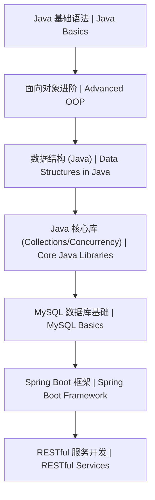

# Java 后端开发学习路线图 | Java Backend Learning Roadmap

本文档展示了 Java 后端开发从入门到 Spring Boot 实战的学习路径。

## 1. 学习顺序 | Learning Order

## 2. 详细路径 | Detailed Path

| 阶段 (Stage) | 知识点 (Topic) | 预计耗时 (Estimated Time) | 前置要求 (Prerequisites) |
| :--- | :--- | :--- | :--- |
| 入门 | [Java 基础知识体系](./基础/README.md) | 30h | 无 |
| 进阶 | [数据结构与算法 (Java)](./数据结构/README.md) | 20h | 基础语法 |
| 框架 | [Spring Boot 核心实战](./框架/01-SpringBoot核心实战.md) | 25h | Java 基础 |

## 3. 学习提示 | Tips
- **代码重构**：尝试使用 Java 8+ 的 `Stream API` 和 `Optional` 来简化逻辑。
- **并发编程**：重点掌握 `CompletableFuture` 和 `ThreadLocal` 的使用场景。
- **项目实战**：通过构建一个简单的 `Todo List API` 来实践 Spring Boot 核心组件。
