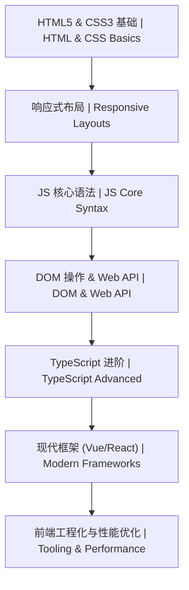

# 05-HTML5 网页开发 | HTML5 Web Development

<!--
作者：fanquanpp
创建日期：2026-04-05
版本：v3.0.0
-->

## 1. 项目简介 | Introduction

本模块是 fanquanpp 个人综合学习笔记库中的 HTML5 网页开发部分，专注于 HTML5 核心标签、语义化结构、表单验证、多媒体处理以及高级 Web API 的学习与应用。作为现代网页开发的基础，HTML5 提供了丰富的语义化标签和强大的 Web API，本模块旨在帮助开发者构建语义化、高性能、可访问的现代网页结构。

This module focuses on HTML5 core tags, semantic structures, form validation, multimedia processing, and advanced Web API learning and application. As the foundation of modern web development, HTML5 provides rich semantic tags and powerful Web APIs, and this module aims to help developers build semantic, high-performance, and accessible modern web page structures.

### 模块定位

- **HTML5 学习指南**：从基础标签到高级 Web API，全面覆盖 HTML5 核心知识点
- **语义化开发资源**：重点讲解语义化标签的使用方法和最佳实践
- **Web API 参考**：提供常用 Web API 的详细使用说明和示例
- **前端框架集成**：包含 Vue 等现代前端框架的实战应用

**使用说明：**

- 本模块已开放为公共资源，允许他人访问和克隆
- 禁止直接修改本仓库内容
- 他人使用本模块内容时出现的任何问题与作者无关

## 2. 学习路线图 | Learning Roadmap



### 详细路径 | Detailed Path

| 阶段 (Stage) | 知识点 (Topic) | 预计耗时 (Estimated Time) | 前置要求 (Prerequisites) |
| :--- | :--- | :--- | :--- |
| 入门 | HTML5 基础体系 | 15h | 无 |
| 进阶 | Vue 核心与实战 | 30h | HTML5, JS |

### 学习提示 | Tips
- **代码重构**：优先使用 ES6+ 的语法特性（解构、箭头函数、模板字符串）。
- **性能优化**：掌握 `Tree-shaking`, `Code Splitting`, `Lazy Loading`。
- **面试重点**：掌握 `Closure`, `Event Loop`, `Promise`, `TypeScript Generics`。
- **实战建议**：使用 `Vite` 构建你的第一个 `Vue` 或 `React` 项目。

## 3. 目录索引 | Directory Index

### 基础语法 | Basics
- [C05_101-概述与语义化.md](./C05_101-概述与语义化.md)
- [C05_102-基础标签与全局属性.md](./C05_102-基础标签与全局属性.md)
- [C05_103-表单与验证.md](./C05_103-表单与验证.md)
- [C05_104-多媒体与Canvas.md](./C05_104-多媒体与Canvas.md)
- [C05_105-存储与WebAPI.md](./C05_105-存储与WebAPI.md)

### 高级特性 | Advanced
- [G05_201-Vue核心与实战.md](./G05_201-Vue核心与实战.md)
- [G05_202-WebComponents与PWA.md](./G05_202-WebComponents与PWA.md)

### 示例 | Examples
- [web_components.html](./示例/web_components.html)

## 3. 基础篇详细内容 | Basics Details

### 3.1 基础篇概述 | Basics Overview

HTML5 基础篇涵盖了 HTML5 的核心技术，包括语义化标签、基础标签与属性、表单与验证、多媒体与 Canvas、存储与 Web API 等内容。通过学习基础篇，你将掌握 HTML5 的基本使用方法，为后续的前端开发学习打下基础。

### 3.2 目录索引 | Directory Index

| 序号 | 文件名 | 描述 |
| :--- | :--- | :--- |
| 01 | [C05_101-概述与语义化.md](./C05_101-概述与语义化.md) | HTML5 历史、文档结构、语义化标签布局 |
| 02 | [C05_102-基础标签与全局属性.md](./C05_102-基础标签与全局属性.md) | 常用文本/媒体标签、data-* 属性、全局属性 |
| 03 | [C05_103-表单与验证.md](./C05_103-表单与验证.md) | 新型 Input 类型、表单验证、datalist 建议 |
| 04 | [C05_104-多媒体与Canvas.md](./C05_104-多媒体与Canvas.md) | 原生音视频、Canvas 2D 绘图、SVG 对比 |
| 05 | [C05_105-存储与WebAPI.md](./C05_105-存储与WebAPI.md) | LocalStorage、Geolocation、Worker、Fetch API |

### 3.3 学习路线 | Learning Path

```
概述与语义化 → 基础标签与全局属性 → 表单与验证 → 多媒体与Canvas → 存储与WebAPI
```

### 3.4 核心知识点 | Core Knowledge Points

#### 3.4.1 概述与语义化

- HTML5 的发展历史和特点
- HTML5 文档结构
- 语义化标签的使用（header、nav、section、article、aside、footer 等）
- 语义化布局的最佳实践
- HTML5 文档类型和字符集

#### 3.4.2 基础标签与全局属性

- 常用文本标签（h1-h6、p、span、a 等）
- 媒体标签（img、video、audio）
- 列表标签（ul、ol、li、dl、dt、dd）
- 表格标签（table、tr、td、th）
- 全局属性（id、class、style、data-* 等）
- 标签的语义和使用场景

#### 3.4.3 表单与验证

- 表单的基本结构
- 新型 Input 类型（email、tel、url、number、date 等）
- 表单验证（required、pattern、min、max 等）
- datalist 元素的使用
- 表单提交和处理
- 表单的可访问性

#### 3.4.4 多媒体与 Canvas

- 原生音频和视频的嵌入
- video 和 audio 标签的属性和方法
- Canvas 2D 绘图 API
- Canvas 基本操作（绘制图形、文本、图像等）
- SVG 与 Canvas 的对比
- 多媒体内容的优化

#### 3.4.5 存储与 Web API

- LocalStorage 和 SessionStorage
- IndexedDB 数据库
- Geolocation API（地理位置）
- Web Worker（后台线程）
- Fetch API（网络请求）
- 其他常用 Web API

### 3.5 学习建议 | Learning Suggestions

1. **循序渐进**：按照学习路线的顺序学习，从概述与语义化开始，逐步掌握 HTML5 的各种特性
2. **实践为主**：多编写代码，通过实际项目练习加深对 HTML5 概念的理解
3. **重点关注**：特别关注语义化标签和 Web API，这是 HTML5 的核心特性
4. **查阅文档**：遇到问题时，参考 MDN 文档和相关资源
5. **代码规范**：遵循 HTML5 代码规范，提高代码的可读性和可维护性
6. **兼容性**：了解 HTML5 特性的浏览器兼容性，使用适当的降级方案
7. **结合 CSS 和 JavaScript**：HTML5 与 CSS 和 JavaScript 结合使用，构建完整的前端应用

### 3.6 延伸阅读 | Further Reading

- [MDN HTML 文档](https://developer.mozilla.org/en-US/docs/Web/HTML) <!-- nofollow -->
- [HTML5 官方规范](https://html.spec.whatwg.org/) <!-- nofollow -->
- [HTML5 教程](https://www.w3schools.com/html/) <!-- nofollow -->

### 3.7 小结 | Summary

HTML5 基础篇提供了 HTML5 的核心技术和基本使用方法，是学习前端开发的起点。通过学习基础篇，你已经了解了 HTML5 的语义化标签、基础标签与属性、表单与验证、多媒体与 Canvas、存储与 Web API 等内容，为后续的前端开发学习打下了基础。

在学习过程中，要注重实践，通过实际项目来巩固所学知识，同时要关注 HTML5 的最佳实践，以编写高质量的 HTML5 代码。HTML5 是现代前端开发的基础，它提供了丰富的语义化标签和强大的 Web API，为构建现代化、响应式的网页应用提供了有力支持。

## 4. 框架篇详细内容 | Frameworks Details

### 4.1 框架列表 | Framework List

| 框架名称 | 笔记文件 | 核心内容 |
| :--- | :--- | :--- |
| **Vue** | [G05_201-Vue核心与实战.md](./G05_201-Vue核心与实战.md) | 核心语法、组件化、路由与状态管理、工程化实战 |

## 5. 环境要求 | Environment Requirements

- **浏览器**：Chrome 90+, Firefox 88+, Safari 14+, Edge 90+
- **开发工具**：VS Code, Sublime Text, 或任何文本编辑器
- **在线工具**：[Codepen](https://codepen.io/), [JSFiddle](https://jsfiddle.net/)

## 6. 快速开始 | Quick Start

1. 编写第一个语义化页面：参考 [C05_101-概述与语义化.md](./C05_101-概述与语义化.md)
2. 实验表单验证：查阅 [C05_103-表单与验证.md](./C05_103-表单与验证.md)
3. 本地预览：在浏览器中打开 HTML 文件

## 7. 学习路线 | Learning Path

`概述与语义化` → `基础标签与全局属性` → `表单与验证` → `多媒体与Canvas` → `存储与WebAPI` → `Vue核心与实战`

## 8. 核心特色 | Key Features

- **语义化结构**：详细讲解 HTML5 语义化标签的使用场景与最佳实践
- **Web API 集成**：收录常用 Web API 的使用方法与示例，包括存储、地理定位等
- **多媒体支持**：提供音频、视频和 Canvas 绘图的实现方法
- **表单验证**：详细讲解 HTML5 表单验证的使用
- **响应式设计**：与 CSS 布局结合，实现响应式网页设计
- **可访问性**：重点讲解网页可访问性的实现方法，确保所有人都能访问
- **浏览器兼容性**：提供各标签和 API 的浏览器支持情况
- **双语注释**：关键概念和代码提供中英文对照注释

## 9. 阅读建议 | Reading Guide

1. 按照学习路线的顺序学习，从概述与语义化开始，逐步掌握 HTML5 的各种特性
2. 结合实际项目练习，加深对 HTML5 标签和 API 的理解
3. 特别关注语义化标签的使用，这是现代网页开发的基础
4. 尝试使用 Web API 实现一些交互功能，巩固所学知识

## 10. 延伸阅读 | Further Reading

- [MDN HTML 文档](https://developer.mozilla.org/en-US/docs/Web/HTML) <!-- nofollow -->
- [HTML5 官方规范](https://html.spec.whatwg.org/) <!-- nofollow -->
- 本仓库：[06-CSS布局](../06-CSS布局/README.md)、[08-Javascript](../08-Javascript/README.md)

## 11. 贡献指南 | Contribution Guide

- 新增标签说明需包含：语法、属性、浏览器兼容性、示例
- 推荐使用 `<section>`, `<article>`, `<aside>` 等语义化容器
- 提供完整的 HTML 示例代码

## 12. 联系方式 | Contact Information

- 邮箱：<fanquanpangpiing@163.com>
- QQ：1839243393
- 欢迎提意见交流或反馈问题

## 13. 许可证信息 | License

- **SPDX-Identifier**：[CC-BY-NC-SA-4.0](https://creativecommons.org/licenses/by-nc-sa/4.0/)
- **Copyright**：2024-2026 fanquanpp

---

**更新日志 | Changelog**

- 2026-04-18: 完成GitHub仓库3.0结构优化规划，统一文件命名规范，优化目录结构，升级为 v3.0.0
- 2026-04-06: 深度优化 README.md 文件，完善结构和内容，增加仓库定位、使用说明等部分，升级为 v1.0.2
- 2026-04-06: 更新优化 README.md 文件，完善目录索引和内容结构，升级为 v1.0.1
- 2026-04-05: 初始化 HTML5 核心标签与 API 笔记
- 2026-10-04: 更新优化 README.md 文件，统一结构和格式
