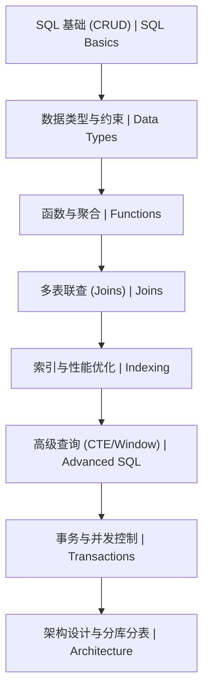

# 10-MySQL 数据库 | MySQL Database Persistence

<!--
作者：fanquanpp
创建日期：2026-04-05
版本：v3.0.0
-->

## 1. 项目简介 | Introduction

本模块是 fanquanpp 个人综合学习笔记库中的 MySQL 数据库部分，专注于 MySQL 关系型数据库的核心概念、安装配置、SQL 语法、数据建模、性能优化以及高可用架构等内容。作为最流行的关系型数据库之一，MySQL 广泛应用于各种规模的应用系统，本模块旨在为开发者提供从入门到进阶的系统化 MySQL 学习路径，帮助构建高效、安全的数据持久化体系。

This module focuses on MySQL relational database core concepts, installation, SQL syntax, data modeling, performance optimization, and high-availability architecture. As one of the most popular relational databases, MySQL is widely used in applications of all sizes, and this module aims to provide a systematic MySQL learning path from beginner to advanced levels, helping build efficient and secure data persistence systems.

### 模块定位

- **MySQL 学习指南**：从基础安装到高级优化，全面覆盖 MySQL 核心知识点
- **SQL 语法参考**：提供详细的 SQL 语法说明和实战示例
- **性能优化资源**：重点讲解 MySQL 性能调优技巧和最佳实践
- **数据建模指南**：收录常见业务场景的数据建模案例和设计原则

**使用说明：**

- 本模块已开放为公共资源，允许他人访问和克隆
- 禁止直接修改本仓库内容
- 他人使用本模块内容时出现的任何问题与作者无关

## 2. 学习路线图 | Learning Roadmap



### 详细路径 | Detailed Path

| 阶段 (Stage) | 知识点 (Topic) | 预计耗时 (Estimated Time) | 前置要求 (Prerequisites) |
| :--- | :--- | :--- | :--- |
| 入门 | MySQL 基础知识体系 | 15h | 无 |
| 进阶 | 索引原理与优化 | 10h | SQL 基础 |
| 核心 | 事务与锁机制 | 10h | 数据库基础 |

### 学习提示 | Tips
- **实战**：多使用 `EXPLAIN` 分析你的慢查询。
- **规范**：遵循阿里巴巴 Java 开发手册中的数据库设计规范。
- **面试**：深入理解 InnoDB 存储引擎的 B+ 树索引原理。

## 3. 目录索引 | Directory Index

### 基础语法 | Basics
- [C10_101-概述与环境.md](./C10_101-概述与环境.md)
- [C10_102-SQL基础语法.md](./C10_102-SQL基础语法.md)
- [C10_103-进阶查询与联查.md](./C10_103-进阶查询与联查.md)
- [C10_104-控制器与应用.md](./C10_104-控制器与应用.md)
- [C10_105-数据类型与约束.md](./C10_105-数据类型与约束.md)
- [C10_106-索引与执行计划.md](./C10_106-索引与执行计划.md)

### 高级特性 | Advanced
- [G10_201-索引与优化.md](./G10_201-索引与优化.md)
- [G10_202-事务与锁.md](./G10_202-事务与锁.md)

### 专项内容 | Specialized
- [Z10_301-advanced_sql_queries.sql](./Z10_301-advanced_sql_queries.sql)

## 3. 环境要求 | Environment Requirements

- **操作系统**：Windows 10+, Ubuntu 22.04+, macOS 14+
- **运行时**：MySQL 8.0 / 8.4 (LTS)
- **最小配置**：1 核心 CPU / 2 GB 内存 / 10 GB 磁盘

## 4. 快速开始 | Quick Start

```bash
# 1. 安装 MySQL (Ubuntu 示例)
sudo apt install mysql-server -y

# 2. 启动并进入命令行
sudo mysql

# 3. 验证版本
mysql> SELECT VERSION();
```

## 5. 学习路线 | Learning Path

`概述与环境` → `SQL基础语法` → `数据类型与约束` → `索引与执行计划` → `进阶查询与联查` → `控制器与应用` → `索引与优化` → `事务与锁`

## 6. 核心特色 | Key Features

- **关系型数据库**：详细讲解 MySQL 关系型数据库的核心概念和特性
- **SQL 语法**：提供完整的 SQL 语法参考和实战示例
- **性能优化**：深入讲解 MySQL 性能调优技巧，包括索引设计、查询优化等
- **数据建模**：收录常见业务场景的数据建模案例和设计原则
- **高可用架构**：讲解 MySQL 高可用架构的实现方法
- **事务管理**：详细分析事务的 ACID 特性和并发控制
- **双语注释**：关键概念和 SQL 语句提供中英文对照注释

## 7. 阅读建议 | Reading Guide

1. 按照学习路线的顺序学习，从概述与安装开始，逐步掌握 MySQL 的各种功能
2. 结合实际项目练习，加深对 SQL 语法的理解
3. 特别关注索引设计和性能优化部分，这是 MySQL 数据库的核心
4. 尝试设计和实现一个完整的数据库模型，巩固所学知识

## 8. 延伸阅读 | Further Reading

- [MySQL 官方文档](https://dev.mysql.com/doc/) <!-- nofollow -->
- [SQL 标准文档](https://www.iso.org/standard/76451.html) <!-- nofollow -->
- 本仓库：[04-Java](../04-Java/README.md)

## 9. 贡献指南 | Contribution Guide

- **分支策略**：遵循 Git Flow (feature/hotfix)
- **提交规范**：使用 Conventional Commits (feat, fix, docs)

## 10. 联系方式 | Contact Information

- 邮箱：<fanquanpangpiing@163.com>
- QQ：1839243393
- 欢迎提意见交流或反馈问题

## 11. 许可证信息 | License

- **SPDX-Identifier**：[CC-BY-NC-SA-4.0](https://creativecommons.org/licenses/by-nc-sa/4.0/)
- **Copyright**：2024-2026 fanquanpp

---

**更新日志 | Changelog**

- 2026-04-18: 完成GitHub仓库3.0结构优化规划，统一文件命名规范，优化目录结构，升级为 v3.0.0
- 2026-04-06: 新增「数据类型与约束 / 索引与执行计划」知识点，补全基础篇索引与学习路线，升级为 v1.0.3
- 2026-04-06: 深度优化 README.md 文件，完善结构和内容，增加仓库定位、使用说明等部分，升级为 v1.0.2
- 2026-04-06: 更新优化 README.md 文件，完善目录索引和内容结构，升级为 v1.0.1
- 2026-04-05: 体系化升级 README，补全双语简介、环境要求与快速开始
- 2026-10-04: 添加控制器与应用知识点，包含控制器实现、设计模式和最佳实践
- 2026-10-04: 更新优化 README.md 文件，统一结构和格式
