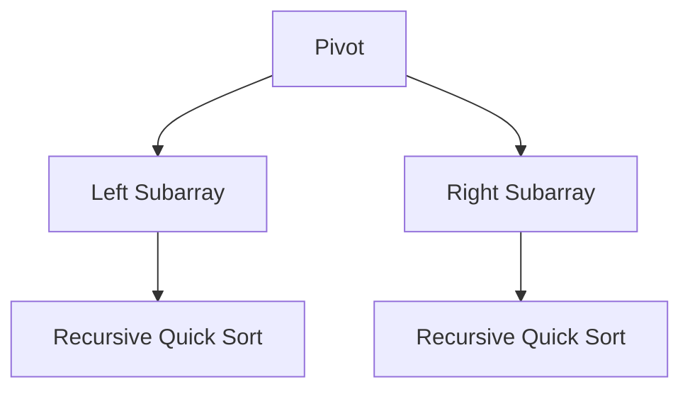

# 算法库 | Algorithms Library (Python)

本文档列出了 Python 语言实现的核心算法及其说明。

| 算法名称 (Algorithm) | 源码文件 (Source) | 难度 (Difficulty) | 标签 (Tags) | 说明 (Description) |
| :--- | :--- | :--- | :--- | :--- |
| 快速排序 | [quick_sort_py.py](./quick_sort_py.py) | 中级 | 排序 | 分治法经典实现 |
| 二分搜索 | [binary_search_py.py](./binary_search_py.py) | 基础 | 搜索 | 有序数组查找 |
| 冒泡排序 | [bubble_sort_py.py](./bubble_sort_py.py) | 基础 | 排序 | 基础交换排序 |
| 归并排序 | [merge_sort_py.py](./merge_sort_py.py) | 中级 | 排序 | 稳定分治排序 |
| 堆排序 | [heap_sort_py.py](./heap_sort_py.py) | 高级 | 排序 | 基于二叉堆排序 |
| BFS/DFS | [bfs_dfs_py.py](./bfs_dfs_py.py) | 中级 | 搜索 | 图/树遍历基础 |
| A* 搜索 | [a_star_py.py](./a_star_py.py) | 高级 | 搜索 | 启发式路径查找 |
| 0/1 背包 | [knapsack_py.py](./knapsack_py.py) | 中级 | 动态规划 | 经典资源分配问题 |
| LCS | [lcs_py.py](./lcs_py.py) | 中级 | 动态规划 | 最长公共子序列 |
| 最短路径 | [dijkstra_py.py](./dijkstra_py.py) | 高级 | 图论 | 单源最短路径 |
| 最小生成树 | [mst_py.py](./mst_py.py) | 高级 | 图论 | Prim/Kruskal 算法 |
| 拓扑排序 | [topo_sort_py.py](./topo_sort_py.py) | 中级 | 图论 | 有向无环图排序 |
| KMP | [kmp_py.py](./kmp_py.py) | 高级 | 字符串 | 高效模式匹配 |

## 算法可视化 | Visualization

### 快速排序 (Quick Sort)


### 二分搜索 (Binary Search)
```ascii
[1, 2, 3, 4, 5, 6, 7]
 L     M     H  -> Target > M, L = M + 1
          [5, 6, 7]
           L  M  H -> Target = M, Found!
```
