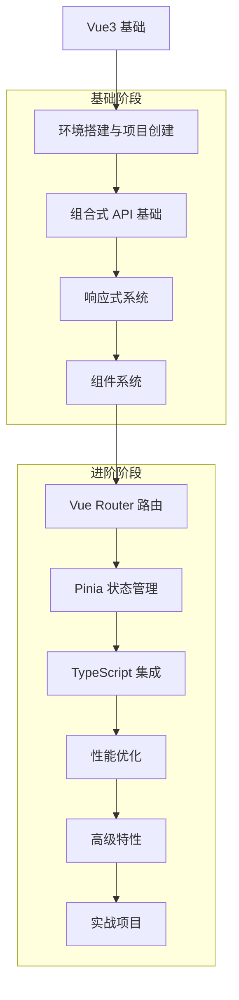

# 12-Vue3 | Vue3 Framework

> @Author: fanquanpp
> @Version: v3.0.0
> @Created: 2026-04-06

## 1. 简介 | Introduction

专注于 Vue3 的核心特性、组合式 API、响应式系统、组件设计、路由与状态管理以及实战应用。作为一款现代化的前端框架，Vue3 以其简洁的 API、出色的性能和强大的生态系统而受到开发者的喜爱，本模块旨在为前端开发者提供从入门到进阶的系统化 Vue3 学习路径。

## 2. 学习路线图 | Learning Roadmap



## 3. 目录索引 | Directory Index

### 基础语法 | Basics

- [V_12-Vue3名词注释查阅表.md](./V_12-Vue3名词注释查阅表.md)
- [C12_101-概述与环境.md](./C12_101-概述与环境.md)
- [C12_102-组合式API.md](./C12_102-组合式API.md)
- [C12_103-响应式系统.md](./C12_103-响应式系统.md)
- [C12_104-组件系统.md](./C12_104-组件系统.md)
- [C12_105-模板语法.md](./C12_105-模板语法.md)
- [C12_106-指令系统.md](./C12_106-指令系统.md)

### 高级特性 | Advanced
- [G12_201-性能优化.md](./G12_201-性能优化.md)
- [G12_202-TypeScript集成.md](./G12_202-TypeScript集成.md)
- [G12_203-高级组件特性.md](./G12_203-高级组件特性.md)
- [G12_204-Vue Router.md](./G12_204-Vue Router.md)
- [G12_205-Pinia 状态管理.md](./G12_205-Pinia 状态管理.md)

### 算法与数据结构 | Algorithms & Data Structures
- [SFDE12_301-debounce_throttle.ts](./算法与数据结构/代码示例/SFDE12_301-debounce_throttle.ts)
- [SFDE12_401-reactive_collections.ts](./算法与数据结构/代码示例/SFDE12_401-reactive_collections.ts)

### 快速入门
- [C12_100-快速入门.md](./C12_100-快速入门.md)

### 示例 | Examples
- [basic_components.vue](./示例/basic_components.vue)
- [composition_api_demo.vue](./示例/composition_api_demo.vue)
- [ChildComponent.vue](./示例/ChildComponent.vue)
- [composables.ts](./示例/composables.ts)
- [reactive_system_demo.vue](./示例/reactive_system_demo.vue)
- [vue_router_demo.vue](./示例/vue_router_demo.vue)
- [pinia_demo.vue](./示例/pinia_demo.vue)
- [typescript_integration.vue](./示例/typescript_integration.vue)

## 4. 学习建议

1. **循序渐进**：从基础开始，逐步深入学习各个核心概念
2. **实践为主**：通过实际项目练习巩固所学知识
3. **查阅文档**：遇到问题时参考官方文档
4. **参与社区**：加入 Vue 社区，与其他开发者交流
5. **持续学习**：关注 Vue 的最新特性和最佳实践

## 5. 推荐资源

- [Vue3 官方文档](https://v3.vuejs.org/)
- [Vue 3 教程 - 中文](https://cn.vuejs.org/)
- [Vite 官方文档](https://vitejs.dev/)
- [Vue Router 官方文档](https://router.vuejs.org/)
- [Pinia 官方文档](https://pinia.vuejs.org/)
- [TypeScript 官方文档](https://www.typescriptlang.org/)

## 6. 常见问题

### Q: Vue3 和 Vue2 的主要区别是什么？
A: Vue3 引入了组合式 API、更好的 TypeScript 支持、更高效的响应式系统、Fragment、Teleport、Suspense 等新特性。

### Q: 如何从 Vue2 迁移到 Vue3？
A: 可以使用官方提供的迁移工具，逐步迁移代码，注意组合式 API 和选项式 API 的差异。

### Q: Vue3 的性能比 Vue2 好多少？
A: Vue3 在渲染性能、内存使用、包大小等方面都有显著提升，特别是在大型应用中。

### Q: 什么时候应该使用组合式 API，什么时候应该使用选项式 API？
A: 组合式 API 更适合复杂逻辑的复用和组织，选项式 API 更适合简单组件和快速开发。

### Q: Vue3 支持 IE11 吗？
A: Vue3 本身不支持 IE11，但可以通过 polyfill 和 Babel 配置来支持。

## 3. 环境要求 | Environment Requirements

- **操作系统**：Windows 10+, Ubuntu 22.04+, macOS 14+
- **运行时**：Node.js 18+, npm 9+
- **框架**：Vue 3.3+
- **构建工具**：Vite 4.4+
- **最小配置**：2 核心 CPU / 4GB 内存 / 1GB 磁盘

## 4. 快速开始 | Quick Start

```bash
# 1. 创建 Vue3 项目
npm create vite@latest my-vue3-app -- --template vue

# 2. 进入项目目录
cd my-vue3-app

# 3. 安装依赖
npm install

# 4. 启动开发服务器
npm run dev
```

## 5. 学习路线 | Learning Path

`概述与环境` → `组合式API` → `响应式系统` → `组件系统` → `模板语法` → `指令系统` → `Vue Router` → `Pinia 状态管理` → `TypeScript集成` → `高级组件特性` → `性能优化`

## 6. 核心特色 | Key Features

- **组合式 API**：深入讲解 Vue3 全新的组合式 API，提高代码复用性和可维护性
- **响应式系统**：解析 Vue3 响应式系统的工作原理和使用方法
- **组件系统**：详细介绍 Vue3 的组件设计、通信和最佳实践
- **性能优化**：提供 Vue3 应用的性能优化技巧和策略
- **TypeScript 集成**：讲解 Vue3 与 TypeScript 的无缝集成
- **生态系统**：涵盖 Vue Router、Pinia 等官方生态工具的使用
- **开发体验**：突出 Vue3 的开发效率和开发者体验
- **双语注释**：关键概念和代码提供中英文对照注释

## 7. 阅读建议 | Reading Guide

1. 按照学习路线的顺序学习，从概述与环境开始，逐步掌握 Vue3 的各种特性
2. 结合实际项目练习，加深对 Vue3 组合式 API 的理解
3. 特别关注响应式系统和组件系统部分，这是 Vue3 的核心
4. 尝试使用 Vue3 构建一个完整的前端应用，巩固所学知识

## 8. 延伸阅读 | Further Reading

- [Vue 官方文档](https://vuejs.org/docs/) <!-- nofollow -->
- [Vue 组合式 API 文档](https://vuejs.org/api/composition-api.html) <!-- nofollow -->
- [Vite 官方文档](https://vitejs.dev/) <!-- nofollow -->

## 9. 贡献指南 | Contribution Guide

- **编码规范**：遵循 [Vue 风格指南](https://vuejs.org/style-guide/)
- **提交规范**：使用 Conventional Commits
- **测试**：提供完整的单元测试和集成测试

## 10. 联系方式 | Contact Information

- 邮箱：<fanquanpangpiing@163.com>
- QQ：1839243393
- 欢迎提意见交流或反馈问题

## 11. 许可证信息 | License

- **SPDX-Identifier**：[CC-BY-NC-SA-4.0](https://creativecommons.org/licenses/by-nc-sa/4.0/)
- **Copyright**：2024-2026 fanquanpp

---

**更新日志 | Changelog**

- **2026-05-02**
  - 全面检查项目结构，确保一致性

- **2026-04-18**
  - 完成 GitHub 仓库 3.0 结构优化规划，统一文件命名规范，优化目录结构，升级为 v3.0.0

- **2026-04-06**
  - 创建 Vue3 模块目录结构，添加 README.md 文件，版本为 v1.0.0