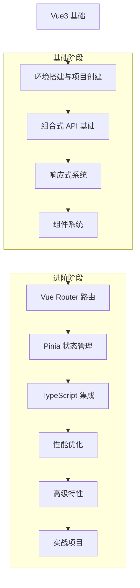

# Vue3 学习路径

## 学习路线图

## 目录结构

### 基础目录

| 文件名 | 内容简介 |
| --- | --- |
| 01-概述与环境.md | Vue3 概述、环境搭建、项目创建、第一个应用 |
| 02-组合式API.md | 组合式 API 介绍、setup 函数、script setup、响应式 API、生命周期钩子、composables、依赖注入、模板引用、响应式工具 |
| 03-响应式系统.md | 响应式系统原理、响应式 API、响应式工具、响应式陷阱、最佳实践 |
| 04-组件系统.md | 单文件组件、Props、事件、插槽、生命周期、组件通信、高级组件特性 |

### 进阶目录

| 文件名 | 内容简介 |
| --- | --- |
| 01-性能优化.md | 渲染优化、响应式优化、网络优化、构建优化、性能监控 |
| 02-TypeScript 集成.md | TypeScript 集成概述与优势、环境搭建、基础类型、接口与类型别名、Vue 组件中的 TypeScript、组合式 API 与 TypeScript、Vue Router 与 TypeScript、Pinia 与 TypeScript、工具类型、最佳实践 |
| 03-高级组件特性.md | 动态组件、异步组件、递归组件、函数式组件、插槽的高级用法、依赖注入、错误边界、组件的生命周期管理 |

### 框架目录

| 文件名 | 内容简介 |
| --- | --- |
| 01-Vue Router.md | Vue Router 基础、路由配置、路由守卫、嵌套路由、动态路由、编程式导航、路由元信息 |
| 02-Pinia 状态管理.md | Pinia 基础、Store 定义、状态管理、Actions、Getters、模块化、持久化、插件 |

### 数据结构目录

| 文件名 | 内容简介 |
| --- | --- |
| README.md | Vue3 中常用的数据结构与使用方法 |

### 算法目录

| 文件名 | 内容简介 |
| --- | --- |
| README.md | Vue3 中常用的算法与实现 |

### 示例目录

| 文件名 | 内容简介 |
| --- | --- |
| basic_components.vue | 基础组件示例 |
| composition_api_demo.vue | 组合式 API 示例 |
| ChildComponent.vue | 依赖注入的子组件示例 |
| composables.ts | 组合式 API 的可复用逻辑示例 |
| reactive_system_demo.vue | 响应式系统示例 |
| vue_router_demo.vue | Vue Router 示例 |
| pinia_demo.vue | Pinia 状态管理示例 |
| typescript_integration.vue | TypeScript 集成示例 |

## 学习建议

1. **循序渐进**：从基础开始，逐步深入学习各个核心概念
2. **实践为主**：通过实际项目练习巩固所学知识
3. **查阅文档**：遇到问题时参考官方文档
4. **参与社区**：加入 Vue 社区，与其他开发者交流
5. **持续学习**：关注 Vue 的最新特性和最佳实践

## 推荐资源

- [Vue3 官方文档](https://v3.vuejs.org/)
- [Vue 3 教程 - 中文](https://cn.vuejs.org/)
- [Vite 官方文档](https://vitejs.dev/)
- [Vue Router 官方文档](https://router.vuejs.org/)
- [Pinia 官方文档](https://pinia.vuejs.org/)
- [TypeScript 官方文档](https://www.typescriptlang.org/)

## 常见问题

### Q: Vue3 和 Vue2 的主要区别是什么？
A: Vue3 引入了组合式 API、更好的 TypeScript 支持、更高效的响应式系统、Fragment、Teleport、Suspense 等新特性。

### Q: 如何从 Vue2 迁移到 Vue3？
A: 可以使用官方提供的迁移工具，逐步迁移代码，注意组合式 API 和选项式 API 的差异。

### Q: Vue3 的性能比 Vue2 好多少？
A: Vue3 在渲染性能、内存使用、包大小等方面都有显著提升，特别是在大型应用中。

### Q: 什么时候应该使用组合式 API，什么时候应该使用选项式 API？
A: 组合式 API 更适合复杂逻辑的复用和组织，选项式 API 更适合简单组件和快速开发。

### Q: Vue3 支持 IE11 吗？
A: Vue3 本身不支持 IE11，但可以通过 polyfill 和 Babel 配置来支持。