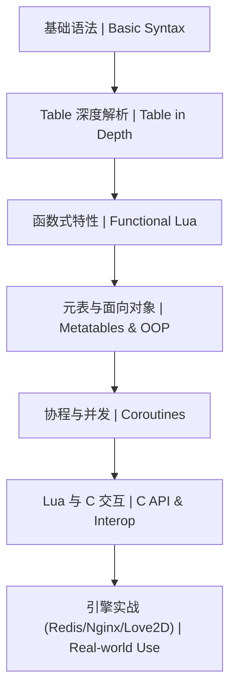

# 14-Lua 语言 | Lua Scripting

<!--
作者：fanquanpp
创建日期：2026-04-05
版本：v3.0.0
-->

## 1. 项目简介 | Introduction

本模块是 fanquanpp 个人综合学习笔记库中的 Lua 语言部分，专注于 Lua 语言的极简语法、Table 核心数据结构、元表机制、协程以及在游戏开发和嵌入式系统中的应用。作为一种轻量级、高效的脚本语言，Lua 以其简洁的语法和强大的扩展能力而广泛应用于游戏逻辑、嵌入式系统、Nginx 扩展等场景，本模块旨在为开发者提供从基础语法到高级应用的系统化 Lua 学习路径。

This module focuses on Lua's minimalist syntax, Table core data structure, metatable mechanism, coroutines, and its applications in game development and embedded systems. As a lightweight and efficient scripting language, Lua is widely used in game logic, embedded systems, Nginx extensions, and other scenarios for its concise syntax and powerful extension capabilities, and this module aims to provide a systematic Lua learning path from basic syntax to advanced applications.

### 模块定位

- **Lua 学习指南**：从基础语法到高级特性，全面覆盖 Lua 核心知识点
- **游戏开发资源**：提供游戏逻辑、AI 行为等游戏开发相关的 Lua 应用
- **嵌入式扩展指南**：收录 Nginx、Godot 等平台的 Lua 扩展开发技巧
- **Table 与元表深度解析**：重点讲解 Lua 独特的 Table 数据结构和元表机制

**使用说明：**

- 本模块已开放为公共资源，允许他人访问和克隆
- 禁止直接修改本仓库内容
- 他人使用本模块内容时出现的任何问题与作者无关

## 2. 学习路线图 | Learning Roadmap



### 详细路径 | Detailed Path

| 阶段 (Stage) | 知识点 (Topic) | 预计耗时 (Estimated Time) | 前置要求 (Prerequisites) |
| :--- | :--- | :--- | :--- |
| 入门 | Lua 基础体系 | 10h | 无 |
| 进阶 | 元表与 OOP 模拟 | 10h | 基础语法、Table |
| 实战 | 数据结构与算法 (Lua) | 15h | Lua 基础 |

### 学习提示 | Tips
- **索引**：记住 Lua 的 Table 索引默认从 **1** 开始。
- **性能**：避免在循环中频繁创建 Table，优先复用。
- **扩展**：学习 LuaJIT 以获得接近 C 的执行速度。

## 3. 目录索引 | Directory Index

### 基础语法 | Basics
- [C14_101-概述与环境.md](./C14_101-概述与环境.md)
- [C14_102-基础语法.md](./C14_102-基础语法.md)
- [C14_103-数据类型与Table.md](./C14_103-数据类型与Table.md)
- [C14_104-函数与闭包.md](./C14_104-函数与闭包.md)
- [C14_105-协程与异步.md](./C14_105-协程与异步.md)

### 高级特性 | Advanced
- [G14_201-元表与OOP.md](./G14_201-元表与OOP.md)
- [G14_202-模块与包.md](./G14_202-模块与包.md)

### 算法与数据结构 | Algorithms & Data Structures
- [SFDE14_301-binary_search_lua.lua](./算法与数据结构/代码示例/SFDE14_301-binary_search_lua.lua)
- [SFDE14_302-dfs_bfs_lua.lua](./算法与数据结构/代码示例/SFDE14_302-dfs_bfs_lua.lua)
- [SFDE14_303-quick_sort_lua.lua](./算法与数据结构/代码示例/SFDE14_303-quick_sort_lua.lua)
- [SFDE14_401-linked_list_lua.lua](./算法与数据结构/代码示例/SFDE14_401-linked_list_lua.lua)
- [SFDE14_402-table_advanced_lua.lua](./算法与数据结构/代码示例/SFDE14_402-table_advanced_lua.lua)

## 3. 环境要求 | Environment Requirements

- **Lua 版本**：5.4+ (标准版) / LuaJIT (高性能版)
- **运行环境**：独立解释器、Nginx (OpenResty)、Godot (通过扩展)
- **最小配置**：1 核心 CPU / 1GB 内存 / 50MB 磁盘

## 4. 快速开始 | Quick Start

```bash
# 1. 安装 Lua
# Windows: 下载 LuaForWindows
# Linux: sudo apt install lua5.4
# macOS: brew install lua

# 2. 验证安装
lua -v

# 3. 运行首个脚本
lua script.lua
```

## 5. 学习路线 | Learning Path

`概述与环境` → `基础语法` → `数据类型与Table` → `函数与闭包` → `协程与异步` → `元表与OOP` → `模块与包`

## 6. 核心特色 | Key Features

- **极简语法**：简洁易读的语法设计，学习曲线平缓
- **Table 核心**：统一的表结构，灵活的数据组织
- **元表机制**：强大的元编程能力，支持面向对象编程
- **协程支持**：轻量级线程，简化异步编程
- **结构清晰**：按照基础、进阶、算法和数据结构组织内容
- **双语注释**：关键概念和代码提供中英文对照注释

## 7. 阅读建议 | Reading Guide

1. 按照学习路线的顺序学习，从概述与环境开始，逐步掌握 Lua 的各种特性
2. 结合实际项目练习，加深对 Lua 语言的理解
3. 特别关注 Table 核心和元表机制部分，这是 Lua 的核心特性
4. 尝试使用 Lua 构建一个简单的游戏逻辑或嵌入式扩展，巩固所学知识

## 8. 延伸阅读 | Further Reading

- [Lua 官方文档](https://www.lua.org/docs.html) <!-- nofollow -->
- [Lua 5.4 参考手册](https://www.lua.org/manual/5.4/) <!-- nofollow -->
- [Programming in Lua](https://www.lua.org/pil/) <!-- nofollow -->

## 9. 技术栈与工具 | Technology Stack & Tools

- **Lua Engine**：5.4+ (标准版) / LuaJIT (高性能版)
- **开发环境**：独立解释器、Nginx (OpenResty)、Godot (通过扩展)
- **编辑器**：VS Code + Lua 插件、Sublime Text

## 10. 联系方式 | Contact Information

- 邮箱：<fanquanpangpiing@163.com>
- QQ：1839243393
- 欢迎提意见交流或反馈问题

## 11. 许可证信息 | License

- **SPDX-Identifier**：[CC-BY-NC-SA-4.0](https://creativecommons.org/licenses/by-nc-sa/4.0/)
- **Copyright**：2024-2026 fanquanpp

---

**更新日志 | Changelog**

- 2026-04-18: 完成GitHub仓库3.0结构优化规划，统一文件命名规范，优化目录结构，升级为 v3.0.0
- 2026-04-06: 深度优化 README.md 文件，完善结构和内容，增加仓库定位、使用说明等部分，升级为 v1.0.2
- 2026-04-06: 更新优化 README.md 文件，完善目录索引和内容结构，升级为 v1.0.1
- 2026-04-05: 体系化重构 Lua 目录结构
