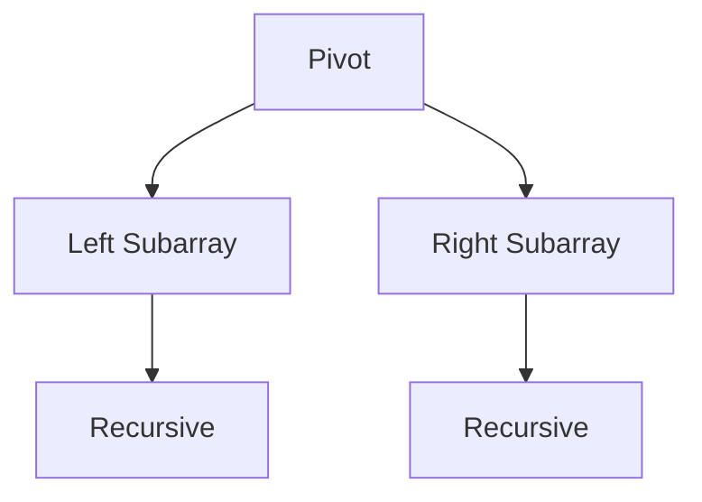

# 算法库 | Algorithms Library (Lua)

本文档列出了 Lua 语言实现的核心算法。

| 算法名称 (Algorithm) | 源码文件 (Source) | 难度 (Difficulty) | 说明 (Description) |
| :--- | :--- | :--- | :--- |
| 快速排序 | [quick_sort_lua.lua](./quick_sort_lua.lua) | 中级 | 基于分治法的排序实现 |
| 二分搜索 | [binary_search_lua.lua](./binary_search_lua.lua) | 基础 | 有序数组的高效查找 |
| DFS/BFS | [dfs_bfs_lua.lua](./dfs_bfs_lua.lua) | 中级 | 图的深度与广度优先遍历 |

## 可视化 | Visualization

### 快速排序 (Quick Sort)

