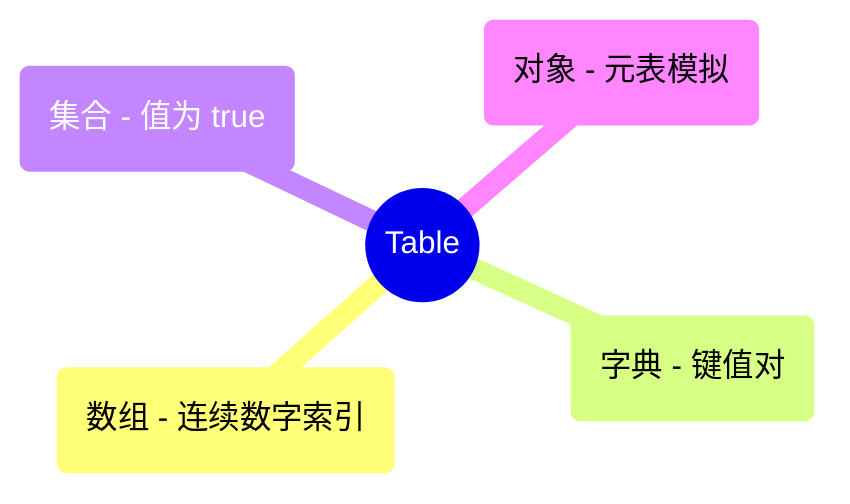

# 数据结构库 | Data Structures Library (Lua)

本文档列出了 Lua 语言实现的核心数据结构。

| 数据结构 (Data Structure) | 源码文件 (Source) | 说明 (Description) |
| :--- | :--- | :--- |
| Table 高级用法 | [table_advanced_lua.lua](./table_advanced_lua.lua) | 模拟集合、栈与类 |
| 单链表 | [linked_list_lua.lua](./linked_list_lua.lua) | 基础链表实现 |

## 可视化 | Visualization

### Lua Table 的多重身份

