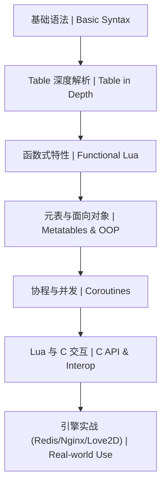

# Lua 脚本开发学习路线图 | Lua Scripting Roadmap

本文档展示了 Lua 脚本开发从基础到高级的学习路径。

## 1. 学习顺序 | Learning Order

## 2. 详细路径 | Detailed Path

| 阶段 (Stage) | 知识点 (Topic) | 预计耗时 (Estimated Time) | 前置要求 (Prerequisites) |
| :--- | :--- | :--- | :--- |
| 入门 | [Lua 基础体系](./基础/README.md) | 10h | 无 |
| 进阶 | [元表与 OOP 模拟](./进阶/01-元表与OOP.md) | 10h | 基础语法、Table |
| 实战 | [数据结构与算法 (Lua)](./算法/README.md) | 15h | Lua 基础 |

## 3. 学习提示 | Tips
- **索引**：记住 Lua 的 Table 索引默认从 **1** 开始。
- **性能**：避免在循环中频繁创建 Table，优先复用。
- **扩展**：学习 LuaJIT 以获得接近 C 的执行速度。
