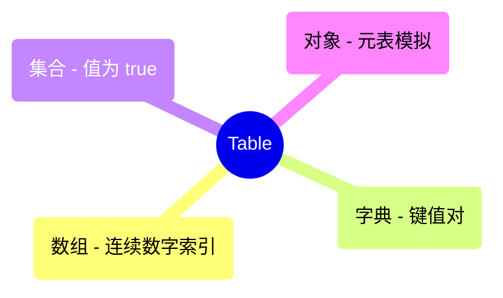

# Lua 数据结构 (Lua Data Structures)

> 此目录收录了使用 Lua 实现的经典数据结构。

## 1. 数据结构列表 (Data Structure List)

| 结构名称 | 源码文件 | 难度 | 标签 | 说明 |
| :--- | :--- | :--- | :--- | :--- |
| **Table 高级用法** | [table_advanced_lua.lua](./table_advanced_lua.lua) | 基础 | 基础 | 模拟集合、栈与类 |
| **单链表** | [linked_list_lua.lua](./linked_list_lua.lua) | 基础 | 链表 | 基础链表实现 |

## 2. 运行指南 (How to Run)
```bash
# 运行数据结构示例
lua linked_list_lua.lua
```

## 3. 可视化 | Visualization

### Lua Table 的多重身份


---
### 更新日志 (Changelog)
- 2026-04-06: 更新优化 README.md 文件，完善内容结构和格式
