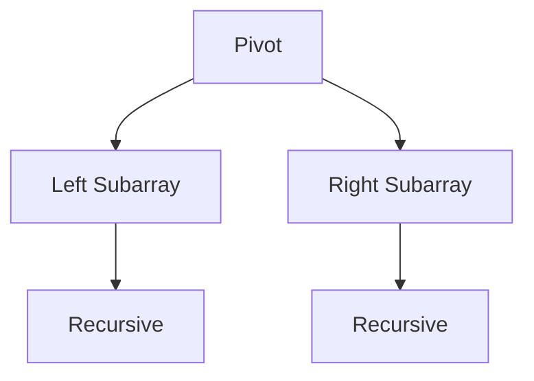

# Lua 算法实现 (Lua Algorithms)

> 此目录收录了使用 Lua 实现的经典算法。

## 1. 算法列表 (Algorithm List)

| 算法名称 | 源码文件 | 难度 | 标签 | 说明 |
| :--- | :--- | :--- | :--- | :--- |
| **快速排序** | [quick_sort_lua.lua](./quick_sort_lua.lua) | 中级 | 排序 | 基于分治法的排序实现 |
| **二分搜索** | [binary_search_lua.lua](./binary_search_lua.lua) | 基础 | 搜索 | 有序数组的高效查找 |
| **DFS/BFS** | [dfs_bfs_lua.lua](./dfs_bfs_lua.lua) | 中级 | 图论 | 图的深度与广度优先遍历 |

## 2. 运行指南 (How to Run)
```bash
# 运行算法示例
lua quick_sort_lua.lua
lua binary_search_lua.lua
```

## 3. 可视化 | Visualization

### 快速排序 (Quick Sort)


---
### 更新日志 (Changelog)
- 2026-04-06: 更新优化 README.md 文件，完善内容结构和格式
