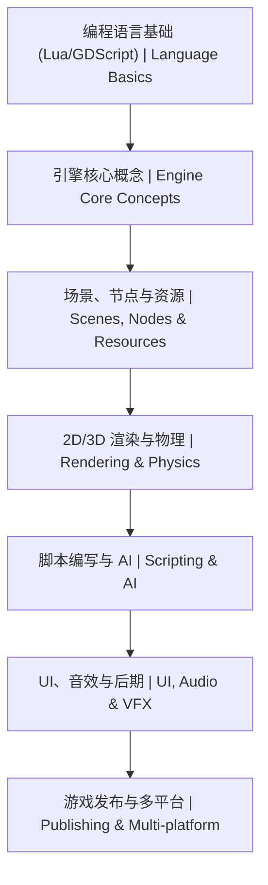

# 15-GDScript 游戏开发 | GDScript Game Development

<!--
作者：fanquanpp
创建日期：2026-04-05
版本：v3.0.0
-->

> **路径**：`15-GDScript游戏开发/` | **GDScript（Godot 脚本语言）** + **Godot（游戏引擎）**

## 1. 项目简介 | Introduction

本模块是 fanquanpp 个人综合学习笔记库中的 GDScript 游戏开发部分，专注于 Godot 引擎的默认脚本语言 GDScript 的学习与应用。作为一款轻量级、Python 风格的脚本语言，GDScript 专为游戏开发设计，本模块涵盖其语法特性、信号与异步机制、性能优化以及版本迁移等核心内容，旨在为 2D/3D 游戏逻辑与工具脚本开发提供全面的技术支持。

This module focuses on GDScript, the default scripting language for Godot engine, covering its syntax features, signal and async mechanisms, performance optimization, and version migration, providing comprehensive technical support for 2D/3D game logic and tool script development.

### 模块定位

- **GDScript 学习指南**：从基础语法到高级特性，全面覆盖 GDScript 核心知识点
- **Godot 引擎应用**：结合 Godot 引擎的实际使用，提供实用的游戏开发技巧
- **性能优化资源**：重点讲解 GDScript 性能优化策略，帮助开发者创建高效游戏
- **版本迁移指南**：提供 Godot 3.x 到 4.x 的迁移技巧，确保项目顺利升级

**使用说明：**

- 本模块已开放为公共资源，允许他人访问和克隆
- 禁止直接修改本仓库内容
- 他人使用本模块内容时出现的任何问题与作者无关

## 2. 学习路线图 | Learning Roadmap

### 详细路径 | Detailed Path

| 阶段 (Stage) | 知识点 (Topic) | 预计耗时 (Estimated Time) | 前置要求 (Prerequisites) |
| :--- | :--- | :--- | :--- |
| 入门 | GDScript 基础体系 | 15h | 无 |
| 进阶 | 信号、异步与注解 | 10h | 基础语法 |
| 实战 | 性能优化与进阶技巧 | 10h | GDScript 基础 |

### 学习提示 | Tips
- **代码重构**：在 Godot 中优先使用 `Signals` 而不是硬编码引用。
- **性能优化**：掌握 `Object Pooling`, `Draw Call Optimization`, `Culling`。
- **面试重点**：理解 `Scene Tree`, `Entity-Component System`, `State Machines`。
- **实战建议**：从制作一个简单的 `2D Platformer` 或 `Visual Novel` 开始。

## 3. 目录索引 | Directory Index

### 基础语法 | Basics
- [C15_101-概述与环境.md](./C15_101-概述与环境.md)
- [C15_102-基础语法.md](./C15_102-基础语法.md)
- [C15_103-函数与面向对象.md](./C15_103-函数与面向对象.md)

### 高级特性 | Advanced
- [G15_201-信号与异步.md](./G15_201-信号与异步.md)
- [G15_202-性能优化与版本差异.md](./G15_202-性能优化与版本差异.md)

### 算法与数据结构 | Algorithms & Data Structures
- [SFDE15_301-astar_gd.gd](./算法与数据结构/代码示例/SFDE15_301-astar_gd.gd)
- [SFDE15_302-bubble_sort_gd.gd](./算法与数据结构/代码示例/SFDE15_302-bubble_sort_gd.gd)
- [SFDE15_401-event_bus_gd.gd](./算法与数据结构/代码示例/SFDE15_401-event_bus_gd.gd)

## 3. 环境要求 | Environment Requirements

- **操作系统**：Windows 10+, Ubuntu 22.04+, macOS 14+
- **运行时**：Godot 4.0+ (LTS)
- **开发工具**：Godot Editor, VS Code with GDScript extension
- **最小配置**：2 核心 CPU / 4 GB 内存 / 1 GB 磁盘

## 4. 快速开始 | Quick Start

1. 下载并安装 Godot 4.0+
2. 创建新项目并选择 GDScript 作为脚本语言
3. 编写第一个脚本并运行

## 5. 学习路线 | Learning Path

`概述与环境` → `基础语法` → `函数与面向对象` → `信号与异步` → `性能优化与版本差异` → `算法与数据结构`

## 6. 核心特色 | Key Features

- **游戏开发专用**：专为 Godot 游戏引擎设计的脚本语言
- **Python 风格**：语法类似 Python，学习曲线平缓
- **信号系统**：强大的信号机制，简化游戏对象间通信
- **性能优化**：重点讲解 GDScript 性能优化技巧与最佳实践
- **版本迁移**：提供 Godot 3.x 到 4.x 的迁移指南
- **游戏逻辑**：专注于游戏逻辑、AI 行为等游戏开发相关内容
- **集成开发**：与 Godot 编辑器无缝集成
- **双语注释**：关键概念和代码提供中英文对照注释

## 7. 阅读建议 | Reading Guide

1. 按照学习路线的顺序学习，从概述与环境开始，逐步掌握 GDScript 的各种特性
2. 结合 Godot 引擎实际操作，加深对 GDScript 的理解
3. 特别关注信号与异步部分，这是 Godot 引擎的核心特性
4. 尝试使用 GDScript 实现简单的游戏功能，巩固所学知识

## 8. 延伸阅读 | Further Reading

- [Godot 官方文档](https://docs.godotengine.org/) <!-- nofollow -->
- [GDScript 官方指南](https://docs.godotengine.org/en/stable/getting_started/scripting/gdscript/gdscript_basics.html) <!-- nofollow -->
- 本仓库：[03-Python脚本](../03-Python脚本/README.md)、[16-Renpy视觉小说](../16-Renpy视觉小说/README.md)

## 9. 关联章节 | Related Modules

- **Python（Python 语言）**：Godot 脚本可与 Python 思维对照 [`03-Python脚本`](../03-Python脚本/README.md)  
- **Ren'Py（视觉小说引擎）**：[`16-Renpy视觉小说`](../16-Renpy视觉小说/README.md)

## 10. 贡献指南 | Contribution Guide

- 代码示例需符合 Godot 官方风格指南
- 提供完整的项目结构和场景文件
- 包含性能测试结果和优化建议

## 11. 联系方式 | Contact Information

- 邮箱：<fanquanpangpiing@163.com>
- QQ：1839243393
- 欢迎提意见交流或反馈问题

## 12. 许可证信息 | License

- **SPDX-Identifier**：[CC-BY-NC-SA-4.0](https://creativecommons.org/licenses/by-nc-sa/4.0/)
- **Copyright**：2024-2026 fanquanpp

---

**更新日志 | Changelog**

- 2026-04-18: 完成GitHub仓库3.0结构优化规划，统一文件命名规范，优化目录结构，升级为 v3.0.0
- 2026-04-06: 深度优化 README.md 文件，完善结构和内容，增加仓库定位、使用说明等部分，升级为 v1.0.2
- 2026-04-06: 更新优化 README.md 文件，完善目录索引和内容结构，升级为 v1.0.1
- 2026-04-05: 统一模块说明，与 Godot 4.x 主线对齐表述
- 2026-10-04: 更新优化 README.md 文件，统一结构和格式
