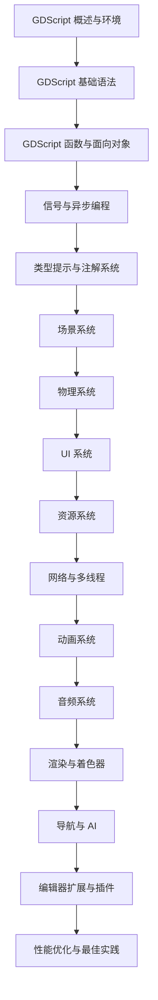

# 15-Godot 游戏引擎 | Godot Game Engine

> @Author: fanquanpp
> @Version: v4.0.0
> @Created: 2026-04-05

## 1. 项目简介 | Introduction

本模块是 fanquanpp 个人综合学习笔记库中的 Godot 游戏引擎部分，专注于 Godot 引擎的核心开发技术，包括 GDScript 脚本语言、场景系统、物理系统、UI 系统、动画系统、网络通信以及游戏开发最佳实践等内容。作为一款免费开源的跨平台游戏引擎，Godot 以其独特的场景系统、节点架构和直观的编辑器而受到开发者的青睐，本模块旨在为创作者提供从入门到进阶的系统化 Godot 学习路径。

This module focuses on Godot engine core development techniques, including GDScript scripting, scene system, physics system, UI system, animation system, networking, and game development best practices. As a free and open-source cross-platform game engine, Godot is loved by developers for its unique scene system, node architecture, and intuitive editor. This module aims to provide a systematic Godot learning path from beginner to advanced levels.

### 模块定位

- **Godot 学习指南**：从 GDScript 基础到高级特性，全面覆盖 Godot 核心知识点
- **游戏开发资源**：提供 2D/3D 游戏开发、场景管理、资源处理等实现方法
- **引擎架构理解**：深入讲解 Godot 的场景树、节点系统、信号机制等核心概念
- **跨平台发布指南**：提供完整的游戏打包和多平台发布流程
- **官方文档同步**：与 Godot 官方文档保持一致的内容和最佳实践

**使用说明：**

- 本模块已开放为公共资源，允许他人访问和克隆
- 禁止直接修改本仓库内容
- 他人使用本模块内容时出现的任何问题与作者无关

**联系方式：**

- 邮箱：<fanquanpangpiing@163.com>
- QQ：1839243393
- 欢迎提意见交流或反馈问题

## 2. 学习路线图 | Learning Roadmap



### 详细路径 | Detailed Path

根据 Godot 官方文档结构，学习路径如下：

| 阶段 (Stage) | 知识点 (Topic) | 前置要求 (Prerequisites) |
| :--- | :--- | :--- |
| 入门 | GDScript 概述与环境 | 无 |
| 入门 | GDScript 基础语法（变量、数据类型、控制流） | 无 |
| 入门 | GDScript 函数与面向对象 | GDScript 基础 |
| 进阶 | 信号与异步编程 | GDScript 基础 |
| 进阶 | 类型提示与注解系统 | GDScript 进阶 |
| 核心 | 场景系统 | GDScript 基础 |
| 核心 | 物理系统（2D/3D） | 场景系统 |
| 核心 | UI 系统 | 场景系统 |
| 核心 | 资源系统 | 场景系统 |
| 高级 | 网络与多线程 | 信号与异步 |
| 高级 | 动画系统 | 场景系统 |
| 高级 | 音频系统 | 场景系统 |
| 高级 | 渲染与着色器 | 场景系统 |
| 高级 | 导航与 AI | 物理系统 |
| 高级 | 编辑器扩展与插件 | 所有进阶知识 |
| 高级 | 性能优化与最佳实践 | 所有核心知识 |

### 官方文档章节对应 | Official Documentation Mapping

| 官方文档章节 | 对应笔记文件 |
| :--- | :--- |
| Getting Started | [C15_101-概述与环境.md](./C15_101-概述与环境.md) |
| Scripting | [C15_102-基础语法.md](./C15_102-基础语法.md) |
| GDScript | [C15_103-函数与面向对象.md](./C15_103-函数与面向对象.md) |
| Signals | [G15_201-信号与异步.md](./G15_201-信号与异步.md) |
| GDScript Annotation | [G15_202-类型提示与注解系统.md](./G15_202-类型提示与注解系统.md) |
| Scene System | [G15_301-场景系统.md](./G15_301-场景系统.md) |
| Physics | [G15_302-物理系统.md](./G15_302-物理系统.md) |
| UI | [G15_303-UI系统.md](./G15_303-UI系统.md) |
| Resources | [G15_304-资源系统.md](./G15_304-资源系统.md) |
| Animation | [G15_401-动画系统.md](./G15_401-动画系统.md) |
| Audio | [G15_402-音频系统.md](./G15_402-音频系统.md) |

### 学习提示 | Tips

- **GDScript 优先**：Godot 4 推荐使用 GDScript 作为主要脚本语言，其语法深受 Python 影响
- **信号机制**：信号是 Godot 核心的观察者模式，务必深入理解
- **场景组合**：善用场景继承和组合来构建复杂的游戏结构
- **类型提示**：Godot 4 的类型提示系统能显著提升代码质量和编辑器支持
- **官方文档**：Godot 官方文档非常完善，遇到问题优先查阅
- **版本差异**：注意 Godot 3.x 与 4.x 之间的重要变化

## 3. 目录索引 | Directory Index

### GDScript 基础 | GDScript Basics

- [C15_101-概述与环境.md](./C15_101-概述与环境.md) - Godot 引擎概述、GDScript 特点、开发环境
- [C15_102-基础语法.md](./C15_102-基础语法.md) - 变量与常量、数据类型、控制结构、运算符
- [C15_103-函数与面向对象.md](./C15_103-函数与面向对象.md) - 函数高级特性、类与对象、继承多态

### GDScript 进阶 | GDScript Advanced

- [G15_201-信号与异步.md](./G15_201-信号与异步.md) - 信号机制、await 协程、观察者模式
- [G15_202-类型提示与注解系统.md](./G15_202-类型提示与注解系统.md) - 静态类型、注解、@export、@tool

### 核心系统 | Core Systems

- [G15_301-场景系统.md](./G15_301-场景系统.md) - 场景树结构、节点类型、场景实例化、场景管理
- [G15_302-物理系统.md](./G15_302-物理系统.md) - 2D/3D 物理、碰撞检测、物理材质、物理体
- [G15_303-UI系统.md](./G15_303-UI系统.md) - 控件系统、布局管理、样式与主题、响应式设计
- [G15_304-资源系统.md](./G15_304-资源系统.md) - 资源类型、资源管理、导入导出、资源预加载

### 视觉效果 | Visual Effects

- [G15_401-动画系统.md](./G15_401-动画系统.md) - 动画播放器、动画树、状态机、骨骼动画
- [G15_402-音频系统.md](./G15_402-音频系统.md) - 音频播放器、音频总线、音频效果、空间音频

### 官方文档 | Official Documentation

- [Godotdoc-chinese](./Godotdoc-chinese/) - Godot 官方文档中文翻译（classes）

## 4. 环境要求 | Environment Requirements

- **操作系统**：Windows 10+, macOS 12+, Ubuntu 22.04+, 跨平台支持
- **运行时**：Godot 4.x (推荐 4.2+)
- **可选运行时**：Godot 3.x (兼容旧项目)
- **最小配置**：1 核心 CPU / 2GB 内存 / 500MB 磁盘
- **推荐配置**：4 核心 CPU / 8GB 内存 / 2GB 磁盘

## 5. 快速开始 | Quick Start

```gdscript
# 1. 创建新项目
# 下载 Godot 4.x: https://godotengine.org/download
# 使用 Godot Editor 创建新项目

# 2. 创建第一个脚本
extends Node

func _ready():
    print("Hello, Godot!")

# 3. 运行游戏
# 按 F5 或点击播放按钮

# 4. 创建一个简单的玩家脚本
extends CharacterBody2D

@export var speed: int = 200

func _physics_process(delta: float) -> void:
    var direction := Input.get_axis("ui_left", "ui_right")
    velocity.x = direction * speed
    move_and_slide()
```

## 6. 核心特色 | Key Features

- **场景系统**：独特的基于场景和节点的架构，便于模块化和重用
- **GDScript**：类似 Python 的脚本语言，语法简洁，学习曲线低
- **信号机制**：强大的观察者模式，实现松耦合的组件通信
- **物理集成**：内置 2D/3D 物理系统，支持多种碰撞形状
- **跨平台**：一次开发，可导出到 Windows、macOS、Linux、Android、iOS、Web
- **开源免费**：MIT 许可证，完全免费使用，无隐藏费用
- **编辑器友好**：功能完备的集成编辑器，支持可视化编辑
- **双语注释**：关键概念和代码提供中英文对照注释
- **官方同步**：与 Godot 官方文档保持一致的内容和最佳实践

## 7. 阅读建议 | Reading Guide

1. **入门路径**：按顺序学习 GDScript 基础模块，掌握 GDScript 语言基础
2. **进阶路径**：学习 GDScript 进阶模块，掌握信号、异步和类型系统
3. **核心系统**：深入学习核心系统模块，这是游戏开发的基础
4. **专项深入**：根据项目需求学习视觉效果等模块
5. **实践项目**：创建简单的 2D/3D 项目，巩固所学知识
6. **查阅 API**：遇到具体类和方法时，查阅 Godotdoc-chinese 中的 API 文档

## 8. Godot 3.x vs 4.x 重要变化

| 特性 | Godot 3.x | Godot 4.x |
| :--- | :--- | :--- |
| 脚本类型推断 | `var x := 10` | 相同 |
| yield | `yield(object, "signal")` | `await object.signal` |
| 类型注解 | `@onready var` | `@export` + 类型提示 |
| 导出变量 | `export var x = 10` | `@export var x = 10` |
| 远程调试 | 使用 `push_error` | 相同 |
| 动画系统 | AnimationPlayer | AnimationPlayer + AnimationTree |
| 物理API | Physics2DServer | PhysicsServer2D/3D |
| 着色器 | Godot Shader Language | Godot Shader Language (更新) |

## 9. 延伸阅读 | Further Reading

- [Godot 官方文档](https://docs.godotengine.org/zh-cn/4.2/) <!-- nofollow -->
- [Godot Asset Library](https://godotengine.org/asset-library) <!-- nofollow -->
- [Godot Tutorials](https://docs.godotengine.org/zh-cn/4.2/tutorials/) <!-- nofollow -->
- [Godot Demo Projects](https://github.com/godotengine/godot-demo-projects) <!-- nofollow -->
- [Awesome Godot](https://github.com/godotengine/awesome-godot) <!-- nofollow -->

## 10. 贡献指南 | Contribution Guide

- **编码规范**：遵循 Godot 官方推荐的 GDScript 代码风格
- **项目结构**：合理组织项目文件和目录
- **性能优化**：定期进行性能分析和优化
- **版本控制**：使用 Git 进行版本管理
- **文档**：为关键代码添加注释和文档
- **提交规范**：使用 Conventional Commits 规范 (feat, fix, docs)

## 11. 许可证信息 | License

- **SPDX-Identifier**：[CC-BY-NC-SA-4.0](https://creativecommons.org/licenses/by-nc-sa/4.0/)
- **Copyright**：2024-2026 fanquanpp

---

**更新日志 | Changelog**

- **2026-05-02**
  - 全面检查项目结构，确保一致性
  - 全面重构优化笔记结构，参考 Godot 官方文档和 Ren'Py 模块结构，重组为扁平化结构，升级为 v4.0.0

- **2026-04-22**
  - 重构笔记结构，补充目录索引，完善学习路径

- **2026-04-05**
  - 初始化 Godot 模块