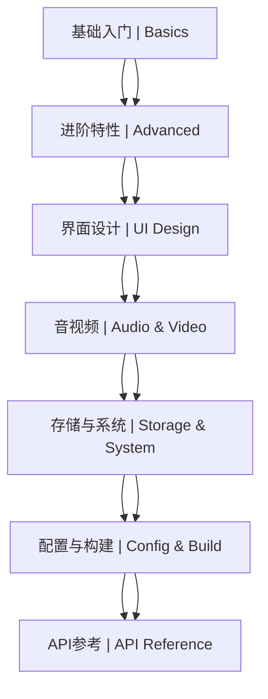

# 16-Ren'Py 视觉小说 | Ren'Py Visual Novel Engine

> @Author: fanquanpp
> @Version: v4.0.0
> @Created: 2026-04-05

## 1. 项目简介 | Introduction

本模块是 fanquanpp 个人综合学习笔记库中的 Ren'Py 视觉小说部分，专注于 Ren'Py 引擎的核心开发技术，包括脚本语法、ATL 动画语言、屏幕系统、游戏机制设计以及发布流程等内容。作为一款专为视觉小说和互动叙事游戏设计的引擎，Ren'Py 以其易用性和强大的功能而受到开发者的喜爱，本模块旨在为创作者提供从入门到进阶的系统化 Ren'Py 学习路径。

This module focuses on Ren'Py engine core development techniques, including scripting, ATL animation language, screen language, game mechanics design, and deployment process. As an engine specifically designed for visual novels and interactive storytelling games, Ren'Py is loved by developers for its ease of use and powerful features, and this module aims to provide a systematic Ren'Py learning path from beginner to advanced levels.

### 模块定位

- **Ren'Py 学习指南**：从基础脚本到高级特性，全面覆盖 Ren'Py 核心知识点
- **视觉小说开发资源**：提供角色、对话、场景、转场等视觉小说核心元素的实现方法
- **互动叙事设计**：收录游戏机制设计、分支剧情处理等互动叙事技巧
- **跨平台发布指南**：提供完整的游戏打包和多平台发布流程
- **官方文档同步**：与 Ren'Py 官方文档保持一致的内容和最佳实践

**使用说明：**

- 本模块已开放为公共资源，允许他人访问和克隆
- 禁止直接修改本仓库内容
- 他人使用本模块内容时出现的任何问题与作者无关

## 2. 学习路线图 | Learning Roadmap



### 详细路径 | Detailed Path

| 阶段 | 模块 | 内容 | 预计耗时 |
| :--- | :--- | :--- | :--- |
| 入门 | 基础入门 | 概述与原理、基础脚本语法、文本处理 | 15h |
| 进阶 | 进阶特性 | ATL动画语言、高级特性与发布 | 25h |
| 进阶 | 界面设计 | 屏幕系统、UI设计、转场效果、分层图像 | 20h |
| 进阶 | 音视频 | 音视频系统 | 10h |
| 高级 | 存储与系统 | 存储与回滚 | 10h |
| 高级 | 配置与构建 | 配置与构建 | 10h |
| 参考 | API参考 | 名词解释 | - |

### 官方文档章节对应 | Official Documentation Mapping

| 官方文档章节 | 对应笔记 |
| :--- | :--- |
| Language Basics | [C16_101-概述与原理.md](./C16_101-概述与原理.md) |
| Labels &amp; Control Flow | [C16_102-基础脚本语法.md](./C16_102-基础脚本语法.md) |
| Dialogue and Narration | [C16_103-文本处理.md](./C16_103-文本处理.md) |
| Transforms (含 ATL) | [G16_201-ATL动画语言.md](./G16_201-ATL动画语言.md) |
| Audio | [G16_401-音视频系统.md](./G16_401-音视频系统.md) |
| Saving, Loading &amp; Rollback | [G16_501-存储与回滚.md](./G16_501-存储与回滚.md) |
| Configuration Variables | [G16_601-配置与构建.md](./G16_601-配置与构建.md) |
| Building Distributions | [G16_601-配置与构建.md](./G16_601-配置与构建.md) |

## 3. 目录索引 | Directory Index

### 基础入门 | Basics

- [C16_101-概述与原理.md](./C16_101-概述与原理.md) - Ren'Py 引擎概述、工作原理、官方文档索引
- [C16_102-基础脚本语法.md](./C16_102-基础脚本语法.md) - 语言基础、标签、对话、图像显示、菜单控制
- [C16_103-文本处理.md](./C16_103-文本处理.md) - 文本样式、文本标签、文本输入、翻译

### 进阶特性 | Advanced Features

- [G16_201-ATL动画语言.md](./G16_201-ATL动画语言.md) - ATL 动画语言、动画语句、内置变换
- [G16_202-高级特性与发布.md](./G16_202-高级特性与发布.md) - Python 集成、Live2D、构建发布

### 界面设计 | UI Design

- [G16_301-屏幕系统与UI设计.md](./G16_301-屏幕系统与UI设计.md) - 屏幕定义、布局系统、控件、动作、样式
- [G16_302-转场效果.md](./G16_302-转场效果.md) - 内置转场、自定义转场、转场控制
- [G16_303-分层图像.md](./G16_303-分层图像.md) - 图层组、属性组合、动态角色

### 音视频 | Audio &amp; Video

- [G16_401-音视频系统.md](./G16_401-音视频系统.md) - 音频系统、背景音乐、音效、语音、视频播放

### 存储与系统 | Storage &amp; System

- [G16_501-存储与回滚.md](./G16_501-存储与回滚.md) - 存档系统、读档机制、回滚功能、持久化数据

### 配置与构建 | Configuration &amp; Build

- [G16_601-配置与构建.md](./G16_601-配置与构建.md) - 配置项变量、游戏设置、构建发布流程

### API参考 | API Reference

- [V16_001-名词解释.md](./V16_001-名词解释.md) - Ren'Py 术语定义、概念说明、函数速查
- [V_16-Ren'Py名词注释查阅表.md](./V_16-Ren'Py名词注释查阅表.md) - Ren'Py 名词注释查阅表

### 官方文档 | Official Documentation

- [Renpydoc-English](./Renpydoc-English/index.html) - Ren'Py 英文官方文档

## 4. 环境要求 | Environment Requirements

- **操作系统**：Windows 10+, macOS 12+, Linux (x86_64)
- **运行时**：Ren'Py 8.5 / 8.6 (Python 3 based)
- **最小配置**：2 核心 CPU / 4GB 内存 / 500MB 磁盘
- **推荐配置**：4 核心 CPU / 8GB 内存 / 1GB 磁盘

## 5. 快速开始 | Quick Start

```bash
# 1. 下载 Ren'Py Launcher
# 访问: https://www.renpy.org/latest.html

# 2. 创建新项目
# 在 Ren'Py Launcher 中点击 "Create New Project"

# 3. 编辑 game/script.rpy
label start:
    "Hello, Ren'Py!"
    return

# 4. 启动游戏 (Shift + R)
```

```renpy
# 完整示例
define config.name = "My Visual Novel"
define e = Character("Eileen", color="#c8ffc8")

label start:
    scene bg room
    show eileen happy
    e "欢迎来到 Ren'Py 世界！"
    menu:
        "选择一":
            jump choice_one
        "选择二":
            jump choice_two

label choice_one:
    e "你选择了第一个选项。"
    return

label choice_two:
    e "你选择了第二个选项。"
    return
```

## 6. 核心特色 | Key Features

| 特性 | 说明 |
| :--- | :--- |
| 视觉小说专用 | 专为视觉小说和互动叙事游戏设计的引擎 |
| 脚本系统 | 详细讲解 Ren'Py 脚本的基本语法和结构 |
| ATL 动画 | 深入解析 ATL 动画语言的使用方法 |
| SL2 屏幕 | 全面介绍 SL2 屏幕语言的界面设计 |
| 音视频系统 | 背景音乐、音效、语音和视频播放控制 |
| 存储系统 | 存档、读档、回滚和持久化数据管理 |
| 跨平台发布 | 支持 Windows、Mac、Linux、Android、iOS、Web |

## 7. 学习提示 | Tips

- **代码整洁**：将 Python 逻辑尽量放在 `init python` 块中
- **性能优化**：大量立绘切换时使用 `image` 语句预定义
- **UI 设计**：Screen 语言是 Ren'Py 最强大的部分，值得深入研究
- **ATL 动画**：ATL 是 Transforms 文档的一部分，包含丰富的动画语句
- **最佳实践**：遵循官方推荐的开发规范和性能优化技巧

## 8. 延伸阅读 | Further Reading

- [Ren'Py 官方文档](https://www.renpy.org/doc.html)
- [Ren'Py 教程](https://www.renpy.org/doc/html/tutorial.html)
- [Ren'Py 论坛](https://lemmasoft.renai.us/forums/)
- [Ren'Py 中文社区](https://www.renpy.cn/)

## 9. 许可证信息 | License

- **SPDX-Identifier**：CC-BY-NC-SA-4.0
- **Copyright**：2024-2026 fanquanpp

---

**更新日志 | Changelog**

- **2026-05-02**
  - 全面检查项目结构，确保一致性
  - 重构目录结构，升级为 v4.0.0（扁平化重组）
  - 清理 Renpydoc-Chinese 文件夹
  - 清理 Renpydoc-English：移除重复/未使用的版本（保留最新 Bootstrap 3.4.1）

- **2026-04-19**
  - 根据官方文档重构优化所有内容，补充缺失的官方文档内容，升级为 v3.1.0 ~ v3.3.0

- **2026-04-18**
  - 完成 GitHub 仓库 3.0 结构优化规划，升级为 v3.0.0