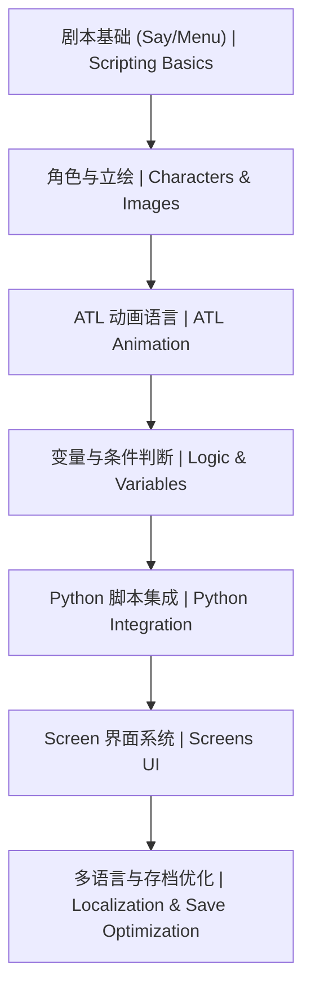

# 16-Ren'Py 视觉小说 | Ren'Py Visual Novel Engine

<!--
作者：fanquanpp
创建日期：2026-04-05
版本：v3.0.0
-->

## 1. 项目简介 | Introduction

本模块是 fanquanpp 个人综合学习笔记库中的 Ren'Py 视觉小说部分，专注于 Ren'Py 引擎的核心开发技术，包括脚本语法、ATL 动画语言、SL2 屏幕语言、游戏机制设计以及发布流程等内容。作为一款专为视觉小说和互动叙事游戏设计的引擎，Ren'Py 以其易用性和强大的功能而受到开发者的喜爱，本模块旨在为创作者提供从入门到进阶的系统化 Ren'Py 学习路径。

This module focuses on Ren'Py engine core development techniques, including scripting, ATL animation language, SL2 screen language, game mechanics design, and deployment process. As an engine specifically designed for visual novels and interactive storytelling games, Ren'Py is loved by developers for its ease of use and powerful features, and this module aims to provide a systematic Ren'Py learning path from beginner to advanced levels.

### 模块定位

- **Ren'Py 学习指南**：从基础脚本到高级特性，全面覆盖 Ren'Py 核心知识点
- **视觉小说开发资源**：提供角色、对话、场景、转场等视觉小说核心元素的实现方法
- **互动叙事设计**：收录游戏机制设计、分支剧情处理等互动叙事技巧
- **跨平台发布指南**：提供完整的游戏打包和多平台发布流程

**使用说明：**

- 本模块已开放为公共资源，允许他人访问和克隆
- 禁止直接修改本仓库内容
- 他人使用本模块内容时出现的任何问题与作者无关

## 2. 学习路线图 | Learning Roadmap



### 详细路径 | Detailed Path

| 阶段 (Stage) | 知识点 (Topic) | 预计耗时 (Estimated Time) | 前置要求 (Prerequisites) |
| :--- | :--- | :--- | :--- |
| 入门 | Ren'Py 基础体系 | 10h | 无 |
| 进阶 | ATL 动画实战 | 15h | Ren'Py 基础 |
| 实战 | 高级特性与发布 | 10h | Python 基础 |

### 学习提示 | Tips
- **代码整洁**：将 Python 逻辑尽量放在 `init python` 块中。
- **性能**：大量立绘切换时使用 `image` 语句预定义以优化加载速度。
- **UI**：Screen 语言是 Ren'Py 最强大的部分，值得深入研究。

## 3. 目录索引 | Directory Index

### 基础语法 | Basics
- [C16_101-概述与原理.md](./C16_101-概述与原理.md)
- [C16_102-基础脚本语法.md](./C16_102-基础脚本语法.md)

### 高级特性 | Advanced
- [G16_201-ATL动画语言.md](./G16_201-ATL动画语言.md)
- [G16_202-高级特性与发布.md](./G16_202-高级特性与发布.md)

### 算法与数据结构 | Algorithms & Data Structures
- [SFDE16_301-save_load_optimization.rpy](./算法与数据结构/代码示例/SFDE16_301-save_load_optimization.rpy)
- [SFDE16_302-typewriter_renpy.rpy](./算法与数据结构/代码示例/SFDE16_302-typewriter_renpy.rpy)

### 官方文档 | Official Documentation
- [Renpy官方教程文档](./Renpy官方教程文档/index.html)

## 3. 环境要求 | Environment Requirements

- **操作系统**：Windows 10+, macOS 12+, Linux (x86_64)
- **运行时**：Ren'Py 8.1 / 8.2 (Python 3 based)
- **最小配置**：2 核心 CPU / 4GB 内存 / 500MB 磁盘 (仅启动器)

## 4. 快速开始 | Quick Start

```bash
# 1. 下载 Ren'Py Launcher
# 访问: https://www.renpy.org/latest.html

# 2. 创建新项目并编辑 script.rpy
label start:
    "Hello, Ren'Py!"
    return

# 3. 启动项目进行验证
```

## 5. 学习路线 | Learning Path

`概述与原理` → `基础脚本语法` → `ATL动画语言` → `高级特性与发布`

## 6. 核心特色 | Key Features

- **视觉小说专用**：专为视觉小说和互动叙事游戏设计的引擎
- **脚本系统**：详细讲解 Ren'Py 脚本的基本语法和结构
- **ATL 动画**：深入解析 ATL 动画语言的使用方法
- **SL2 屏幕**：全面介绍 SL2 屏幕语言的界面设计
- **互动叙事**：专注于分支剧情、选择系统等互动叙事元素
- **跨平台发布**：提供完整的游戏打包和多平台发布流程
- **资源管理**：讲解游戏资源的组织和管理
- **双语注释**：关键概念和代码提供中英文对照注释

## 7. 阅读建议 | Reading Guide

1. 按照学习路线的顺序学习，从概述与环境开始，逐步掌握 Ren'Py 的各种功能
2. 结合实际项目练习，加深对 Ren'Py 脚本的理解
3. 特别关注 ATL 动画和 SL2 屏幕语言部分，这是 Ren'Py 的核心特性
4. 尝试创建一个简单的视觉小说项目，巩固所学知识

## 8. 延伸阅读 | Further Reading

- [Ren'Py 官方文档](https://www.renpy.org/doc.html) <!-- nofollow -->
- [Ren'Py 教程](https://www.renpy.org/doc/html/tutorial.html) <!-- nofollow -->
- [Ren'Py 论坛](https://lemmasoft.renai.us/forums/) <!-- nofollow -->

## 9. 贡献指南 | Contribution Guide

- **编码规范**：遵循 Ren'Py 脚本缩进风格 (4 空格)
- **资源规范**：图片资源放置于 `images/`，音频放置于 `audio/`
- **提交规范**：使用 Conventional Commits

## 10. 联系方式 | Contact Information

- 邮箱：<fanquanpangpiing@163.com>
- QQ：1839243393
- 欢迎提意见交流或反馈问题

## 11. 许可证信息 | License

- **SPDX-Identifier**：[CC-BY-NC-SA-4.0](https://creativecommons.org/licenses/by-nc-sa/4.0/)
- **Copyright**：2024-2026 fanquanpp

---

**更新日志 | Changelog**

- 2026-04-18: 完成GitHub仓库3.0结构优化规划，统一文件命名规范，优化目录结构，升级为 v3.0.0
- 2026-04-06: 深度优化 README.md 文件，完善结构和内容，增加仓库定位、使用说明等部分，升级为 v1.0.2
- 2026-04-06: 更新优化 README.md 文件，完善目录索引和内容结构，修正路径错误，升级为 v1.0.1
- 2026-04-05: 体系化升级 README，补全分册索引、环境要求与快速开始
