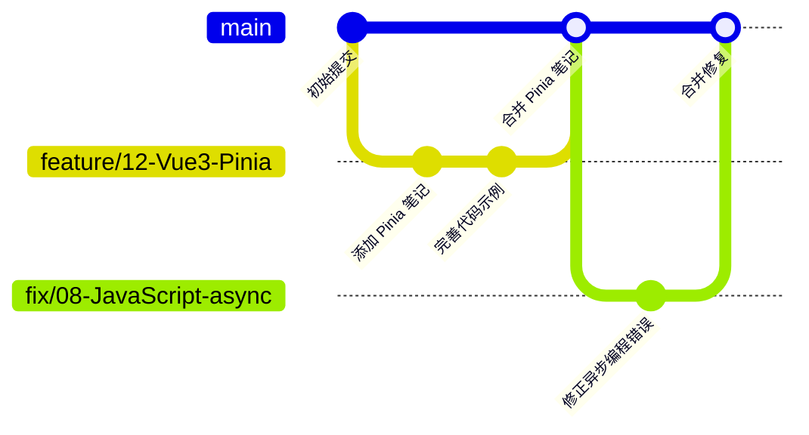

# 贡献指南 | Contribution Guide

> @Author: fanquanpp
> @Version: v3.5.0
> @Created: 2026-05-02
> @Description: MyNotebook 项目贡献规范和检查清单

---

## 1. 欢迎贡献

感谢您对 MyNotebook 的关注！本项目旨在打造一个全面的技术学习知识库，欢迎任何形式的贡献，包括但不限于：

- 修正错别字或语法错误
- 完善现有文档内容
- 添加新的知识点或代码示例
- 优化代码结构和注释
- 报告问题或提出建议

---

## 2. 贡献类型

### 2.1 文档改进

| 类型 | 说明 | 示例 |
|------|------|------|
| **错别字修正** | 修正文档中的错别字 | 将"程序结构"改为"程序结构" |
| **内容完善** | 补充现有文档的不足 | 添加更多代码示例 |
| **格式优化** | 改善文档格式和可读性 | 统一标题层级 |
| **翻译改进** | 改善中英文对照质量 | 优化术语翻译 |

### 2.2 代码贡献

| 类型 | 说明 | 要求 |
|------|------|------|
| **算法实现** | 添加新的算法代码 | 必须包含测试用例 |
| **代码优化** | 优化现有代码性能 | 需说明优化效果 |
| **示例补充** | 添加实际应用示例 | 需包含运行说明 |

### 2.3 新增内容

| 类型 | 说明 | 要求 |
|------|------|------|
| **新增模块** | 创建全新的技术模块 | 需遵循命名规范 |
| **知识点扩展** | 在现有模块中添加新知识点 | 需更新 README 索引 |

---

## 3. 文件命名规范

### 3.1 命名格式

```
[类型代号][模块序号]_[文件序号]-[文件名].md
```

### 3.2 类型代号

| 类型 | 代号 | 说明 | 编号范围 |
|------|------|------|---------|
| 基础知识点 | C | 面向初学者的基础概念 | 101-199 |
| 高级知识点 | G | 面向进阶者的高级特性 | 201-299 |
| 专项知识点 | Z | 特定领域的深入探讨 | 301-399 |
| 算法与数据结构 | SFDE | 算法与数据结构实现 | 301-499 |
| 名词注释表 | V | 专有名词解释 | 101-999 |

### 3.3 模块序号

| 模块 | 序号 | 模块 | 序号 |
|------|------|------|------|
| GitHub | 01 | Markdown | 09 |
| C语言 | 02 | MySQL | 10 |
| Python | 03 | TypeScript | 11 |
| Java | 04 | Vue3 | 12 |
| HTML5 | 05 | C++ | 13 |
| CSS | 06 | Lua | 14 |
| Git | 07 | Godot | 15 |
| JavaScript | 08 | Ren'Py | 16 |

### 3.4 示例

```markdown
# 正确示例
C02_101-概述.md           # 02-C语言 模块，基础知识点，文件序号101
G04_201-SpringBoot核心实战.md  # 04-Java 模块，高级知识点，文件序号201
SFDE03_301-binary_search_py.py  # 03-Python 模块，算法实现

# 错误示例
C02_概述.md               # 缺少文件序号
C02_101概述.md           # 连接符错误
02-C语言_概述.md          # 格式错误
```

---

## 4. 文档格式规范

### 4.1 元数据头部

每个文档必须包含以下元数据：

```markdown
# 文档标题

> @Author: [你的名字]
> @Category: [分类]
> @Description: [简短描述] | [English description]
```

### 4.2 标题层级

```markdown
# 一级标题（文档标题）
## 二级标题（主要章节）
### 三级标题（子章节）
#### 四级标题（详细内容）
```

### 4.3 代码块规范

````markdown
```语言
// 代码内容
```
````

示例：

```python
def hello_world():
    print("Hello, World!")
```

### 4.4 表格规范

```markdown
| 列1 | 列2 | 列3 |
| :--- | :---: | ---: |
| 左对齐 | 居中 | 右对齐 |
```

### 4.5 链接规范

```markdown
[链接文本](./路径/文件.md)
[外部链接](https://example.com)
```

### 4.6 内容规范

- **禁止使用 emoji**：文档中禁止使用任何 emoji 表情符号，包括但不限于笑脸、火箭、对勾、警告等图形符号
- 使用标准 ASCII 字符和中文汉字
- 使用 Markdown 语法进行格式化，如粗体、斜体、代码

---

## 5. 代码规范

### 5.1 通用规范

- 使用 UTF-8 编码
- 使用 Unix 换行符 (LF)
- 文件结尾添加空行
- 适度添加空行增强可读性

### 5.2 多语言规范

| 语言 | 规范 |
|------|------|
| **C/C++** | Google C++ Style Guide |
| **Java** | Google Java Style Guide |
| **JavaScript/TypeScript** | ESLint + Prettier |
| **Python** | PEP 8 |
| **HTML/CSS** | W3C 标准 |

### 5.3 注释规范

- 关键代码添加中文注释
- 复杂逻辑添加详细说明
- 保持注释与代码同步更新

示例：

```c
// 计算数组元素之和
// @param arr: 输入数组
// @param n: 数组长度
// @return: 元素和
int sum_array(int arr[], int n) {
    int sum = 0;
    for (int i = 0; i < n; i++) {
        sum += arr[i];  // 累加每个元素
    }
    return sum;
}
```

---

## 6. 提交规范

### 6.1 Commit 格式

```
<类型>(<模块>): <简短描述>

[可选的详细说明]
```

### 6.2 类型标识

| 类型 | 说明 | 示例 |
|------|------|------|
| `feat` | 新功能 | `feat(03-Python): 添加快速排序算法` |
| `fix` | 修复错误 | `fix(02-C): 修正指针部分错别字` |
| `docs` | 文档更新 | `docs(README): 更新学习路径` |
| `style` | 格式调整 | `style: 统一代码缩进` |
| `refactor` | 重构 | `refactor(04-Java): 优化集合框架笔记` |
| `test` | 测试相关 | `test: 添加单元测试` |
| `chore` | 杂项 | `chore: 更新依赖` |

### 6.3 示例

```bash
# 正确示例
git commit -m "feat(03-Python): 添加推导式与生成器知识点"
git commit -m "fix(08-JavaScript): 修正异步编程章节的代码错误"
git commit -m "docs(README): 更新学习路线图"

# 错误示例
git commit -m "更新"                           # ❌ 描述过于简略
git commit -m "修改了一些东西"                   # ❌ 描述不明确
git commit -m "feat: 添加新内容"                # ❌ 缺少模块标识
```

---

## 7. 分支策略

### 7.1 分支命名

```bash
# 功能分支
feature/<模块>-<功能描述>
feature/12-Vue3-CompositionAPI

# 修复分支
fix/<模块>-<问题描述>
fix/02-C-pointer-error

# 文档分支
docs/<模块>-<文档描述>
docs/03-Python-算法补充

# 版本分支
release/v<版本号>
release/v3.6.0
```

### 7.2 工作流程



---

## 8. Pull Request 规范

### 8.1 PR 标题

```
[类型] <模块>: <简短描述>

示例：
[feat] 12-Vue3: 添加 Pinia 状态管理知识点
[fix] 02-C语言: 修正指针章节的内存管理错误
[docs] README: 更新学习路径图
```

### 8.2 PR 描述模板

```markdown
## 变更类型
- [ ] 新功能 (feat)
- [ ] 修复错误 (fix)
- [ ] 文档更新 (docs)
- [ ] 代码重构 (refactor)
- [ ] 其他 (chore)

## 变更内容
请描述本次变更的内容...

## 关联问题
请关联相关的 Issue（如有）...

## 测试情况
- [ ] 本地测试通过
- [ ] 代码示例可正常运行
- [ ] 文档格式检查通过

## 截图（如有）
请添加相关截图...
```

---

## 9. 贡献检查清单

### 9.1 提交前检查

```markdown
## 贡献检查清单

### 文件命名
- [ ] 遵循命名规范 (类型代号_模块序号_文件序号-文件名.md)
- [ ] 使用正确的中文连接符 (短横线 `-`)
- [ ] 文件名不包含特殊字符

### 文档格式
- [ ] 包含完整的元数据头部
- [ ] 标题层级清晰（一级到四级）
- [ ] 代码块标注正确的语言
- [ ] 表格格式正确

### 内容质量
- [ ] 内容完整，无占位符
- [ ] 代码示例可正常运行
- [ ] 术语使用一致
- [ ] 无错别字

### 交叉引用
- [ ] 更新了模块 README 索引
- [ ] 添加了相关模块的引用链接（如有）
- [ ] 更新了学习路线图（如有）

### 版本更新
- [ ] 更新了文档 `@Version`（如有）
- [ ] 添加了更新日志条目
```

### 9.2 自动检查工具

```bash
# Markdown 语法检查
markdownlint README.md **/*.md

# 链接有效性检查
# (建议在 PR 时手动检查外链)

# 文件命名检查
# (建议使用上述检查清单人工检查)
```

---

## 10. 问题反馈

### 10.1 Issue 类型

| 类型 | 标签 | 说明 |
|------|------|------|
| **Bug** | `bug` | 报告错误或问题 |
| **功能建议** | `enhancement` | 提出新功能建议 |
| **文档问题** | `documentation` | 文档相关的问题 |
| **疑问** | `question` |  일반적인 질문 |

### 10.2 Issue 模板

```markdown
## 问题描述
请详细描述您遇到的问题...

## 环境信息
- 操作系统：
- 相关模块：
- 问题文件：

## 复现步骤
1.
2.
3.

## 预期行为
请描述您的预期行为...

## 截图（如有）
请添加相关截图...
```

---

## 11. 联系方式

- **邮箱**：fanquanpangpiing@163.com
- **QQ**：1839243393
- **GitHub Issue**：[新建 Issue](https://github.com/fanquanpp/MyNotebook/issues)

---

## 12. 许可证

本项目采用 **CC-BY-NC-SA-4.0** 许可证。

您的贡献将同样采用此许可证。

---

**最后更新：2026-05-02**
