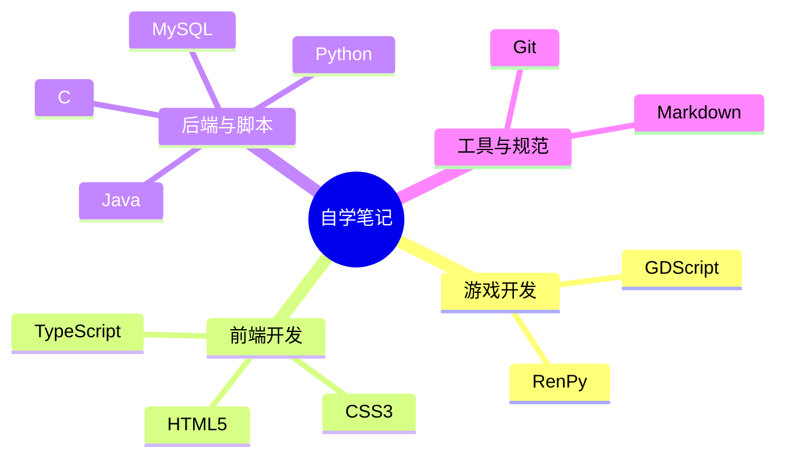

<a id="title"></a>
# fanquanpp 的自学笔记仓库

本仓库是 fanquanpp 的私人学习笔记，包含各种技术领域的学习资料，按照不同的技术分类进行系统化整理。

---

## 🎯 学习目标与知识图谱

本仓库旨在建立一个结构化、可检索的个人知识库。



---

## 📋 前置知识清单

| 领域 | 推荐链接 | 预计学习时长 |
| :--- | :--- | :--- |
| 编程基础 | [CS50](https://cs50.harvard.edu/x/) | 40h |
| Web 基础 | [MDN HTML/CSS](https://developer.mozilla.org/zh-CN/docs/Learn) | 20h |
| 数据库 | [SQL Tutorial](https://www.w3schools.com/sql/) | 10h |

---

## 💻 运行环境

- **操作系统**: Windows 10/11, Ubuntu 22.04 LTS
- **工具链**:
    - C: GCC 11+
    - Java: OpenJDK 17
    - Python: 3.10+
    - Node.js: 18+
    - Git: 2.30+

---

## 📦 依赖安装

```bash
# Python
pip install -r requirements.txt

# Node.js/TypeScript
npm install

# Java (Maven)
mvn install
```

---

## 🚀 快速开始

1. **克隆仓库**:
   ```bash
   git clone https://github.com/fanquanpp/Notebook.git
   ```
2. **查看目录**:
   打开 [SUMMARY.md](SUMMARY.md) 查看完整知识地图。
3. **本地预览**:
   ```bash
   npm install -g docsify-cli
   docsify serve .
   ```
4. **运行示例**:
   进入对应目录（如 `C/algorithms/basic`）执行编译运行。

---

## 🛠️ 开发规范

详见各目录下的 `.style-guide.md` 及根目录 [glossary.md](glossary.md)。

---

## 📜 声明

本仓库内容允许任何人查阅参考，但若因使用本仓库内容而产生任何问题，使用者需自行负责。
