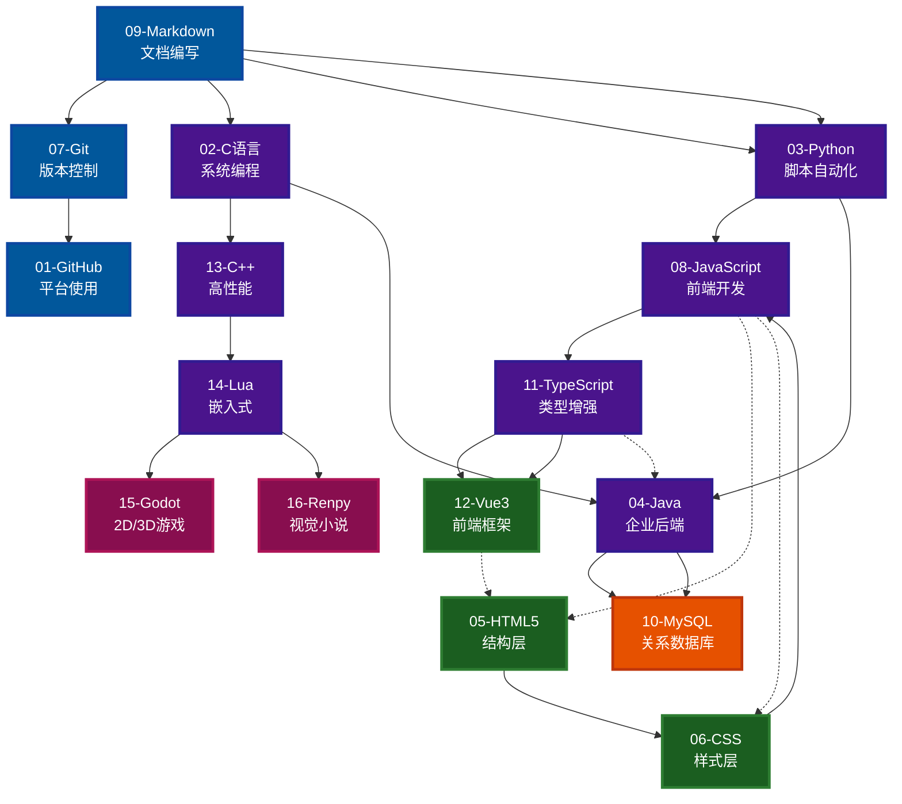

# Note-Data | 个人综合资料库

> @Version: v3.5.1
> @Author: fanquanpp
> @Category: Documentation
> @Description: 综合性资料库，覆盖 C/C++、Web 前端、Python/Java 后端、MySQL 数据库及游戏开发。 | Comprehensive tech learning notebook covering C/C++, Web, Python/Java, MySQL, and game dev.
> @Updated: 2026-05-03

***

## 1. 项目简介 | Introduction

MyNotebook 是一个综合性资料库，覆盖 C/C++、Web 前端、Python/Java 后端、MySQL 数据库及游戏开发等多个技术领域。

### 联系方式

- 邮箱：<fanquanpangpiing@163.com>
- QQ：1839243393

## 2. 目录索引 | Directory Index

### 2.1 快速导航

|  序号 | 模块名称          | 英文名称                     | 路径                                                     |
| :-: | :------------ | :----------------------- | :----------------------------------------------------- |
|  01 | GitHub 平台     | GitHub Platform          | [./01-Github/README.md](./01-Github/README.md)         |
|  02 | C 语言与算法       | C & Algorithms           | [./02-C语言/README.md](./02-C语言/README.md)               |
|  03 | Python 基础     | Python Scripting         | [./03-Python/README.md](./03-Python/README.md)         |
|  04 | Java 后端开发     | Java Backend Development | [./04-Java/README.md](./04-Java/README.md)             |
|  05 | HTML5 网页开发    | HTML5 Web Development    | [./05-HTML5/README.md](./05-HTML5/README.md)           |
|  06 | CSS 布局        | CSS Layouts              | [./06-CSS/README.md](./06-CSS/README.md)               |
|  07 | Git 版本控制      | Git Version Control      | [./07-Git/README.md](./07-Git/README.md)               |
|  08 | JavaScript 基础 | JavaScript               | [./08-Javascript/README.md](./08-Javascript/README.md) |
|  09 | Markdown 文档   | Markdown Documentation   | [./09-Markdown/README.md](./09-Markdown/README.md)     |
|  10 | MySQL 数据库     | MySQL Database           | [./10-MySQL/README.md](./10-MySQL/README.md)           |
|  11 | TypeScript 进阶 | TypeScript Advanced      | [./11-Typescript/README.md](./11-Typescript/README.md) |
|  12 | Vue3          | Vue3 Framework           | [./12-Vue3/README.md](./12-Vue3/README.md)             |
|  13 | C++ 系统编程      | C++ Systems Programming  | [./13-C++/README.md](./13-C++/README.md)               |
|  14 | Lua 语言        | Lua Language             | [./14-Lua/README.md](./14-Lua/README.md)               |
|  15 | Godot 游戏引擎    | Godot Game Engine        | [./15-Godot/README.md](./15-Godot/README.md)           |
|  16 | Ren'Py 游戏引擎   | Ren'Py Game Engine       | [./16-Renpy/README.md](./16-Renpy/README.md)           |

### 2.2 技术领域分类

#### 基础工具与平台支持

- [GitHub 平台](./01-Github/README.md)
- [Git 版本控制](./07-Git/README.md)
- [Markdown 文档](./09-Markdown/README.md)

#### 编程语言

- [C 语言与算法](./02-C语言/README.md)
- [Python 基础](./03-Python/README.md)
- [Java 后端开发](./04-Java/README.md)
- [JavaScript 基础](./08-Javascript/README.md)
- [TypeScript 进阶](./11-Typescript/README.md)
- [C++ 系统编程](./13-C++/README.md)
- [Lua 语言](./14-Lua/README.md)

#### Web 前端开发

- [HTML5 网页开发](./05-HTML5/README.md)
- [CSS 布局](./06-CSS/README.md)
- [Vue3](./12-Vue3/README.md)

#### 数据库

- [MySQL 数据库](./10-MySQL/README.md)

#### 游戏开发

- [Godot 游戏引擎](./15-Godot/README.md)
- [Ren'Py 游戏引擎](./16-Renpy/README.md)

## 3. 技术架构 | Technical Architecture

### 3.1 技术模块依赖关系



### 3.2 学习路线推荐

#### 路线一：Web 全栈开发

Markdown -> Git -> GitHub -> HTML5 -> CSS -> JavaScript -> TypeScript -> Vue3 -> MySQL

#### 路线二：后端开发

Markdown -> Git -> GitHub -> C 语言 -> Python -> Java -> MySQL

## 4. 快速开始 | Quick Start

```bash
# 1. 克隆仓库到当前目录
git clone https://github.com/fanquanpp/MyNotebook.git .

# 2. 浏览模块内容
# 例如：查看 Python 基础模块
cd 03-Python

# 3. 开始学习
# 按照每个模块的 README.md 中的学习路线进行学习
```

## 5. 优质资源推荐 | Recommended Resources

### 外部 GitHub 仓库推荐

#### JavaScript 相关

- **JavaScript笔记** -> [anbang/javascript-notes](https://github.com/anbang/javascript-notes.git)
  - 全面的 JavaScript 学习笔记和示例
- **Airbnb JavaScript风格指南** -> [airbnb/javascript](https://github.com/airbnb/javascript.git)
  - 业界广泛使用的 JavaScript 代码风格指南
- **30 seconds of code** -> [30-seconds/30-seconds-of-code](https://github.com/30-seconds/30-seconds-of-code)
  - 收集了大量实用 JavaScript、Python 等语言的代码片段

#### 算法相关

- **算法可视化器** -> [algorithm-visualizer/algorithm-visualizer](https://github.com/algorithm-visualizer/algorithm-visualizer.git)
  - 通过可视化方式理解各种算法的运行过程
- **LeetCode算法题解** -> [doocs/leetcode](https://github.com/doocs/leetcode.git)
  - 包含详细的 LeetCode 题目解析和解答方法
- **算法问题合集** -> [MTrajK/coding-problems](https://github.com/MTrajK/coding-problems.git)
  - 收集了各种编程算法问题和答案
- **数据结构与算法(斯洛伐克)** -> [thepranaygupta/Data-Structures-and-Algorithms](https://github.com/thepranaygupta/Data-Structures-and-Algorithms)
  - 全面的数据结构与算法实现
- **算法与数据结构(开源书籍)** -> [kelvins/algorithms-and-data-structures](https://github.com/kelvins/algorithms-and-data-structures.git)
  - 多种编程语言实现的算法与数据结构
- **ApacheCN算法译文集** -> [apachecn/apachecn-algo-zh](https://github.com/apachecn/apachecn-algo-zh.git)
  - 数据结构与算法的中文译文集，包含 LeetCode 题解
- **Hello 算法** -> [krahets/hello-algo](https://github.com/krahets/hello-algo.git)
  - 图解代码、一键运行的数据结构与算法教程，支持多语言实现
- **The Algorithms (Python)** -> [TheAlgorithms/Python](https://github.com/TheAlgorithms/Python)
  - 各种数据结构和算法的 Python 实现
- **The Algorithms (Java)** -> [TheAlgorithms/Java](https://github.com/TheAlgorithms/Java)
  - 各种数据结构和算法的 Java 实现

#### TypeScript 相关

- **多行文本测量和排版** -> [chenglou/pretext](https://github.com/chenglou/pretext.git)
  - 专注于文本测量和排版的 TypeScript 库

#### Java 相关

- **toBeBetterJavaer** -> [itwanger/toBeBetterJavaer](https://github.com/itwanger/toBeBetterJavaer.git)
  - 通俗易懂、风趣幽默的 Java 学习指南，覆盖 Java 基础、并发编程、虚拟机等核心知识点
- **awesome-java** -> [akullpp/awesome-java](https://github.com/akullpp/awesome-java)
  - Java 生态高质量库与工具索引，常见问题解决方案合集
- **StudyNotes (krislinzhao)** -> [krislinzhao/StudyNotes](https://github.com/krislinzhao/StudyNotes)
  - 高度结构化的 Java 后端笔记，重点覆盖 Spring 全家桶及分布式系统

#### C++ 相关

- **CppGuide** -> [balloonwj/CppGuide](https://github.com/balloonwj/CppGuide.git)
  - C++ 后台开发进阶学习资料，包含 C++ 必知必会的知识点和常见服务器架构等内容

#### CSS 相关

- **Flexbox-Labs** -> [prazzon/Flexbox-Labs](https://github.com/prazzon/Flexbox-Labs.git)
  - 基于 Web 的 CSS Flexbox 布局工具，提供更直观和实时预览功能

#### Git 相关

- **Pro Git 2 中文翻译** -> [progit/progit2-zh](https://github.com/progit/progit2-zh.git)
  - Git 圣经《Pro Git》第二版的中文翻译版本
- **GitHub Docs** -> [github/docs](https://github.com/github/docs)
  - GitHub 官方文档，学习 Git 与 GitHub 协作的权威材料

#### 开源社区相关

- **HelloGitHub** -> [521xueweihan/HelloGitHub](https://github.com/521xueweihan/HelloGitHub.git)
  - 分享 GitHub 上有趣、入门级的开源项目，每月 28 号以月刊形式更新
- **Awesome** -> [sindresorhus/awesome](https://github.com/sindresorhus/awesome)
  - GitHub 各种优质主题列表（Awesome Lists）的总目录，可作为发掘资源的"藏宝图"

#### 游戏开发相关

- **Godot Engine** -> [godotengine/godot](https://github.com/godotengine/godot.git)
  - 强大的 2D 和 3D 游戏引擎，开源免费，支持多平台导出

#### Python 相关

- **Python Mastery** -> [dabeaz-course/python-mastery](https://github.com/dabeaz-course/python-mastery.git)
  - David Beazley 的高级 Python 编程课程，包含教学和解决方案

#### 工具相关

- **NoteGen** -> [codexu/note-gen](https://github.com/codexu/note-gen.git)
  - 强大的 Markdown AI 笔记工具，有助于使用 AI 辅助记录和写作
- **Reference** -> [jaywcjlove/reference](https://github.com/jaywcjlove/reference.git)
  - 面向开发者的技术速查表合集，整理常见技术、工具与开发流程

#### 计算机核心知识

- **CS-Notes (CyC2018)** -> [CyC2018/CS-Notes](https://github.com/CyC2018/CS-Notes)
  - 知名技术面试笔记，全面覆盖算法、操作系统、网络、Java、系统设计等
- **CS-Notes (wx-chevalier)** -> [wx-chevalier/CS-Notes](https://github.com/wx-chevalier/CS-Notes)
  - 注重编程语言基础、演进与工程实践，培养跨语言的编程思维
- **Build Your Own X** -> [codecrafters-io/build-your-own-x](https://github.com/codecrafters-io/build-your-own-x)
  - 从零构建数据库、Git、Docker 等技术的实践教程合集
- **OSSU Computer Science** -> [ossu/computer-science](https://github.com/ossu/computer-science)
  - 完整的自学计算机科学课程规划，利用免费课程构建科班知识体系

#### 系统设计与面试

- **System Design Primer** -> [donnemartin/system-design-primer](https://github.com/donnemartin/system-design-primer)
  - 系统设计领域权威入门指南，学习如何设计大型可扩展系统
- **System Design Resources** -> [InterviewReady/system-design-resources](https://github.com/InterviewReady/system-design-resources)
  - 系统设计资源合集，与面试准备紧密结合

#### 学习路线与代码片段

- **Developer Roadmap** -> [kamranahmedse/developer-roadmap](https://github.com/kamranahmedse/developer-roadmap)
  - 提供前端、后端、DevOps 等岗位的详细技术学习路线图
- **StudyNotes (hongjilin)** -> [hongjilin/StudyNotes](https://github.com/hongjilin/StudyNotes)
  - 全栈偏前端的开发者笔记，贴近实际开发

#### 书籍与资源合集

- **Free Programming Books** -> [EbookFoundation/free-programming-books](https://github.com/EbookFoundation/free-programming-books)
  - 海量免费编程电子书，分类详细
- **FreeCodeCamp** -> [freeCodeCamp/freeCodeCamp](https://github.com/freeCodeCamp/freeCodeCamp)
  - 免费互动学习平台的开源代码库，内含丰富学习资料
- **Public APIs** -> [public-apis/public-apis](https://github.com/public-apis/public-apis)
  - 收集大量免费公开 API，便于开发调用
- **CS-Books** -> [fffaraz/CS-Books](https://github.com/fffaraz/CS-Books)
  - 超 1000 本计算机经典书籍汇总

#### 个人笔记结构参考

- **Cecilife 个人技术笔记** -> [cecilifenotebook/notebook](https://github.com/cecilifenotebook/notebook)
  - 知识组织范例，结构按算法、系统设计等分类，含自动化笔记质量检查
- **PiperLiu 的计算机基础笔记** -> [PiperLiu/CS-courses-notes](https://github.com/PiperLiu/CS-courses-notes)
  - MIT 6.S081、6.824 等硬核课程的学习心得

#### Web 全栈 & WebGIS 专项

- **webgis-roadmap** -> [sshuair/webgis-roadmap](https://github.com/sshuair/webgis-roadmap)
  - 开源 WebGIS 开发学习路线图，从 GIS 基础到工程实践
- **awesome-frontend-gis** -> [sshuair/awesome-frontend-gis](https://github.com/sshuair/awesome-frontend-gis)
  - 前端 GIS 精选资源，侧重 Deck.GL、Cesium.js 等高性能库和数据处理工具
- **awesome-webgis** -> [sshuair/awesome-webgis](https://github.com/sshuair/awesome-webgis)
  - 综合 WebGIS 资源索引，包含 Leaflet、GeoServer、PostGIS 等
- **Leaflet** -> [Leaflet/Leaflet](https://github.com/Leaflet/Leaflet)
  - 轻量级交互式地图库，快速搭建地图应用
- **OpenLayers** -> [openlayers/openlayers](https://github.com/openlayers/openlayers)
  - 功能强大的地图渲染引擎，支持复杂空间分析
- **GeoServer** -> [geoserver/geoserver](https://github.com/geoserver/geoserver)
  - 企业级开源地图服务器，发布 WMS/WFS 等服务
- **MapStore2** -> [geosolutions-it/MapStore2](https://github.com/geosolutions-it/MapStore2)
  - 基于 React + Leaflet/OpenLayers 的企业级 WebGIS 框架
- **CesiumJS** -> [CesiumGS/cesium](https://github.com/CesiumGS/cesium)
  - 三维地球引擎，支持时空数据可视化
- **CesiumJS 中文教程** -> [CesiumLab/cesiumjs-tutorial-cn](https://github.com/CesiumLab/cesiumjs-tutorial-cn)
  - Cesium 中文入门与进阶教程
- **all-of-frontend** -> [zhangyuang/all-of-frontend](https://github.com/zhangyuang/all-of-frontend)
  - 真全栈项目实践，覆盖前端、后端及前沿技术栈
- **web-dev-resources** -> [mtdvio/web-dev-resources](https://github.com/mtdvio/web-dev-resources)
  - 汇集 150+ 高质量链接的 Web 开发资源宝库

## 6. 笔记文件命名策略 | Note File Naming Strategy

### 6.1 整体结构

基础知识点笔记 -> 高级知识点笔记 -> 专项知识点笔记

### 6.2 命名规则

**完整格式**：`[类型代号][文件大类序号]_[文件序号]-[笔记内容].md`

**示例**：`C01_101-账户与安全.md`

| 部分     | 说明             | 示例                           |
| :----- | :------------- | :--------------------------- |
| 类型代号   | 笔记类型标识（见下表）    | C, G, Z, V                   |
| 文件大类序号 | 模块编号（2位数字，不能省） | 01, 02, ..., 16              |
| 文件序号   | 文件编号（3位数字）     | 101, 102, ..., 201, 202, ... |
| 笔记内容   | 文件主题描述（短横线分隔）  | 账户与安全、配置与构建                  |

### 6.3 类型代号说明

| 类型      | 代号 | 说明                     | 编号范围    |
| :------ | :- | :--------------------- | :------ |
| 基础知识点笔记 | C  | 面向初学者的基础概念和使用方法        | 101-199 |
| 高级知识点笔记 | G  | 面向进阶者的高级特性和最佳实践        | 201-299 |
| 专项知识点笔记 | Z  | 特定领域的深入研讨和专题研究         | 301-399 |
| 名词注释查阅表 | V  | 对应内容的专有名词的定义和相关的注释说明文档 | 101-999 |

### 6.4 排序规则

- **文件大类排序**：01, 02, 03...16（按模块重要性和学习顺序）
- **文件排序**：101, 102...201, 202, 203...（基础知识点从101开始，高级知识点从201开始）

## 7. 延伸阅读 | Further Reading

- [TypeScript 中文手册](https://jkchao.github.io/typescript-book-chinese/)
- [Godot 引擎文档](https://docs.godotengine.org/zh-cn/4.5/)
- [Ren'Py 官方文档](https://www.renpy.org/doc/html/)
- [Vue3 中文文档](https://cn.vuejs.org/)
- [MDN Web 文档](https://developer.mozilla.org/zh-CN/)

***

**更新日志 | Changelog**

### 2026-05-04

- **v3.5.1** - 修复根目录 README 章节编号不连续问题，重新编排为 1-7 连续编号
- \[优化] 将原 3.2/3.3 合并为第 3 章"技术架构"，下设 3.1/3.2 子节
- \[优化] 将原第 5/7/8/11 章重新编号为第 4/5/6/7 章

### 2026-05-03

- **v3.5.0** - 编码问题修复与项目规范化重构
- \[修复] 修复 PowerShell 脚本导致的 UTF-8 BOM 中文乱码问题
- \[文档] 重写 16 个模块的 README.md 文件，统一结构和版本号
- \[基建] 新增 `.editorconfig` 文件，强制执行 UTF-8 无 BOM 编码规范
- \[工具] 重写所有 PowerShell 脚本，使用 .NET API 确保 UTF-8 无 BOM 写入
- \[检查] 新增 `.scripts/run_all_checks.ps1` 综合检查脚本
- \[优化] 根目录 README 融合学习路线、环境要求、贡献指南等章节

### 2026-04-18

- **v3.3.0** - 合并笔记文件命名策略到 README.md
- **v3.0.0** - 完成 GitHub 仓库 3.0 结构优化规划，统一文件命名规范

### 2026-04-08

- **v2.5.8 \~ v2.5.9** - 补充多个优质 GitHub 仓库推荐

### 2026-04-07

- **v2.5.5 \~ v2.5.7** - 优化 README.md 外部资源推荐部分

### 2026-04-06

- **v2.5.1 \~ v2.5.4** - 重构项目根目录 README.md，优化结构和可读性

### 2026-04-05

- **v2.5.0** - 全库重构完成

