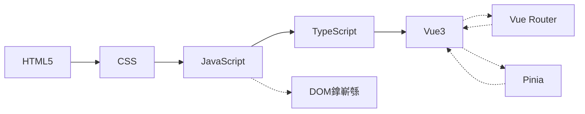
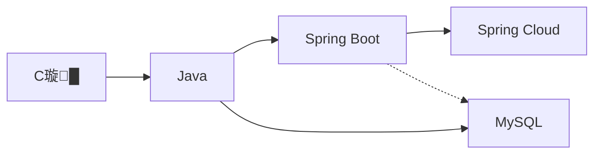
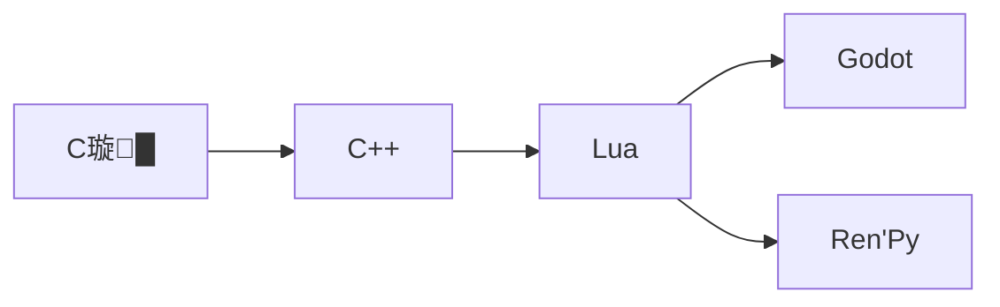

# MyNotebook | 涓汉缁煎悎璧勬枡绗旇搴?

> @Author: fanquanpp
> @Version: v3.5.0
> @Created: 2026-04-05
> @Description: 缁煎悎鎬т釜浜鸿祫鏂欑瑪璁板簱锛屾兜鐩?C/C++銆乄eb 鍓嶇銆丳ython/Java 鍚庣銆丮ySQL 鏁版嵁搴撳強娓告垙寮€鍙戠瓑澶氫釜鎶€鏈鍩熴€?| Comprehensive personal knowledge notebook covering multiple technical fields.

<br />

## 0. 浼樿川璧勬簮鎺ㄨ崘 | Recommended Resources

### 澶栭儴 GitHub 浠撳簱鎺ㄨ崘

#### JavaScript 鐩稿叧

- **JavaScript绗旇** 鈫?[anbang/javascript-notes](https://github.com/anbang/javascript-notes.git)
  - 鍏ㄩ潰鐨?JavaScript 瀛︿範绗旇鍜岀ず渚?
- **Airbnb JavaScript椋庢牸鎸囧崡** 鈫?[airbnb/javascript](https://github.com/airbnb/javascript.git)
  - 涓氱晫骞挎硾閲囩敤鐨?JavaScript 浠ｇ爜椋庢牸鎸囧崡

#### 绠楁硶鐩稿叧

- **绠楁硶鍙鍖栧櫒** 鈫?[algorithm-visualizer/algorithm-visualizer](https://github.com/algorithm-visualizer/algorithm-visualizer.git)
  - 閫氳繃鍙鍖栨柟寮忕悊瑙ｅ悇绉嶇畻娉曠殑鎵ц杩囩▼
- **LeetCode绠楁硶棰樿瑙?* 鈫?[doocs/leetcode](https://github.com/doocs/leetcode.git)
  - 鍖呭惈璇︾粏鐨?LeetCode 棰樼洰瑙ｆ瀽鍜岃В鍐虫柟妗?
- **绠楁硶闂闆嗗悎** 鈫?[MTrajK/coding-problems](https://github.com/MTrajK/coding-problems.git)
  - 鏀堕泦浜嗗悇绉嶇紪绋嬬畻娉曢棶棰樺拰瑙ｇ瓟
- **鏁版嵁缁撴瀯涓庣畻娉曪紙鏅媺鐗癸級** 鈫?[thepranaygupta/Data-Structures-and-Algorithms](https://github.com/thepranaygupta/Data-Structures-and-Algorithms.git)
  - 鍏ㄩ潰鐨勬暟鎹粨鏋勪笌绠楁硶瀹炵幇
- **绠楁硶涓庢暟鎹粨鏋勶紙寮€灏旀枃锛?* 鈫?[kelvins/algorithms-and-data-structures](https://github.com/kelvins/algorithms-and-data-structures.git)
  - 澶氱缂栫▼璇█瀹炵幇鐨勭畻娉曚笌鏁版嵁缁撴瀯
- **ApacheCN绠楁硶璇戞枃闆?* 鈫?[apachecn/apachecn-algo-zh](https://github.com/apachecn/apachecn-algo-zh.git)
  - 鏁版嵁缁撴瀯涓庣畻娉曠殑涓枃璇戞枃闆嗭紝鍖呭惈 LeetCode 棰樿В
- **Hello 绠楁硶** 鈫?[krahets/hello-algo](https://github.com/krahets/hello-algo.git)
  - 鍔ㄧ敾鍥捐В銆佷竴閿繍琛岀殑鏁版嵁缁撴瀯涓庣畻娉曟暀绋嬶紝鏀寔澶氳瑷€瀹炵幇

#### TypeScript 鐩稿叧

- **澶氳鏂囨湰娴嬮噺鍜屽竷灞€** 鈫?[chenglou/pretext](https://github.com/chenglou/pretext.git)
  - 涓撴敞浜庢枃鏈祴閲忓拰甯冨眬鐨?TypeScript 搴?

#### Java 鐩稿叧

- **toBeBetterJavaer** 鈫?[itwanger/toBeBetterJavaer](https://github.com/itwanger/toBeBetterJavaer.git)
  - 閫氫織鏄撴噦銆侀瓒ｅ菇榛樼殑 Java 瀛︿範鎸囧崡锛屾兜鐩?Java 鍩虹銆佸苟鍙戠紪绋嬨€佽櫄鎷熸満绛夋牳蹇冪煡璇嗙偣

#### C++ 鐩稿叧

- **CppGuide** 鈫?[balloonwj/CppGuide](https://github.com/balloonwj/CppGuide.git)
  - C++ 鍚庣寮€鍙戣繘闃跺涔犺祫鏂欙紝鍖呭惈 C++ 蹇呯煡蹇呬細鐨勭煡璇嗙偣鍜屾父鎴忔湇鍔″櫒绔灦鏋勭瓑鍐呭

#### CSS 鐩稿叧

- **Flexbox-Labs** 鈫?[prazzon/Flexbox-Labs](https://github.com/prazzon/Flexbox-Labs.git)
  - 鍩轰簬 Web 鐨?CSS Flexbox 甯冨眬宸ュ叿锛屾彁渚涚洿瑙傜晫闈㈠拰瀹炴椂棰勮鍔熻兘

#### Git 鐩稿叧

- **Pro Git 2 涓枃缈昏瘧** 鈫?[progit/progit2-zh](https://github.com/progit/progit2-zh.git)
  - Git 鏉冨▉涔︾睄銆奝ro Git銆嬬浜岀増鐨勪腑鏂囩炕璇戠増鏈?

#### 寮€婧愮ぞ鍖虹浉鍏?

- **HelloGitHub** 鈫?[521xueweihan/HelloGitHub](https://github.com/521xueweihan/HelloGitHub.git)
  - 鍒嗕韩 GitHub 涓婃湁瓒ｃ€佸叆闂ㄧ骇鐨勫紑婧愰」鐩紝姣忔湀 28 鍙蜂互鏈堝垔褰㈠紡鏇存柊

#### 娓告垙寮€鍙戠浉鍏?

- **Godot Engine** 鈫?[godotengine/godot](https://github.com/godotengine/godot.git)
  - 璺ㄥ钩鍙扮殑 2D 鍜?3D 娓告垙寮曟搸锛屽厤璐瑰紑婧愶紝鏀寔澶氬钩鍙板鍑?

#### Python 鐩稿叧

- **Python Mastery** 鈫?[dabeaz-course/python-mastery](https://github.com/dabeaz-course/python-mastery.git)
  - David Beazley 鐨勯珮绾?Python 缂栫▼璇剧▼锛屽寘鍚粌涔犲拰瑙ｅ喅鏂规

#### 宸ュ叿鐩稿叧

- **NoteGen** 鈫?[codexu/note-gen](https://github.com/codexu/note-gen.git)
  - 璺ㄥ钩鍙扮殑 Markdown AI 绗旇杞欢锛岃嚧鍔涗簬浣跨敤 AI 杩炴帴璁板綍鍜屽啓浣?
- **Reference** 鈫?[jaywcjlove/reference](https://github.com/jaywcjlove/reference.git)
  - 闈㈠悜寮€鍙戣€呯殑鎶€鏈€熸煡娓呭崟闆嗗悎锛屾暣鐞嗗父瑙佹妧鏈€佸伐鍏蜂笌寮€鍙戞祦绋?

***

## 1. 椤圭洰绠€浠?| Introduction

MyNotebook 鏄竴涓患鍚堟€ф妧鏈涔犵瑪璁板簱锛屾兜鐩?C/C++銆乄eb 鍓嶇銆丳ython/Java 鍚庣銆丮ySQL 鏁版嵁搴撳強娓告垙寮€鍙戠瓑澶氫釜鎶€鏈鍩燂紝涓鸿嚜瀛﹁€呮彁渚涘涔犺祫鏂欍€?

### 鏍稿績浠峰€?

- **浣撶郴鍖栧涔?*锛氫粠鍩虹鍒拌繘闃讹紝鏋勫缓瀹屾暣鐨勭煡璇嗕綋绯?
- **瀹炴垬瀵煎悜**锛氭彁渚涗赴瀵岀殑浠ｇ爜绀轰緥鍜屽疄璺垫寚鍗?
- **鎸佺画鏇存柊**锛氬畾鏈熺淮鎶わ紝淇濇寔鍐呭鐨勬椂鏁堟€?

### 鑱旂郴鏂瑰紡

- 閭锛?fanquanpangpiing@163.com>

## 2. 鐩綍绱㈠紩 | Directory Index

### 2.1 蹇€熷鑸?

| 搴忓彿 | 妯″潡鍚嶇О          | 鑻辨枃鍚嶇О                     | 璺緞                                                     |
| :- | :------------ | :----------------------- | :----------------------------------------------------- |
| 01 | GitHub 骞冲彴     | GitHub Platform          | [./01-Github/README.md](./01-Github/README.md)         |
| 02 | C 璇█涓庣畻娉?      | C & Algorithms           | [./02-C璇█/README.md](./02-C璇█/README.md)               |
| 03 | Python 鑴氭湰     | Python Scripting         | [./03-Python/README.md](./03-Python/README.md)         |
| 04 | Java 鍚庣寮€鍙?    | Java Backend Development | [./04-Java/README.md](./04-Java/README.md)             |
| 05 | HTML5 缃戦〉寮€鍙?   | HTML5 Web Development    | [./05-HTML5/README.md](./05-HTML5/README.md)           |
| 06 | CSS 甯冨眬        | CSS Layouts              | [./06-CSS/README.md](./06-CSS/README.md)               |
| 07 | Git 鐗堟湰鎺у埗      | Git Version Control      | [./07-Git/README.md](./07-Git/README.md)               |
| 08 | JavaScript 鑴氭湰 | JavaScript               | [./08-Javascript/README.md](./08-Javascript/README.md) |
| 09 | Markdown 鏂囨。   | Markdown Documentation   | [./09-Markdown/README.md](./09-Markdown/README.md)     |
| 10 | MySQL 鏁版嵁搴?    | MySQL Database           | [./10-MySQL/README.md](./10-MySQL/README.md)           |
| 11 | TypeScript 杩涢樁 | TypeScript Advanced      | [./11-Typescript/README.md](./11-Typescript/README.md) |
| 12 | Vue3          | Vue3 Framework           | [./12-Vue3/README.md](./12-Vue3/README.md)             |
| 13 | C++ 绯荤粺缂栫▼      | C++ Systems Programming  | [./13-C++/README.md](./13-C++/README.md)               |
| 14 | Lua 璇█        | Lua Language             | [./14-Lua/README.md](./14-Lua/README.md)               |
| 15 | Godot 娓告垙寮曟搸    | Godot Game Engine        | [./15-Godot/README.md](./15-Godot/README.md)           |
| 16 | Ren'Py 娓告垙寮曟搸   | Ren'Py Game Engine       | [./16-Renpy/README.md](./16-Renpy/README.md)           |

### 2.2 鎶€鏈鍩熷垎绫?

#### 2.2.1 鍩虹宸ュ叿涓庣増鏈帶鍒?

- [GitHub 骞冲彴](./01-Github/README.md)
- [Git 鐗堟湰鎺у埗](./07-Git/README.md)
- [Markdown 鏂囨。](./09-Markdown/README.md)

#### 2.2.2 缂栫▼璇█

- [C 璇█涓庣畻娉昡(./02-C璇█/README.md)
- [Python 鑴氭湰](./03-Python/README.md)
- [Java 鍚庣寮€鍙慮(./04-Java/README.md)
- [JavaScript 鑴氭湰](./08-Javascript/README.md)
- [TypeScript 杩涢樁](./11-Typescript/README.md)
- [C++ 绯荤粺缂栫▼](./13-C++/README.md)
- [Lua 璇█](./14-Lua/README.md)

#### 2.2.3 Web 鍓嶇寮€鍙?

- [HTML5 缃戦〉寮€鍙慮(./05-HTML5/README.md)
- [CSS 甯冨眬](./06-CSS/README.md)
- [Vue3](./12-Vue3/README.md)

#### 2.2.4 鏁版嵁搴?

- [MySQL 鏁版嵁搴揮(./10-MySQL/README.md)

#### 2.2.5 娓告垙寮€鍙?

- [Godot 娓告垙寮曟搸](./15-Godot/README.md)
- [Ren'Py 娓告垙寮曟搸](./16-Renpy/README.md)

## 3. 瀛︿範璺嚎 | Learning Path

### 3.1 鎺ㄨ崘瀛︿範椤哄簭

1. **鍩虹宸ュ叿**锛歁arkdown 鏂囨。 鈫?Git 鐗堟湰鎺у埗 鈫?GitHub 骞冲彴
2. **缂栫▼璇█鍩虹**锛欳 璇█涓庣畻娉?鈫?Python 鑴氭湰 鈫?JavaScript 鑴氭湰
3. **Web 鍓嶇**锛欻TML5 缃戦〉寮€鍙?鈫?CSS 甯冨眬 鈫?TypeScript 杩涢樁 鈫?Vue3
4. **鍚庣寮€鍙?*锛欽ava 鍚庣寮€鍙?鈫?MySQL 鏁版嵁搴?
5. **绯荤粺涓庢父鎴忓紑鍙?*锛欳++ 绯荤粺缂栫▼ 鈫?Lua 璇█ 鈫?Godot 娓告垙寮曟搸 鈫?Ren'Py 娓告垙寮曟搸

### 3.2 鎶€鏈ā鍧椾緷璧栧叧绯?
```mermaid
graph TB
    %% 鍩虹宸ュ叿灞?    M["09-Markdown<br/>鏂囨。缂栧啓"]
    G["07-Git<br/>鐗堟湰鎺у埗"]
    GH["01-GitHub<br/>骞冲彴浣跨敤"]

    %% 缂栫▼璇█灞?    C["02-C璇█<br/>绯荤粺缂栫▼"]
    Py["03-Python<br/>鑴氭湰鑷姩鍖?]
    JS["08-JavaScript<br/>鍓嶇寮€鍙?]
    TS["11-TypeScript<br/>绫诲瀷澧炲己"]
    J["04-Java<br/>浼佷笟鍚庣"]
    CPP["13-C++<br/>楂樻€ц兘"]
    Lua["14-Lua<br/>宓屽叆寮?]

    %% Web鎶€鏈眰
    H["05-HTML5<br/>缁撴瀯灞?]
    CSS["06-CSS<br/>鏍峰紡灞?]
    Vue["12-Vue3<br/>鍓嶇妗嗘灦"]

    %% 鏁版嵁灞?    DB["10-MySQL<br/>鍏崇郴鏁版嵁搴?]

    %% 娓告垙寮€鍙戝眰
    Godot["15-Godot<br/>2D/3D娓告垙"]
    Renpy["16-Renpy<br/>瑙嗚灏忚"]

    %% 鍩虹宸ュ叿娴佺▼
    M --> G --> GH

    %% 缂栫▼璇█娴佺▼
    M --> C --> CPP --> Lua
    M --> Py --> JS --> TS --> Vue
    M --> Py --> J --> DB
    C --> J

    %% Web鎶€鏈祦绋?    H --> CSS --> JS
    TS --> Vue

    %% 鍚庣鏁版嵁娴佺▼
    J --> DB

    %% 娓告垙寮€鍙戞祦绋?    Lua --> Godot
    Lua --> Renpy

    %% 璺ㄩ鍩熷叧鑱?    JS -.-> H
    JS -.-> CSS
    TS -.-> J
    Vue -.-> H

    %% 鏍峰紡
    classDef foundation fill:#e1f5fe,stroke:#01579b,stroke-width:2px
    classDef language fill:#f3e5f5,stroke:#4a148c,stroke-width:2px
    classDef web fill:#e8f5e9,stroke:#1b5e20,stroke-width:2px
    classDef data fill:#fff3e0,stroke:#e65100,stroke-width:2px
    classDef game fill:#fce4ec,stroke:#880e4f,stroke-width:2px

    class M,G,GH foundation
    class C,Py,JS,TS,J,CPP,Lua language
    class H,CSS,Vue web
    class DB data
    class Godot,Renpy game
```

### 3.3 瀛︿範璺緞鎺ㄨ崘

#### 璺緞涓€锛歐eb 鍏ㄦ爤寮€鍙?


#### 璺緞浜岋細鍚庣寮€鍙?


#### 璺緞涓夛細绯荤粺涓庢父鎴忓紑鍙?


## 4. 鐜瑕佹眰 | Environment Requirements

- **鎿嶄綔绯荤粺**锛歐indows 10+, Ubuntu 22.04+, macOS 14+
- **杩愯鏃?*锛?
  - Python 3.10+ (鐢ㄤ簬 Python 妯″潡)
  - JDK 17+ (鐢ㄤ簬 Java 妯″潡)
  - Node.js 16+ (鐢ㄤ簬鍓嶇妯″潡)
  - Git 2.40+ (鐢ㄤ簬鐗堟湰鎺у埗)
- **寮€鍙戝伐鍏?*锛歏S Code, IntelliJ IDEA, Eclipse 绛?
- **鏈€灏忛厤缃?*锛? 鏍稿績 CPU / 1 GB 鍐呭瓨 / 500 MB 纾佺洏

## 5. 蹇€熷紑濮?| Quick Start

```bash
# 1. 鍏嬮殕浠撳簱鍒板綋鍓嶇洰褰?
git clone https://github.com/fanquanpp/MyNotebook.git .

# 2. 娴忚妯″潡鍐呭
# 渚嬪锛氭煡鐪?Python 鑴氭湰妯″潡
cd 03-Python鑴氭湰

# 3. 寮€濮嬪涔?
# 鎸夌収姣忎釜妯″潡鐨?README.md 涓殑瀛︿範璺嚎杩涜瀛︿範
```

## 6. 鏍稿績鐗硅壊 | Key Features

- **鍘熷瓙鍖栫瑪璁?*锛氭瘡涓€涓牳蹇冪煡璇嗙偣鐙珛鎴愭枃锛屼究浜庢绱笌缁存姢
- **鍙岃娉ㄩ噴**锛氭墍鏈夋簮鐮佸潎鍖呭惈涓枃/鑻辨枃鍙岃娉ㄩ噴涓庤В鏋?
- **瀛︿範璺嚎**锛氭瘡涓ā鍧楀潎鎻愪緵 Mermaid 娴佺▼鍥惧舰寮忕殑瀛︿範璺緞
- **宸ヤ笟绾ф爣鍑?*锛氶伒寰粺涓€鐨勪唬鐮侀鏍兼寚鍗楋紝骞堕€氳繃鑷姩鍖栬剼鏈繘琛屾牎楠?
- **鍏ㄩ潰瑕嗙洊**锛氭兜鐩栦粠鍩虹璇硶鍒伴珮绾у簲鐢ㄧ殑瀹屾暣鐭ヨ瘑浣撶郴
- **瀹炴垬瀵煎悜**锛氭彁渚涗赴瀵岀殑浠ｇ爜绀轰緥鍜屽疄闄呭簲鐢ㄥ満鏅?
- **缁撴瀯娓呮櫚**锛氶噰鐢ㄧ郴缁熷寲鐨勭洰褰曠粨鏋勶紝渚夸簬瀵艰埅鍜屾煡鎵?
- **鎸佺画鏇存柊**锛氬畾鏈熸洿鏂板唴瀹癸紝淇濇寔鐭ヨ瘑鐨勬椂鏁堟€у拰鍑嗙‘鎬?

## 7. 绗旇鏂囦欢鍛藉悕绛栫暐 | Note File Naming Strategy

### 7.1 鏁翠綋缁撴瀯

鍩虹鐭ヨ瘑鐐圭瑪璁?鈫?楂樼骇鐭ヨ瘑鐐圭瑪璁?鈫?涓撻」鐭ヨ瘑鐐圭瑪璁?

### 7.2 鍛藉悕瑙勫垯

**瀹屾暣鏍煎紡**锛歚[绫诲瀷浠ｅ彿][鏂囦欢澶瑰簭鍙穄_[鏂囦欢搴忓彿]-[绗旇鍐呭].md`

**绀轰緥**锛歚C01_101-璐︽埛鍙婂畨鍏?md`

| 閮ㄥ垎    | 璇存槑              | 绀轰緥                      |
| ----- | --------------- | ----------------------- |
| 绫诲瀷浠ｅ彿  | 绗旇绫诲瀷鏍囪瘑锛堣涓嬭〃锛?    | C銆丟銆乑銆丼FDE銆乂            |
| 鏂囦欢澶瑰簭鍙?| 妯″潡缂栧彿锛?浣嶆暟瀛楋紝涓嶈冻琛?锛?| 01銆?2銆?..銆?6            |
| 鏂囦欢搴忓彿  | 鏂囦欢缂栧彿锛?浣嶆暟瀛楋級      | 101銆?02銆?..銆?01銆?02銆?.. |
| 绗旇鍐呭  | 鏂囦欢涓婚鎻忚堪锛堢煭妯嚎鍒嗛殧锛?  | 璐︽埛鍙婂畨鍏ㄣ€侀厤缃笌鏋勫缓             |

### 7.3 绫诲瀷浠ｅ彿璇存槑

| 绫诲瀷      | 浠ｅ彿   | 璇存槑                     | 缂栧彿鑼冨洿    |
| ------- | ---- | ---------------------- | ------- |
| 鍩虹鐭ヨ瘑鐐圭瑪璁?| C    | 闈㈠悜鍒濆鑰呯殑鍩虹姒傚康鍜屼娇鐢ㄦ柟娉?       | 101-199 |
| 楂樼骇鐭ヨ瘑鐐圭瑪璁?| G    | 闈㈠悜杩涢樁鑰呯殑楂樼骇鐗规€у拰鏈€浣冲疄璺?       | 201-299 |
| 涓撻」鐭ヨ瘑鐐圭瑪璁?| Z    | 鐗瑰畾棰嗗煙鐨勬繁鍏ユ帰璁ㄥ拰涓撻鐮旂┒         | 301-399 |
| 绠楁硶涓庢暟鎹粨鏋?| SFDE | 绠楁硶涓庢暟鎹粨鏋勭浉鍏崇殑涓撲笟鍐呭         | 301-399 |
| 鍚嶈瘝娉ㄩ噴鏌ラ槄琛?| V    | 瀵瑰簲鍐呭鐨勪笓鏈夊悕璇嶇殑瀹氫箟鍜屾蹇电殑瑙ｉ噴璇存槑鏂囨。 | 101-999 |

### 7.4 鎺掑簭瑙勫垯

- **鏂囦欢澶规帓搴?*锛?1銆?2銆?3鈥︹€?6锛堟寜妯″潡閲嶈鎬у拰瀛︿範椤哄簭锛?
- **鏂囦欢鎺掑簭**锛?01銆?02鈥︹€?01銆?02銆?03鈥︹€︼紙鍩虹鐭ヨ瘑鐐逛粠101寮€濮嬶紝楂樼骇鐭ヨ瘑鐐逛粠201寮€濮嬶級

## 8. 璐＄尞鎸囧崡 | Contribution Guide

- **鍒嗘敮绛栫暐**锛氶伒寰?Git Flow (feature/hotfix) 宸ヤ綔娴?
- **鎻愪氦瑙勮寖**锛氫娇鐢?Conventional Commits 瑙勮寖 (feat, fix, docs)
- **浠ｇ爜瑙勮寖**锛?
  - C/C++: 閬靛惊 Google C++ Style Guide
  - Java: 閬靛惊 Google Java Style Guide
  - JavaScript/TypeScript: 閬靛惊 ESLint 瑙勮寖
  - Python: 閬靛惊 PEP 8 瑙勮寖
- **鏂囨。瑙勮寖**锛?
  - 閲囩敤 Markdown 鏍煎紡
  - 閬靛惊 CJK/Alphanumeric 闂磋窛瑙勮寖
  - 鍥剧墖璧勬簮瀛樻斁鍦?`assets/` 鐩綍涓?

## 9. 璁稿彲璇佷俊鎭?| License

- **SPDX-Identifier**锛歔CC-BY-NC-SA-4.0](https://creativecommons.org/licenses/by-nc-sa/4.0/)
- **Copyright**锛?024-2026 fanquanpp

## 10. 寤朵几闃呰 | Further Reading

- [TypeScript 涓枃鎵嬪唽](https://jkchao.github.io/typescript-book-chinese/)
- [Godot 寮曟搸鏂囨。](https://docs.godotengine.org/zh-cn/4.5/)
- [Ren'Py 瀹樻柟鏂囨。](https://www.renpy.org/doc/html/)

***

**鏇存柊鏃ュ織 | Changelog**

### 2026-05-02

- **v3.5.0** - 鍏ㄩ潰妫€鏌ユ墍鏈夋ā鍧楁枃浠跺畬鏁存€э紝鏇存柊鍒?GitHub
- 閫愪釜妫€鏌ユ墍鏈?16 涓ā鍧楃殑鏂囦欢瀹屾暣鎬?
- 楠岃瘉鎵€鏈夊熀纭€鐭ヨ瘑鐐广€侀珮绾х煡璇嗙偣銆佺畻娉曠ず渚嬬殑鏂囦欢缁撴瀯
- 纭鎵€鏈夋ā鍧?README 淇濇寔涓€鑷存€?
- 娓呯悊涓嶅繀瑕佺殑閲嶅鍐呭
- 鎻愪氦鏇存柊骞朵笂浼犲埌 GitHub

### 2026-05-02

- **v3.4.0** - 浼樺寲 README.md 缁撴瀯锛岀粏鍖栨枃浠跺懡鍚嶈鍒欏拰鏇存柊鏃ュ織
- 浼樺寲 README.md 缁撴瀯鍜屽唴瀹?
- 缁嗗寲鏂囦欢鍛藉悕瑙勫垯锛屽鍔犺〃鏍艰鏄?
- 娣诲姞鐗堟湰鍘嗗彶鍒楄〃
- 灏嗙増鏈巻鍙茶〃鏍兼敼涓哄垪琛ㄦ牸寮?
- 娓呯悊 `.gitignore` 閲嶅鏉＄洰锛屼紭鍖栭厤缃?
- 鍏ㄩ潰妫€鏌ラ」鐩粨鏋勫拰閰嶇疆鏂囦欢锛岀‘淇濅竴鑷存€?
- 鏇存柊鎵€鏈夋ā鍧?README 鏂囦欢

### 2026-04-18

- **v3.3.0** - 闆嗘垚绗旇鏂囦欢鍛藉悕绛栫暐鍒?README.md
- **v3.0.0** - 瀹屾垚 GitHub 浠撳簱 3.0 缁撴瀯浼樺寲瑙勫垝锛岀粺涓€鏂囦欢鍛藉悕瑙勮寖
- **v2.5.10** - 鏇存柊 README.md 鏂囦欢锛岀‘淇濆寘鍚渶鏂扮殑鐩綍缁撴瀯鍜屼俊鎭?
- 闆嗘垚绗旇鏂囦欢鍛藉悕绛栫暐鍒?README.md锛岃缁嗚鏄庢枃浠跺懡鍚嶈鍒欏拰浠ｅ彿绯荤粺
- 瀹屾垚 GitHub 浠撳簱 3.0 缁撴瀯浼樺寲瑙勫垝锛岀粺涓€鏂囦欢鍛藉悕瑙勮寖锛屼紭鍖栫洰褰曠粨鏋?
- 鏇存柊 README.md 鏂囦欢锛岀‘淇濆寘鍚渶鏂扮殑鐩綍缁撴瀯鍜屼俊鎭?

### 2026-04-08

- **v2.5.8 \~ v2.5.9** - 琛ュ厖澶氫釜浼樿川 GitHub 浠撳簱鎺ㄨ崘
- 琛ュ厖澶氫釜浼樿川 GitHub 浠撳簱鎺ㄨ崘锛堢畻娉曘€丣ava銆丆++銆丆SS銆丟it銆佹父鎴忓紑鍙戙€丳ython Mastery銆丯oteGen銆丷eference锛?

### 2026-04-07

- **v2.5.5 \~ v2.5.7** - 浼樺寲 README.md 澶栭儴璧勬簮鎺ㄨ崘閮ㄥ垎
- 浼樺寲 README.md 澶栭儴璧勬簮鎺ㄨ崘閮ㄥ垎锛屼粠鍒楄〃鏀逛负琛ㄦ牸骞舵寜鍒嗙被缁勭粐锛屾彁鍗囧彲璇绘€?

### 2026-04-06

- **v2.5.1 \~ v2.5.4** - 閲嶆瀯椤圭洰鏍圭洰褰?README.md锛屼紭鍖栫粨鏋勫拰鍙鎬?
- 閲嶆瀯椤圭洰鏍圭洰褰?README.md锛屼紭鍖栫粨鏋勫拰鍙鎬э紝澧炲姞瀛︿範椤哄簭璇存槑鍜屾妧鏈ā鍧椾緷璧栧叧绯诲浘
- 琛ュ厖鍚勬ā鍧楅珮绾ф枃浠跺す鍜屽唴瀹癸紝瀹屽杽鏁版嵁缁撴瀯鍜岀畻娉曞疄鐜?
- 淇鍏ㄥ簱 README 瀵艰埅涓庣储寮曢敊璇紝鏂板/琛ュ叏閮ㄥ垎妯″潡鐭ヨ瘑鐐逛笌鏂囨。缁撴瀯
- 娣卞害浼樺寲 README.md 鎻忚堪鍐呭锛屽鍔犱粨搴撳畾浣嶈鏄庯紝鎻愬崌鏂囨。涓撲笟鎬?
- 鏇存柊浼樺寲鎵€鏈?README.md 鏂囦欢锛岀粺涓€缁撴瀯鍜屾牸寮?

### 2026-04-05

- **v2.5.0** - 鍏ㄥ簱閲嶆瀯瀹屾垚
- 鍏ㄥ簱閲嶆瀯瀹屾垚
