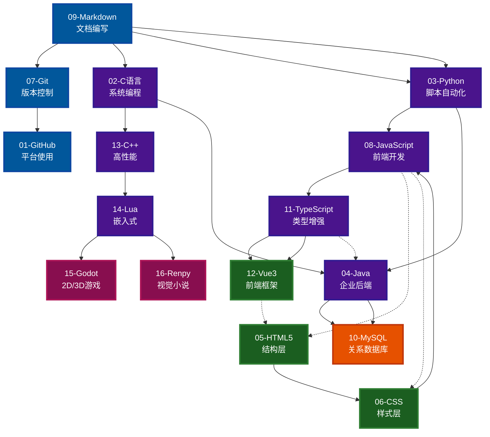
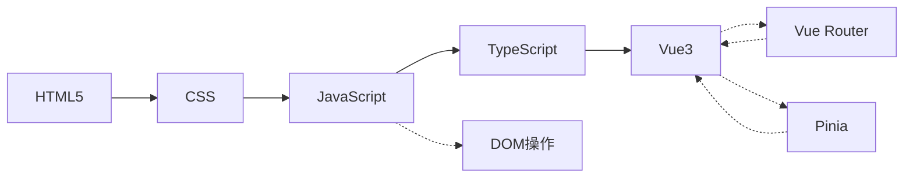
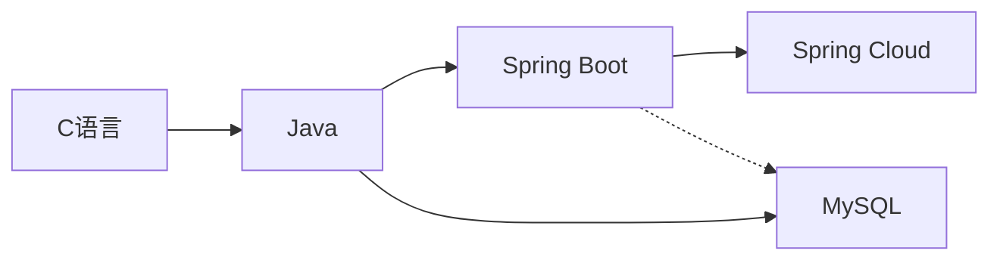
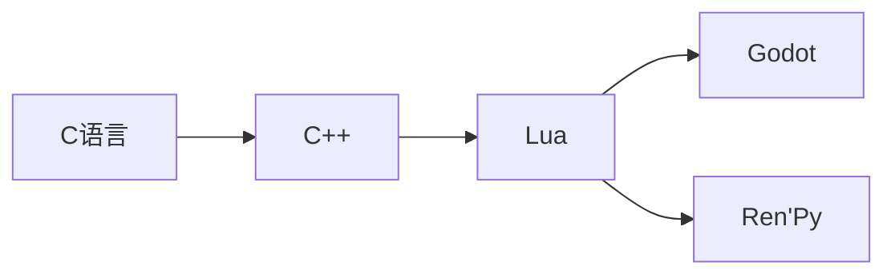

# MyNotebook | 个人综合资源笔记库

> @Author: fanquanpp
> @Version: v3.5.0
> @Created: 2026-04-05
> @Description: 综合性个人资源笔记库，覆盖 C/C++、Web 前端、Python/Java 后端、MySQL 数据库及游戏开发等多个技术领域。| Comprehensive personal knowledge notebook covering multiple technical fields.

<br />

## 0. 优质资源推荐 | Recommended Resources

### 外部 GitHub 仓库推荐

#### JavaScript 相关

- **JavaScript笔记** → [anbang/javascript-notes](https://github.com/anbang/javascript-notes.git)
  - 全面的 JavaScript 学习笔记和示例
- **Airbnb JavaScript风格指南** → [airbnb/javascript](https://github.com/airbnb/javascript.git)
  - 业界广泛使用的 JavaScript 代码风格指南

#### 算法相关

- **算法可视化器** → [algorithm-visualizer/algorithm-visualizer](https://github.com/algorithm-visualizer/algorithm-visualizer.git)
  - 通过可视化方式理解各种算法的运行过程
- **LeetCode算法题解** → [doocs/leetcode](https://github.com/doocs/leetcode.git)
  - 包含详细的 LeetCode 题目解析和解答方法
- **算法问题合集** → [MTrajK/coding-problems](https://github.com/MTrajK/coding-problems.git)
  - 收集了各种编程算法问题和答案
- **数据结构与算法(斯洛伐克)** → [thepranaygupta/Data-Structures-and-Algorithms](https://github.com/thepranaygupta/Data-Structures-and-Algorithms.git)
  - 全面的数据结构与算法实现
- **算法与数据结构(开源书籍)** → [kelvins/algorithms-and-data-structures](https://github.com/kelvins/algorithms-and-data-structures.git)
  - 多种编程语言实现的算法与数据结构
- **ApacheCN算法译文集** → [apachecn/apachecn-algo-zh](https://github.com/apachecn/apachecn-algo-zh.git)
  - 数据结构与算法的中文译文集，包含 LeetCode 题解
- **Hello 算法** → [krahets/hello-algo](https://github.com/krahets/hello-algo.git)
  - 图解代码、一键运行的数据结构与算法教程，支持多语言实现

#### TypeScript 相关

- **多行文本测量和排版** → [chenglou/pretext](https://github.com/chenglou/pretext.git)
  - 专注于文本测量和排版的 TypeScript 库

#### Java 相关

- **toBeBetterJavaer** → [itwanger/toBeBetterJavaer](https://github.com/itwanger/toBeBetterJavaer.git)
  - 通俗易懂、风趣幽默的 Java 学习指南，覆盖 Java 基础、并发编程、虚拟机等核心知识点

#### C++ 相关

- **CppGuide** → [balloonwj/CppGuide](https://github.com/balloonwj/CppGuide.git)
  - C++ 后台开发进阶学习资料，包含 C++ 必知必会的知识点和常见服务器架构等内容

#### CSS 相关

- **Flexbox-Labs** → [prazzon/Flexbox-Labs](https://github.com/prazzon/Flexbox-Labs.git)
  - 基于 Web 的 CSS Flexbox 布局工具，提供更直观和实时预览功能

#### Git 相关

- **Pro Git 2 中文翻译** → [progit/progit2-zh](https://github.com/progit/progit2-zh.git)
  - Git 圣经《Pro Git》第二版的中文翻译版本

#### 开源社区相关

- **HelloGitHub** → [521xueweihan/HelloGitHub](https://github.com/521xueweihan/HelloGitHub.git)
  - 分享 GitHub 上有趣、入门级的开源项目，每月 28 号以月刊形式更新

#### 游戏开发相关

- **Godot Engine** → [godotengine/godot](https://github.com/godotengine/godot.git)
  - 强大的 2D 和 3D 游戏引擎，开源免费，支持多平台导出

#### Python 相关

- **Python Mastery** → [dabeaz-course/python-mastery](https://github.com/dabeaz-course/python-mastery.git)
  - David Beazley 的高级 Python 编程课程，包含教学和解决方案

#### 工具相关

- **NoteGen** → [codexu/note-gen](https://github.com/codexu/note-gen.git)
  - 强大的 Markdown AI 笔记工具，有助于使用 AI 辅助记录和写作
- **Reference** → [jaywcjlove/reference](https://github.com/jaywcjlove/reference.git)
  - 面向开发者的技术速查表合集，整理常见技术、工具与开发流程

***

## 1. 项目简介 | Introduction

MyNotebook 是一个综合性技术学习笔记库，覆盖 C/C++、Web 前端、Python/Java 后端、MySQL 数据库及游戏开发等多个技术领域，为自学者提供学习资料。

### 核心目标

- **体系化学习**：从基础到进阶，构建完整的知识体系
- **实战导向**：提供丰富的代码示例和实战指导
- **持续更新**：定期维护，保持内容的时效性

### 联系方式

- 邮箱：<fanquanpangpiing@163.com>

## 2. 目录索引 | Directory Index

### 2.1 快速导航

| 序号 | 模块名称 | 英文名称 | 路径 |
| :- | :--- | :--- | :--- |
| 01 | GitHub 平台 | GitHub Platform | [./01-Github/README.md](./01-Github/README.md) |
| 02 | C 语言与算法 | C & Algorithms | [./02-C语言/README.md](./02-C语言/README.md) |
| 03 | Python 基础 | Python Scripting | [./03-Python/README.md](./03-Python/README.md) |
| 04 | Java 后端开发 | Java Backend Development | [./04-Java/README.md](./04-Java/README.md) |
| 05 | HTML5 网页开发 | HTML5 Web Development | [./05-HTML5/README.md](./05-HTML5/README.md) |
| 06 | CSS 布局 | CSS Layouts | [./06-CSS/README.md](./06-CSS/README.md) |
| 07 | Git 版本控制 | Git Version Control | [./07-Git/README.md](./07-Git/README.md) |
| 08 | JavaScript 基础 | JavaScript | [./08-Javascript/README.md](./08-Javascript/README.md) |
| 09 | Markdown 文档 | Markdown Documentation | [./09-Markdown/README.md](./09-Markdown/README.md) |
| 10 | MySQL 数据库 | MySQL Database | [./10-MySQL/README.md](./10-MySQL/README.md) |
| 11 | TypeScript 进阶 | TypeScript Advanced | [./11-Typescript/README.md](./11-Typescript/README.md) |
| 12 | Vue3 | Vue3 Framework | [./12-Vue3/README.md](./12-Vue3/README.md) |
| 13 | C++ 系统编程 | C++ Systems Programming | [./13-C++/README.md](./13-C++/README.md) |
| 14 | Lua 语言 | Lua Language | [./14-Lua/README.md](./14-Lua/README.md) |
| 15 | Godot 游戏引擎 | Godot Game Engine | [./15-Godot/README.md](./15-Godot/README.md) |
| 16 | Ren'Py 游戏引擎 | Ren'Py Game Engine | [./16-Renpy/README.md](./16-Renpy/README.md) |

### 2.2 技术领域分类

#### 2.2.1 基础工具与平台支持

- [GitHub 平台](./01-Github/README.md)
- [Git 版本控制](./07-Git/README.md)
- [Markdown 文档](./09-Markdown/README.md)

#### 2.2.2 编程语言

- [C 语言与算法](./02-C语言/README.md)
- [Python 基础](./03-Python/README.md)
- [Java 后端开发](./04-Java/README.md)
- [JavaScript 基础](./08-Javascript/README.md)
- [TypeScript 进阶](./11-Typescript/README.md)
- [C++ 系统编程](./13-C++/README.md)
- [Lua 语言](./14-Lua/README.md)

#### 2.2.3 Web 前端开发

- [HTML5 网页开发](./05-HTML5/README.md)
- [CSS 布局](./06-CSS/README.md)
- [Vue3](./12-Vue3/README.md)

#### 2.2.4 数据库

- [MySQL 数据库](./10-MySQL/README.md)

#### 2.2.5 游戏开发

- [Godot 游戏引擎](./15-Godot/README.md)
- [Ren'Py 游戏引擎](./16-Renpy/README.md)

## 3. 学习路径 | Learning Path

### 3.1 推荐学习顺序

1. **基础工具**：Markdown 文档 → Git 版本控制 → GitHub 平台
2. **编程语言基础**：C 语言与算法 → Python 基础 → JavaScript 基础
3. **Web 前端**：HTML5 网页开发 → CSS 布局 → TypeScript 进阶 → Vue3
4. **后端开发**：Java 后端开发 → MySQL 数据库
5. **系统与游戏开发**：C++ 系统编程 → Lua 语言 → Godot 游戏引擎 → Ren'Py 游戏引擎

### 3.2 技术模块依赖关系



### 3.3 学习路径推荐

#### 路径一：Web 全栈开发



#### 路径二：后端开发



#### 路径三：系统与游戏开发



## 4. 环境要求 | Environment Requirements

- **操作系统**：Windows 10+, Ubuntu 22.04+, macOS 14+
- **运行时**：
  - Python 3.10+ (用于 Python 模块)
  - JDK 17+ (用于 Java 模块)
  - Node.js 16+ (用于前端模块)
  - Git 2.40+ (用于版本控制)
- **开发工具**：VS Code, IntelliJ IDEA, Eclipse 等
- **最小配置**：2 核心 CPU / 1 GB 内存 / 500 MB 磁盘

## 5. 快速开始 | Quick Start

```bash
# 1. 克隆仓库到当前目录
git clone https://github.com/fanquanpp/MyNotebook.git .

# 2. 浏览模块内容
# 例如：查看 Python 基础模块
cd 03-Python

# 3. 开始学习
# 按照每个模块的 README.md 中的学习路线进行学习
```

## 6. 项目开发工具 | Development Tools

### 6.1 编码验证与检查

项目包含自动化脚本，用于验证和维护文档质量：

```powershell
# 运行所有检查（编码、版本一致性、文件命名）
cd c:\Apan\Projects\Notebook
.\.scripts\run_all_checks.ps1

# 仅检查编码（并自动修复）
.\.scripts\validate_encoding.ps1 -Fix

# 同步版本号
.\.scripts\sync_version.ps1 -NewVersion "v3.5.0"
```

### 6.2 编码规范

- **文件编码**：UTF-8 无 BOM（通过 `.editorconfig` 强制执行）
- **换行符**：LF
- **缩进**：2空格（Markdown），4空格（代码）
- **编辑器配置**：使用 VS Code 并安装 EditorConfig 插件

### 6.3 重构洞察报告

详细的项目重构历史、问题分析和最佳实践，请查看：
- [REFACTOR_INSIGHTS.md](./REFACTOR_INSIGHTS.md) - 完整的重构洞察报告

## 7. 核心特色 | Key Features

- **原子化笔记**：每一个核心知识点独立成文，便于检索与维护
- **双语注释**：所有源代码均包含中文/英文双语注释与说明
- **学习路线**：每个模块均提供 Mermaid 流程图形式的学习路径
- **企业级标准**：遵循统一的命名风格指南，并通过自动化工具进行检查
- **全面覆盖**：覆盖从基础语法到高级应用的完整知识体系
- **实战导向**：提供丰富的代码示例和实际应用场景
- **结构清晰**：采用系统化的目录结构，便于浏览和查找
- **持续更新**：定期更新内容，保持知识的时效性和准确性
- **编码安全**：通过自动化脚本确保 UTF-8 无 BOM 编码，防止中文乱码
- **质量保障**：配置 GitHub Actions 自动检查一致性和质量

## 8. 笔记文件命名策略 | Note File Naming Strategy

### 8.1 整体结构

基础知识点笔记 → 高级知识点笔记 → 专项知识点笔记

### 8.2 命名规则

**完整格式**：`[类型代号][文件大类序号]_[文件序号]-[笔记内容].md`

**示例**：`C01_101-账户与安全.md`

| 部分 | 说明 | 示例 |
| :--- | :--- | :--- |
| 类型代号 | 笔记类型标识（见下表） | C, G, Z, SFDE, V |
| 文件大类序号 | 模块编号（2位数字，不能省） | 01, 02, ..., 16 |
| 文件序号 | 文件编号（3位数字） | 101, 102, ..., 201, 202, ... |
| 笔记内容 | 文件主题描述（短横线分隔） | 账户与安全、配置与构建 |

### 8.3 类型代号说明

| 类型 | 代号 | 说明 | 编号范围 |
| :--- | :--- | :--- | :--- |
| 基础知识点笔记 | C | 面向初学者的基础概念和使用方法 | 101-199 |
| 高级知识点笔记 | G | 面向进阶者的高级特性和最佳实践 | 201-299 |
| 专项知识点笔记 | Z | 特定领域的深入研讨和专题研究 | 301-399 |
| 算法与数据结构 | SFDE | 算法与数据结构相关的专业内容 | 301-499 |
| 名词注释查阅表 | V | 对应内容的专有名词的定义和相关的注释说明文档 | 101-999 |

### 8.4 排序规则

- **文件大类排序**：01, 02, 03...16（按模块重要性和学习顺序）
- **文件排序**：101, 102...201, 202, 203...（基础知识点从101开始，高级知识点从201开始）

## 9. 贡献指南 | Contribution Guide

- **分支策略**：遵循 Git Flow (feature/hotfix) 工作流
- **提交规范**：使用 Conventional Commits 规范 (feat, fix, docs)
- **代码规范**：
  - C/C++: 遵循 Google C++ Style Guide
  - Java: 遵循 Google Java Style Guide
  - JavaScript/TypeScript: 遵循 ESLint 规范
  - Python: 遵循 PEP 8 规范
- **文档规范**：
  - 使用 Markdown 格式
  - 遵循 CJK/Alphanumeric 间距规范
  - 图片资源存放在 `assets/` 目录中
- **编码规范**：
  - 所有 Markdown 文件使用 UTF-8 无 BOM 编码
  - 使用 `.editorconfig` 统一编辑器行为
  - 提交前运行 `.scripts/validate_encoding.ps1` 检查编码

## 10. 许可证信息 | License

- **SPDX-Identifier**：[CC-BY-NC-SA-4.0](https://creativecommons.org/licenses/by-nc-sa/4.0/)
- **Copyright**：2024-2026 fanquanpp

## 11. 延伸阅读 | Further Reading

- [TypeScript 中文手册](https://jkchao.github.io/typescript-book-chinese/)
- [Godot 引擎文档](https://docs.godotengine.org/zh-cn/4.5/)
- [Ren'Py 官方文档](https://www.renpy.org/doc/html/)

***

**更新日志 | Changelog**

### 2026-05-03

- **v3.5.0** - 编码问题修复与项目规范化重构
- 🔧 问题解决：修复 PowerShell 脚本导致的 UTF-8 BOM 中文乱码问题
- 📝 文档完善：重写 11 个模块的 README.md 文件（02-C语言、03-Python、04-Java、05-HTML5、09-Markdown、10-MySQL、11-Typescript、12-Vue3、14-Lua、15-Godot、16-Renpy）
- 🏗️ 基础设施：新增 `.editorconfig` 文件，强制执行 UTF-8 无 BOM 编码规范
- 🛠️ 脚本优化：重写所有 PowerShell 脚本，使用 .NET API 确保 UTF-8 无 BOM 写入
- 🔍 新增工具：新增 `.scripts/run_all_checks.ps1` 综合检查脚本
- 📊 报告文档：新增 `REFACTOR_INSIGHTS.md` 完整重构洞察报告
- ✅ 统一结构：所有 README 采用统一的结构和版本号
- 🔗 上传 GitHub：完成重构并推送到远程仓库

### 2026-04-18

- **v3.3.0** - 合并笔记文件命名策略到 README.md
- **v3.0.0** - 完成 GitHub 仓库 3.0 结构优化规划，统一文件命名规范
- **v2.5.10** - 更新 README.md 文件，确保包含最新的目录结构和信息
- 合并笔记文件命名策略到 README.md，详细说明文件命名规则和代号系统
- 完成 GitHub 仓库 3.0 结构优化规划，统一文件命名规范，优化目录结构
- 更新 README.md 文件，确保包含最新的目录结构和信息

### 2026-04-08

- **v2.5.8 ~ v2.5.9** - 补充多个优质 GitHub 仓库推荐
- 补充多个优质 GitHub 仓库推荐（算法、Java、C++、CSS、Git、游戏开发、Python Mastery、NoteGen、Reference）

### 2026-04-07

- **v2.5.5 ~ v2.5.7** - 优化 README.md 外部资源推荐部分
- 优化 README.md 外部资源推荐部分，从列表改为表格并按分类组织，提高可读性

### 2026-04-06

- **v2.5.1 ~ v2.5.4** - 重构项目根目录 README.md，优化结构和可读性
- 重构项目根目录 README.md，优化结构和可读性，添加学习顺序说明和技术模块依赖关系图
- 补充各模块高级文档和内容，完善数据结构和算法实现
- 修复全库 README 链接与导航错误，新增/补全部分模块知识点与文档结构
- 深度优化 README.md 描述内容，增加项目定位说明，提升文档专业性
- 更新优化所有 README.md 文件，统一结构和格式

### 2026-04-05

- **v2.5.0** - 全库重构完成
