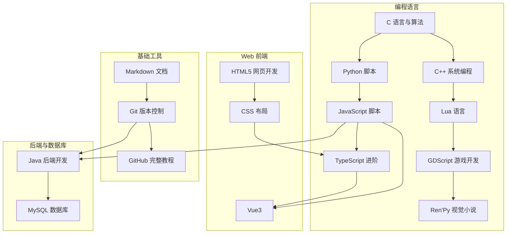

# MyNotebook | 个人综合资料笔记库

<!--
作者：fanquanpp
创建日期：2026-04-05
版本：v2.5.4
-->

## 1. 项目简介 | Introduction

MyNotebook 是 fanquanpp 维护的综合性个人资料笔记库，专注于提供高质量、系统化的技术学习资料。本仓库采用「一知识点一文件」的深度解析模式，涵盖 C/C++、Web 前端、Python/Java 后端、MySQL 数据库及游戏开发等多个技术领域，旨在为自学者提供工业级的参考资料。

### 仓库定位

- **学习资源中心**：汇集各领域核心知识点，形成完整的学习体系
- **技术文档库**：提供详细的技术解析和实践指南
- **个人知识管理**：系统化整理个人学习成果，便于复习和查阅

**使用说明：**

- 仓库已开放为公共，允许他人访问和克隆
- 禁止直接修改本仓库内容
- 他人使用本仓库内容时出现的任何问题与作者无关

**联系方式：**

- 邮箱：<fanquanpangpiing@163.com>
- QQ：1839243393
- 欢迎提意见交流或反馈问题

## 2. 目录索引 | Directory Index

### 2.1 快速导航

| 序号 | 模块名称          | 英文名称                      | 路径                                                         |
| :- | :------------ | :------------------------ | :--------------------------------------------------------- |
| 01 | GitHub 完整教程   | GitHub Tutorial           | [./01-Github完整教程/README.md](./01-Github完整教程/README.md)     |
| 02 | C 语言与算法       | C & Algorithms            | [./02-C语言/README.md](./02-C语言/README.md)                   |
| 03 | Python 脚本     | Python Scripting          | [./03-Python脚本/README.md](./03-Python脚本/README.md)         |
| 04 | Java 后端开发     | Java Backend Development  | [./04-Java后端开发/README.md](./04-Java后端开发/README.md)         |
| 05 | HTML5 网页开发    | HTML5 Web Development     | [./05-HTML5网页开发/README.md](./05-HTML5网页开发/README.md)       |
| 06 | CSS 布局        | CSS Layouts               | [./06-CSS布局/README.md](./06-CSS布局/README.md)               |
| 07 | Git 版本控制      | Git Version Control       | [./07-Git版本控制/README.md](./07-Git版本控制/README.md)           |
| 08 | JavaScript 脚本 | JavaScript                | [./08-Javascript脚本/README.md](./08-Javascript脚本/README.md) |
| 09 | Markdown 文档   | Markdown Documentation    | [./09-Markdown文档/README.md](./09-Markdown文档/README.md)     |
| 10 | MySQL 数据库     | MySQL Database            | [./10-MySQL数据库/README.md](./10-MySQL数据库/README.md)         |
| 11 | TypeScript 进阶 | TypeScript Advanced       | [./11-Typescript进阶/README.md](./11-Typescript进阶/README.md) |
| 12 | Vue3          | Vue3 Framework            | [./12-Vue3/README.md](./12-Vue3/README.md)                 |
| 13 | C++ 系统编程      | C++ Systems Programming   | [./13-C++系统编程/README.md](./13-C++系统编程/README.md)           |
| 14 | Lua 语言        | Lua Language              | [./14-Lua语言/README.md](./14-Lua语言/README.md)               |
| 15 | GDScript 游戏开发 | GDScript Game Development | [./15-GDScript游戏开发/README.md](./15-GDScript游戏开发/README.md) |
| 16 | Ren'Py 视觉小说   | Ren'Py Visual Novel       | [./16-Renpy视觉小说/README.md](./16-Renpy视觉小说/README.md)       |

### 2.2 技术领域分类

#### 2.2.1 基础工具与版本控制
- [GitHub 完整教程](./01-Github完整教程/README.md)
- [Git 版本控制](./07-Git版本控制/README.md)
- [Markdown 文档](./09-Markdown文档/README.md)

#### 2.2.2 编程语言
- [C 语言与算法](./02-C语言/README.md)
- [Python 脚本](./03-Python脚本/README.md)
- [Java 后端开发](./04-Java后端开发/README.md)
- [JavaScript 脚本](./08-Javascript脚本/README.md)
- [TypeScript 进阶](./11-Typescript进阶/README.md)
- [C++ 系统编程](./13-C++系统编程/README.md)
- [Lua 语言](./14-Lua语言/README.md)
- [GDScript 游戏开发](./15-GDScript游戏开发/README.md)
- [Ren'Py 视觉小说](./16-Renpy视觉小说/README.md)

#### 2.2.3 Web 前端开发
- [HTML5 网页开发](./05-HTML5网页开发/README.md)
- [CSS 布局](./06-CSS布局/README.md)
- [Vue3](./12-Vue3/README.md)

#### 2.2.4 数据库
- [MySQL 数据库](./10-MySQL数据库/README.md)

## 3. 学习路线 | Learning Path

### 3.1 推荐学习顺序

1. **基础工具**：Markdown 文档 → Git 版本控制 → GitHub 完整教程
2. **编程语言基础**：C 语言与算法 → Python 脚本 → JavaScript 脚本
3. **Web 前端**：HTML5 网页开发 → CSS 布局 → TypeScript 进阶 → Vue3
4. **后端开发**：Java 后端开发 → MySQL 数据库
5. **系统与游戏开发**：C++ 系统编程 → Lua 语言 → GDScript 游戏开发 → Ren'Py 视觉小说

### 3.2 技术模块依赖关系



## 4. 环境要求 | Environment Requirements

- **操作系统**：Windows 10+, Ubuntu 22.04+, macOS 14+
- **运行时**：
  - Python 3.10+ (用于 Python 模块)
  - JDK 17+ (用于 Java 模块)
  - Node.js 16+ (用于前端模块)
  - Git 2.40+ (用于版本控制)
- **开发工具**：VS Code, IntelliJ IDEA, Eclipse 等
- **最小配置**：1 核心 CPU / 1 GB 内存 / 500 MB 磁盘

## 5. 快速开始 | Quick Start

```bash
# 1. 克隆仓库到当前目录
git clone https://github.com/fanquanpp/MyNotebook.git .

# 2. 浏览模块内容
# 例如：查看 Python 脚本模块
cd 03-Python脚本

# 3. 开始学习
# 按照每个模块的 README.md 中的学习路线进行学习
```

## 6. 核心特色 | Key Features

- **原子化笔记**：每一个核心知识点独立成文，便于检索与维护
- **双语注释**：所有源码均包含中文/英文双语注释与解析
- **学习路线**：每个模块均提供 Mermaid 流程图形式的学习路径
- **工业级标准**：遵循统一的代码风格指南，并通过自动化脚本进行校验
- **全面覆盖**：涵盖从基础语法到高级应用的完整知识体系
- **实战导向**：提供丰富的代码示例和实际应用场景
- **结构清晰**：采用系统化的目录结构，便于导航和查找
- **持续更新**：定期更新内容，保持知识的时效性和准确性

## 7. 贡献指南 | Contribution Guide

- **分支策略**：遵循 Git Flow (feature/hotfix) 工作流
- **提交规范**：使用 Conventional Commits 规范 (feat, fix, docs)
- **代码规范**：
  - C/C++: 遵循 Google C++ Style Guide
  - Java: 遵循 Google Java Style Guide
  - JavaScript/TypeScript: 遵循 ESLint 规范
  - Python: 遵循 PEP 8 规范
- **文档规范**：
  - 采用 Markdown 格式
  - 遵循 CJK/Alphanumeric 间距规范
  - 图片资源存放在 `assets/` 目录下

## 8. 许可证信息 | License

- **SPDX-Identifier**：[CC-BY-NC-SA-4.0](https://creativecommons.org/licenses/by-nc-sa/4.0/)
- **Copyright**：2024-2026 fanquanpp

## 9. 延伸阅读 | Further Reading

- [TypeScript 中文手册](https://jkchao.github.io/typescript-book-chinese/)
- [Godot 引擎文档](https://docs.godotengine.org/zh-cn/4.5/)
- [Ren'Py 官方文档](https://www.renpy.org/doc/html/)

***

**更新日志 | Changelog**

- 2026-04-05: 全库重构完成，引入「一知识点一文件」架构，升级为 v2.5.0
- 2026-04-06: 更新优化所有 README.md 文件，统一结构和格式，升级为 v2.5.1
- 2026-04-06: 再次更新优化 README.md 文件，确保内容一致性和准确性
- 2026-04-06: 深度优化 README.md 描述内容，增加仓库定位说明，提升文档专业性，升级为 v2.5.2
- 2026-04-06: 修复全库 README 导航与索引错误，新增/补全部分模块知识点与文档结构，升级为 v2.5.3
- 2026-04-06: 补充各模块高级文件夹和内容，完善数据结构和算法实现，升级为 v2.5.4
- 2026-04-06: 重构项目根目录 README.md，优化结构和可读性，增加学习顺序说明和技术模块依赖关系图

